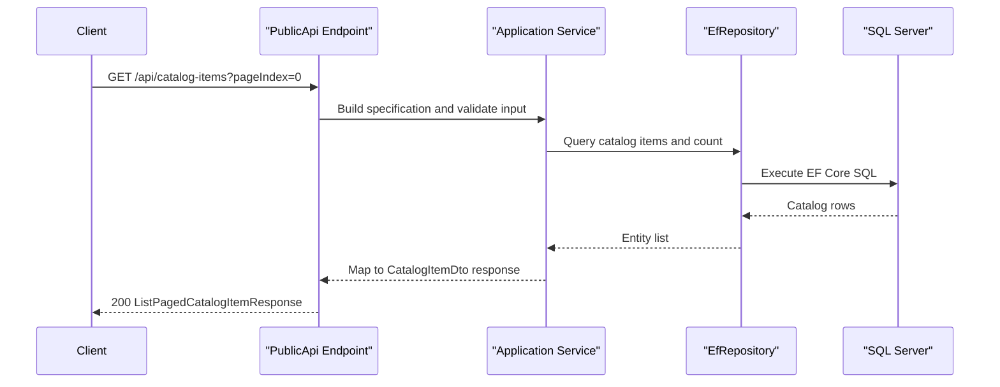

# API & Service Communication Contracts

The solution exposes a REST API surface primarily through the PublicApi host and also includes authenticated Web-host endpoints. Communication is mostly synchronous HTTP with in-process service and repository calls.

## Service Catalog

| Service | Port | Category | Purpose |
|---|---|---|---|
| Web (`src/Web`) | 5106 externally (Docker), 8080 container | API Layer | MVC/Razor/Blazor host for storefront and account management |
| PublicApi (`src/PublicApi`) | 5200 externally (Docker), 8080 container | API Layer | Catalog and auth API endpoints for clients/admin |
| SQL Server (compose) | 1433 | Infrastructure | Persistent store for catalog/order and identity data |

## API Endpoints Inventory

| Service | Method | Path | Request Type | Response Type |
|---|---|---|---|---|
| PublicApi | POST | `/api/authenticate` | `AuthenticateRequest` body | `AuthenticateResponse` (JWT + claims) |
| PublicApi | GET | `/api/catalog-items` | Query (`pageSize`, `pageIndex`, filters) | `ListPagedCatalogItemResponse` |
| PublicApi | GET | `/api/catalog-items/{catalogItemId}` | Path (`catalogItemId`) | `GetByIdCatalogItemResponse` |
| PublicApi | POST | `/api/catalog-items` | `CreateCatalogItemRequest` body | `CreateCatalogItemResponse` |
| PublicApi | PUT | `/api/catalog-items` | `UpdateCatalogItemRequest` body | `UpdateCatalogItemResponse` |
| PublicApi | DELETE | `/api/catalog-items/{catalogItemId}` | Path (`catalogItemId`) | `DeleteCatalogItemResponse` |
| PublicApi | GET | `/api/catalog-brands` | None | `ListCatalogBrandsResponse` |
| PublicApi | GET | `/api/catalog-types` | None | `ListCatalogTypesResponse` |
| Web | GET | `/Order/MyOrders` | Authenticated user context | MVC view model response |
| Web | GET | `/Order/Detail/{orderId}` | Path (`orderId`) | MVC order detail view model |

## Management & Observability Endpoints

| Service | Endpoint | Custom Metrics (if any) |
|---|---|---|
| Web | `/health` | None detected |
| Web | `/home_page_health_check` | None detected |
| Web | `/api_health_check` | None detected |
| PublicApi | `/swagger/v1/swagger.json` and Swagger UI | None detected |

## DTOs & Contracts

PublicApi contracts are organized as dedicated request/response DTO classes per endpoint group (for example `CreateCatalogItemRequest`, `CatalogItemDto`, `AuthenticateResponse`). These DTOs form service-level API contracts and are mapped from domain entities through AutoMapper profiles. No gateway-level aggregation DTOs spanning multiple independently deployed services were identified. Serialization relies on ASP.NET Core JSON defaults (`System.Text.Json`) and Swagger annotations for API metadata.

## Communication Patterns

Communication is predominantly synchronous REST over HTTP. PublicApi endpoint handlers delegate to application services/repositories within the same process boundary and EF Core persists to SQL Server. No asynchronous broker-based messaging pattern was detected. Web uses cookie-based authentication while PublicApi uses JWT bearer auth; CORS policy is configured in PublicApi. Transport security is enabled through HTTPS redirection, with Swagger and health endpoints exposed according to environment setup.

## Service Technology Matrix

| Service | Web | Data Access | Discovery | Gateway | Actuator | Cache | Metrics |
|---|---|---|---|---|---|---|---|
| Web | MVC + Razor + Blazor | EF Core via repository pattern | None | None | ASP.NET health checks | In-memory cache | Health status only |
| PublicApi | Minimal API endpoints + controllers | EF Core via repository pattern | None | None | Swagger/OpenAPI | In-memory cache | Swagger/health only |

## Service Communication Sequence

