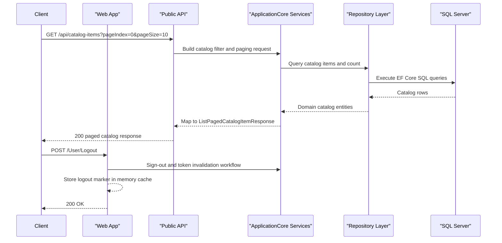

# API & Service Communication Contracts

The application exposes a moderate REST API surface across the PublicApi project and selected Web controllers. Communication is mostly synchronous HTTP with in-process service/repository calls, plus lightweight health and Swagger endpoints.

## Service Catalog

| Service | Port | Category | Purpose |
|---|---|---|---|
| Web | 5000/5001 (launch), 5106 in Docker base URL | API Layer | Storefront UI (MVC/Razor) and auth/user helper endpoints |
| PublicApi | 5099 (dev API base), 5200 in Docker base URL | API Layer | Catalog CRUD/list and authentication endpoints for clients/admin |
| BlazorAdmin | Hosted by Web (server-side + WASM assets) | Business | Admin UI that calls PublicApi for catalog management |
| SQL Server container (`sqlserver`) | 1433 | Infrastructure | Catalog and identity persistence backing both Web and PublicApi |

## API Endpoints Inventory

| Service | Method | Path | Request Type | Response Type |
|---|---|---|---|---|
| PublicApi | POST | `/api/authenticate` | `AuthenticateRequest` | `AuthenticateResponse` |
| PublicApi | GET | `/api/catalog-items` | Query (`pageSize`, `pageIndex`, `catalogBrandId`, `catalogTypeId`) via `ListPagedCatalogItemRequest` | `ListPagedCatalogItemResponse` |
| PublicApi | GET | `/api/catalog-items/{catalogItemId}` | `GetByIdCatalogItemRequest` (path param) | `GetByIdCatalogItemResponse` |
| PublicApi | POST | `/api/catalog-items` | `CreateCatalogItemRequest` | `CreateCatalogItemResponse` |
| PublicApi | PUT | `/api/catalog-items` | `UpdateCatalogItemRequest` | `UpdateCatalogItemResponse` |
| PublicApi | DELETE | `/api/catalog-items/{catalogItemId}` | `DeleteCatalogItemRequest` (path param) | `DeleteCatalogItemResponse` |
| PublicApi | GET | `/api/catalog-brands` | none | `ListCatalogBrandsResponse` |
| PublicApi | GET | `/api/catalog-types` | none | `ListCatalogTypesResponse` |
| Web | GET | `/User` | authenticated user context | `UserInfo` |
| Web | POST | `/User/Logout` | none | `200 OK` |

## Management & Observability Endpoints

| Service | Endpoint | Custom Metrics (if any) |
|---|---|---|
| Web | `/health` | No custom metric names found |
| Web | `/home_page_health_check` | No custom metric names found |
| Web | `/api_health_check` | No custom metric names found |
| PublicApi | `/swagger/v1/swagger.json` | Swagger/OpenAPI metadata |
| PublicApi | `/swagger` (UI) | Swagger UI rendering |

## DTOs & Contracts

The API contract is represented by request/response DTO classes in `PublicApi` such as `CreateCatalogItemRequest`, `UpdateCatalogItemRequest`, `ListPagedCatalogItemResponse`, and `AuthenticateResponse`. DTOs are service-level API models (not persistence entities), while domain entities such as `CatalogItem` and `Order` remain internal to domain/infrastructure layers. Serialization uses ASP.NET Core JSON (`System.Text.Json`) and Swashbuckle annotations for OpenAPI generation. No protobuf or GraphQL schemas were detected.

## Communication Patterns

Communication is primarily synchronous REST over HTTP. Web and PublicApi use dependency injection and repository abstractions for in-process calls to domain/data layers. No message broker, pub/sub transport, or explicit circuit-breaker library configuration was identified. SQL retry is configured on SQL Server connections (`EnableRetryOnFailure`) for transient DB faults. Service discovery is not dynamic; endpoints are configured through environment/appsettings base URLs. Security posture includes JWT bearer auth in PublicApi, ASP.NET Identity/cookie auth in Web, and role-based checks in UI flows; HTTPS is enabled in launch profiles and middleware.

## Service Technology Matrix

| Service | Web | Data Access | Discovery | Gateway | Actuator | Cache | Metrics |
|---|---|---|---|---|---|---|---|
| Web | MVC + Razor Pages + Blazor host | EF Core via `IRepository` | None (configured base URLs) | No | ASP.NET health checks | MemoryCache | Health endpoints |
| PublicApi | MinimalApi.Endpoint + Controllers | EF Core via `IRepository` | None (configured base URLs) | No | Swagger endpoints | MemoryCache | Swagger/OpenAPI |
| BlazorAdmin | Blazor WebAssembly client | Calls PublicApi | None | No | None | Browser/local storage | None |

## Service Communication Sequence

