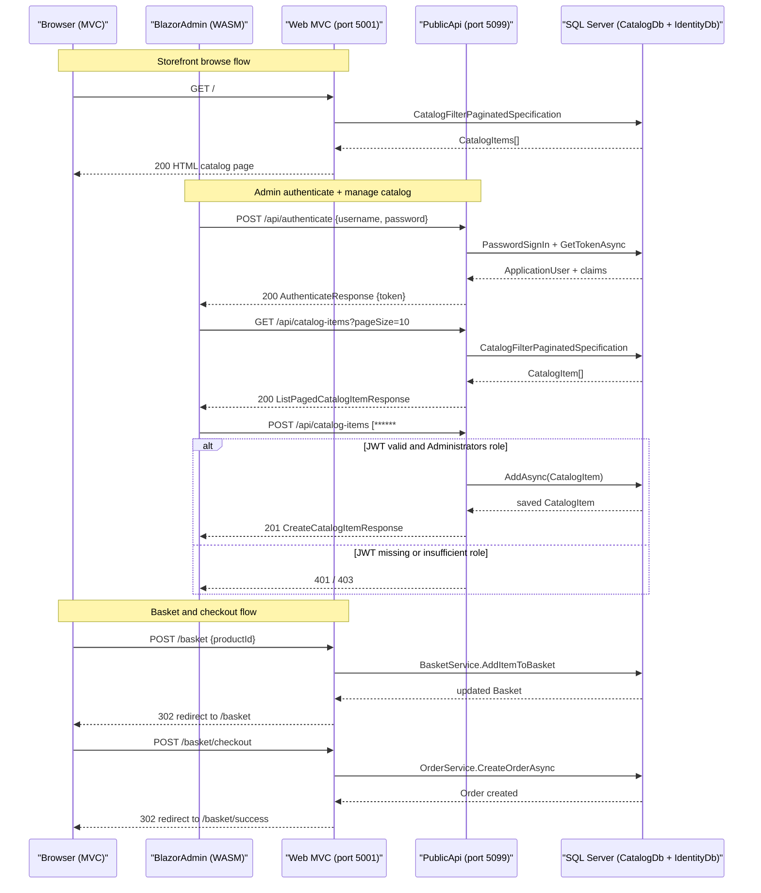

# API & Service Communication Contracts

eShopOnWeb exposes 10 REST API endpoints across two independently deployable HTTP services (the MVC Web application and the Public REST API), with no asynchronous messaging or API gateway in the topology.

## Service Catalog

| Service | Port | Category | Purpose |
|---------|------|----------|---------|
| Web (MVC Storefront) | 5001 (HTTPS), 5000 (HTTP) | API Layer / Business | Server-rendered e-commerce storefront; exposes user, order, and basket pages plus supporting JSON controller endpoints for the Blazor WASM panel |
| PublicApi | 5099 (HTTPS), 5098 (HTTP) | API Layer | Minimal REST API providing catalog, brand, type CRUD and JWT authentication; consumed by BlazorAdmin |

## API Endpoints Inventory

### PublicApi (`src/PublicApi`) — Minimal API / Ardalis.ApiEndpoints

| Method | Path | Request Type | Response Type | Auth Required |
|--------|------|-------------|---------------|---------------|
| POST | `/api/authenticate` | `AuthenticateRequest` | `AuthenticateResponse` (JWT token) | None |
| GET | `/api/catalog-items` | Query: `pageSize`, `pageIndex`, `catalogBrandId`, `catalogTypeId` | `ListPagedCatalogItemResponse` | None |
| GET | `/api/catalog-items/{catalogItemId}` | Path: `catalogItemId` | `GetByIdCatalogItemResponse` | None |
| POST | `/api/catalog-items` | `CreateCatalogItemRequest` (body) | `CreateCatalogItemResponse` (201) | JWT — Administrators role |
| PUT | `/api/catalog-items` | `UpdateCatalogItemRequest` (body) | `UpdateCatalogItemResponse` | JWT — Administrators role |
| DELETE | `/api/catalog-items/{catalogItemId}` | Path: `catalogItemId` | `DeleteCatalogItemResponse` | JWT — Administrators role |
| GET | `/api/catalog-brands` | None | `ListCatalogBrandsResponse` | None |
| GET | `/api/catalog-types` | None | `ListCatalogTypesResponse` | None |

### Web MVC — Internal JSON Controllers (supporting BlazorAdmin)

| Method | Path | Request Type | Response Type | Auth Required |
|--------|------|-------------|---------------|---------------|
| GET | `/user` | None | `UserInfo` (JSON) | Cookie / Anonymous |
| POST | `/user/logout` | None | `200 OK` | Cookie / Anonymous |

### Web MVC — Razor Pages / MVC Views (HTML, not REST)

| Method | Path | Notes |
|--------|------|-------|
| GET/POST | `/basket` | Basket view and item add/update/delete |
| GET/POST | `/basket/checkout` | Checkout form |
| GET | `/order/my-orders` | Authenticated order history |
| GET | `/order/detail/{orderId}` | Order detail view |
| GET/POST | `/manage/*` | Account management (2FA, password, profile) |

## Management & Observability Endpoints

| Service | Endpoint | Description |
|---------|----------|-------------|
| Web | `/health` | Aggregated health check (HTTP 200/503) |
| Web | `/home_page_health_check` | Checks the homepage renders product catalog content |
| Web | `/api_health_check` | Checks PublicApi reachability |
| PublicApi | `/swagger` | Swagger UI (development only) |
| PublicApi | `/swagger/v1/swagger.json` | OpenAPI 3.0 specification |

No custom metrics (Micrometer, Application Insights SDK, Prometheus exporters) are configured; health check results are the only structured observability exposed by either service.

## DTOs & Contracts

All DTOs are plain C# classes (not records) deriving from `BaseRequest` / `BaseResponse` base classes that provide a `CorrelationId` for request tracing. Key contracts:

| DTO Class | Service | Role | Immutable |
|-----------|---------|------|-----------|
| `AuthenticateRequest` | PublicApi | Request body — username + password | No |
| `AuthenticateResponse` | PublicApi | Response — JWT token, lock-out flags | No |
| `CatalogItemDto` | PublicApi | Catalog item payload (shared across list/get/create/update) | No |
| `ListPagedCatalogItemRequest` | PublicApi | Query parameters for paged catalog listing | No |
| `ListPagedCatalogItemResponse` | PublicApi | Paginated list of `CatalogItemDto` with page count | No |
| `GetByIdCatalogItemRequest` / `Response` | PublicApi | Single item fetch by ID | No |
| `CreateCatalogItemRequest` / `Response` | PublicApi | Admin — create new catalog item | No |
| `UpdateCatalogItemRequest` / `Response` | PublicApi | Admin — update existing catalog item | No |
| `DeleteCatalogItemRequest` / `Response` | PublicApi | Admin — delete catalog item by ID | No |
| `ListCatalogBrandsResponse` | PublicApi | List of `CatalogBrandDto` | No |
| `ListCatalogTypesResponse` | PublicApi | List of `CatalogTypeDto` | No |
| `UserInfo` | Web | Current user identity + JWT token for Blazor | No |
| `BasketViewModel` | Web | View model for basket page | No |

Serialization uses `System.Text.Json` (ASP.NET Core 8 default). The PublicApi is documented with Swashbuckle Annotations (`[SwaggerOperation]`). No protobuf schemas or GraphQL schemas are present.

## Communication Patterns

**Synchronous (REST)**:  
All inter-service communication is synchronous HTTP/REST. The BlazorAdmin (Blazor WebAssembly, hosted inside the Web project) calls the PublicApi at `https://localhost:5099/api/` using `HttpClient`. Base URLs are configured in `appsettings.json` under `baseUrls.apiBase` and `baseUrls.webBase`. There is no API gateway, service mesh, gRPC, or message broker.

**Resilience Patterns**:  
No explicit circuit breaker, retry policy, or bulkhead pattern is implemented (no Polly configuration found). The `CatalogItemListPagedEndpoint` includes a deliberate `Task.Delay(1000)` simulating latency. No timeout configuration is applied at the `HttpClient` level.

**Service Discovery**:  
Services use hardcoded base URLs from `appsettings.json`; no dynamic service discovery (Consul, Eureka, Kubernetes DNS) is configured.

**Startup Dependency Chain**:  
The Web and PublicApi services are independent; the Web service's `api_health_check` health endpoint probes the PublicApi but there is no enforced startup ordering between them.

**Security Posture**:  
- **Transport**: Both services are configured for HTTPS in all environments; Kestrel is set to redirect HTTP to HTTPS.  
- **Authentication**: The Web storefront uses ASP.NET Core Cookie authentication. The PublicApi uses JWT ****** (`JwtBearerDefaults.AuthenticationScheme`). The `UserController` in Web also issues JWT tokens for the Blazor panel via `ITokenClaimsService`.  
- **Authorization**: Write endpoints (POST/PUT/DELETE catalog items) require the `Administrators` role in the JWT. Read catalog endpoints (GET) are anonymous — no authentication is required to list or view catalog items.  
- **Gap**: No CORS policy is explicitly configured in the PublicApi, which may allow cross-origin requests from any origin in development.

## Service Technology Matrix

| Service | Web Framework | Data Access | Discovery | Gateway | Swagger/Health | Cache | Metrics |
|---------|--------------|-------------|-----------|---------|----------------|-------|---------|
| Web (MVC) | ASP.NET Core 8 MVC + Razor Pages | EF Core 8 (SqlServer / InMemory) | None (hardcoded URLs) | No | Health checks at `/health` | IMemoryCache (user token cache) | None |
| PublicApi | ASP.NET Core 8 Minimal API + Ardalis.ApiEndpoints | EF Core 8 (SqlServer / InMemory) | None (hardcoded URLs) | No | Swagger UI at `/swagger` | None | None |

## Service Communication Sequence

