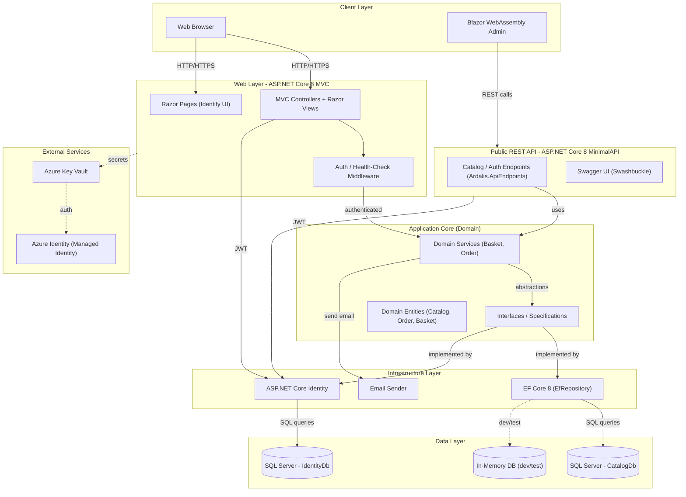
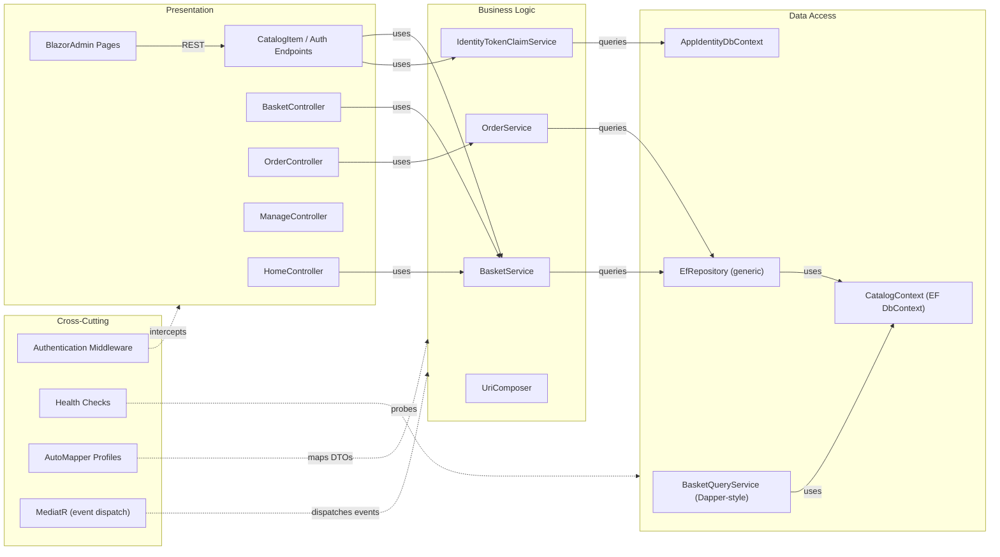

# Architecture Diagram

eShopOnWeb is a multi-project ASP.NET Core 8 e-commerce reference application consisting of an MVC web storefront, a Blazor WebAssembly admin panel, and a minimal REST API, all backed by SQL Server via Entity Framework Core.

## Application Architecture

### Technology Stack Summary

| Layer | Technology | Version | Purpose |
|-------|-----------|---------|---------|
| Presentation (Web) | ASP.NET Core MVC | 8.0.2 | Server-side web storefront with Razor views |
| Presentation (Admin) | Blazor WebAssembly | 8.0.2 | SPA admin panel hosted in the MVC app |
| REST API | ASP.NET Core Minimal API | 8.0.2 | Public REST API for catalog and auth |
| Domain | ApplicationCore (.NET 8) | 8.0 | Business logic, entities, specifications |
| Data Access | Entity Framework Core (SqlServer) | 8.0.2 | ORM for catalog and identity databases |
| Identity | ASP.NET Core Identity | 8.0.2 | User management and JWT authentication |
| API Documentation | Swashbuckle / Swagger | 6.5.0 | OpenAPI spec and Swagger UI |
| Secrets Management | Azure Key Vault | 1.3.1 | Production configuration secrets |
| Authentication | Azure Identity / JWT ****** 1.10.4 / 8.0.2 | Managed Identity and token-based auth |

### Data Storage & External Services

The application uses two SQL Server databases: `CatalogDb` (catalog items, brands, types, orders, baskets) and an Identity database (users, roles, claims). Entity Framework Core 8 manages both through the `CatalogContext` and `AppIdentityDbContext`. In development and testing, an in-memory EF Core provider is used as a drop-in replacement. Azure Key Vault is leveraged in production to supply connection strings and other secrets via `Azure.Extensions.AspNetCore.Configuration.Secrets`, authenticated through `Azure.Identity` (supports Managed Identity and Azure Developer CLI credentials).

### Key Architectural Decisions

- **Clean Architecture with repository pattern**: The domain (`ApplicationCore`) has zero infrastructure dependencies; all data access is abstracted behind `IRepository<T>` and `IReadRepository<T>` interfaces implemented by `EfRepository` in the Infrastructure project.
- **Dual authentication strategy**: The MVC storefront uses Cookie-based authentication while the Public API and BlazorAdmin use JWT ****** issued by `IdentityTokenClaimService`.
- **Ardalis.Specification for query encapsulation**: All EF Core queries are expressed as reusable `Specification<T>` objects (via `Ardalis.Specification`), keeping repository implementations thin and controllers/services free of LINQ.

## Component Relationships

### Component Inventory

| Component | Layer | Type | Responsibility |
|-----------|-------|------|----------------|
| HomeController | Presentation | MVC Controller | Renders catalog index, search, and product detail pages |
| BasketController | Presentation | MVC Controller | Manages shopping basket add/remove/checkout flow |
| OrderController | Presentation | MVC Controller | Displays order history and detail for authenticated users |
| ManageController | Presentation | MVC Controller | Account management (profile, password) |
| CatalogItem / Auth Endpoints | Presentation | Minimal API Endpoints | CRUD catalog items and JWT auth via PublicApi |
| BlazorAdmin Pages | Presentation | Blazor WebAssembly | Admin CRUD for catalog items, brands, and types |
| BasketService | Business Logic | Domain Service | Basket creation, item management, and checkout logic |
| OrderService | Business Logic | Domain Service | Creates orders from basket, applies business rules |
| IdentityTokenClaimService | Business Logic | Service | Issues JWT tokens for authenticated users |
| UriComposer | Business Logic | Utility | Builds product image URIs from configuration templates |
| EfRepository | Data Access | Generic Repository | Generic IRepository/IReadRepository implementation over EF Core |
| CatalogContext | Data Access | EF DbContext | Manages CatalogItem, Order, Basket, Buyer entities |
| AppIdentityDbContext | Data Access | EF DbContext | Manages ASP.NET Core Identity user store |
| BasketQueryService | Data Access | Query Service | Read-optimized basket queries |
| Authentication Middleware | Cross-Cutting | Middleware | Cookie and JWT ****** pipeline |
| Health Checks | Cross-Cutting | Health Check | Database connectivity probes exposed at `/health` |
| AutoMapper Profiles | Cross-Cutting | Mapper | DTO ↔ entity mapping across Web and PublicApi |
| MediatR | Cross-Cutting | Event Bus | In-process domain event dispatching |
