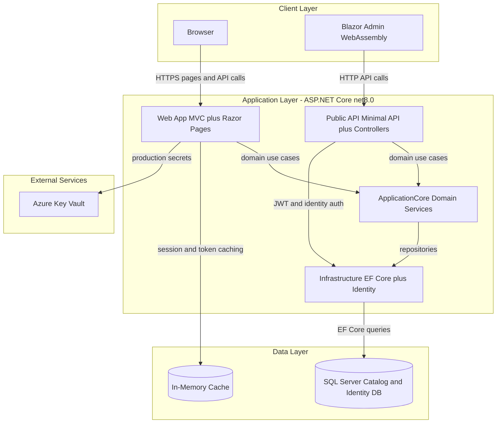
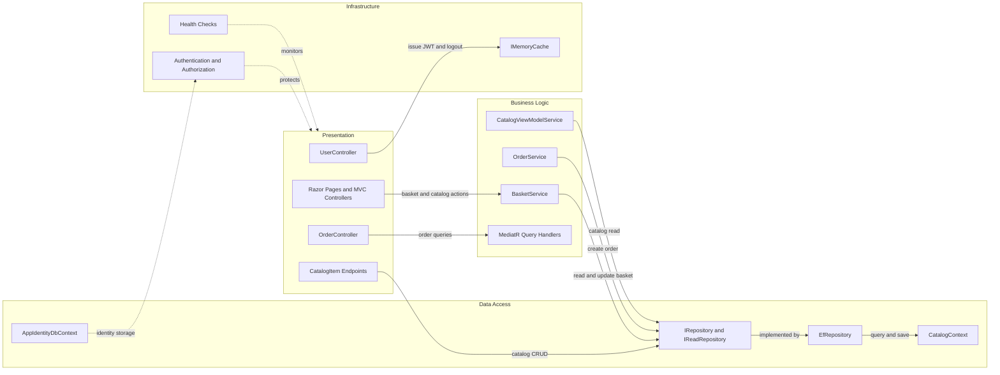

# Architecture Diagram

This repository implements an e-commerce reference application with separate Web UI, Public API, and shared core/infrastructure libraries. The diagrams below summarize its runtime architecture and component interactions.

## Application Architecture

### Technology Stack Summary

| Layer | Technology | Version | Purpose |
|---|---|---|---|
| Presentation | ASP.NET Core MVC, Razor Pages, Blazor Server and WASM | net8.0 | Web storefront and admin UI |
| API | ASP.NET Core MinimalApi.Endpoint + Controllers + Swagger | net8.0 | Catalog and auth API surface |
| Business | ApplicationCore with MediatR and Ardalis.Specification | net8.0 | Domain services and use-case orchestration |
| Data | EF Core + ASP.NET Identity + SQL Server provider | EF Core 8.0.2 | Persistence for catalog, basket, orders, identity |
| Security | ASP.NET Identity + JWT bearer auth | AspNet 8.0.2 | Authentication and authorization |

### Data Storage & External Services

The app uses SQL Server for both catalog/order data and identity data through two EF Core DbContexts. It uses in-memory caching for token and session-related data, and production mode can load secrets from Azure Key Vault for SQL connection strings.

### Key Architectural Decisions

- Uses layered architecture with ApplicationCore abstractions (`IRepository`, `IReadRepository`) and Infrastructure EF implementation (`EfRepository`).
- Splits external API responsibilities into a dedicated `PublicApi` project while keeping storefront MVC/Razor in `Web`.
- Supports environment-specific infrastructure wiring (local/docker SQL configuration vs Azure Key Vault-backed production configuration).

## Component Relationships

### Component Inventory

| Component | Layer | Type | Responsibility |
|---|---|---|---|
| `OrderController` | Presentation | MVC Controller | Returns authenticated user order history and detail views |
| `UserController` | Presentation | API Controller | Returns current user info and handles logout/token cache invalidation |
| `CatalogItemListPagedEndpoint` | Presentation | Minimal API Endpoint | Serves paged catalog item API responses |
| `BasketService` | Business Logic | Domain Service | Adds items, updates quantities, and transfers baskets |
| `OrderService` | Business Logic | Domain Service | Converts basket contents into persisted orders |
| `GetMyOrdersHandler` / `GetOrderDetailsHandler` | Business Logic | MediatR Handlers | Query-side order projections for Web UI |
| `EfRepository<T>` | Data Access | Repository Implementation | Generic EF-based repository for aggregates |
| `CatalogContext` | Data Access | EF Core DbContext | Catalog, basket, and order persistence |
| `AppIdentityDbContext` | Data Access | Identity DbContext | ASP.NET Identity users/roles persistence |
| `ApiHealthCheck` / `HomePageHealthCheck` | Infrastructure | Health Check | Validates API and homepage availability |
