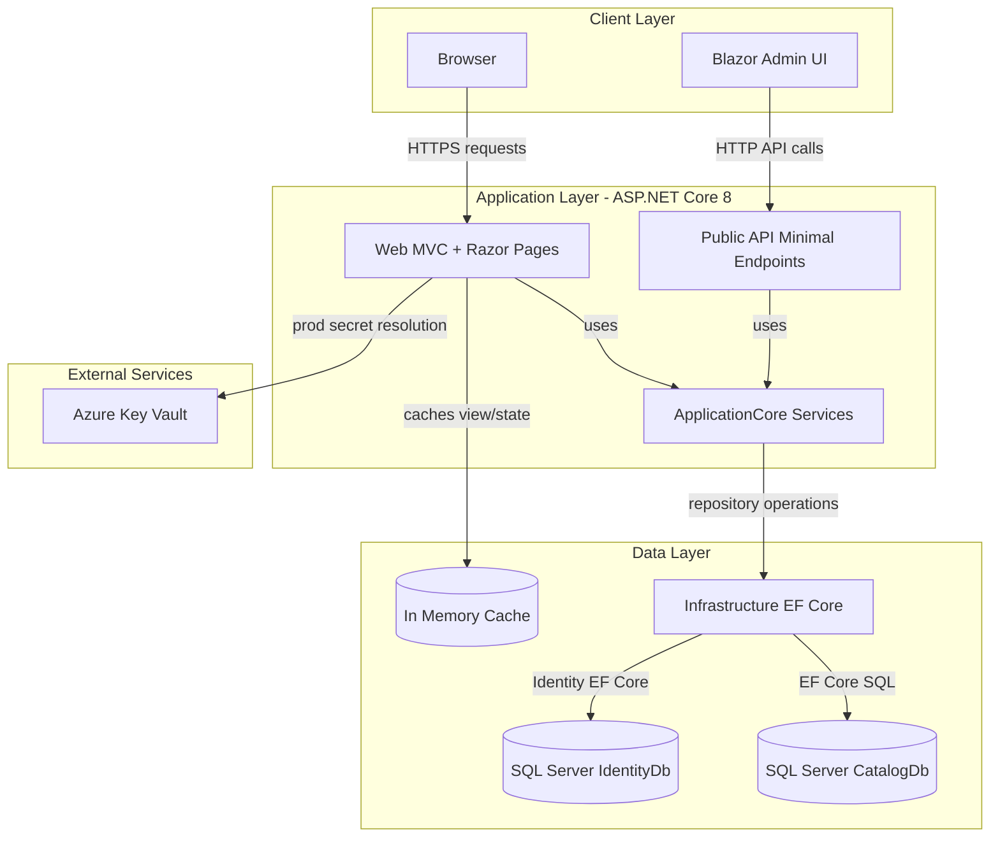
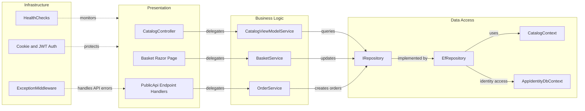

# Architecture Diagram

This .NET 8 solution uses separate web and API frontends over shared application and infrastructure libraries. Data is persisted in SQL Server via Entity Framework Core with identity and catalog domains.

## Application Architecture

### Technology Stack Summary

| Layer | Technology | Version | Purpose |
|---|---|---|---|
| Presentation | ASP.NET Core MVC, Razor Pages, Blazor Server/WebAssembly | .NET 8 | Web UI and admin experience |
| API | ASP.NET Core Minimal API + Ardalis.ApiEndpoints | .NET 8 | REST API for catalog and auth |
| Business | ApplicationCore services + MediatR | .NET 8 | Domain/business orchestration |
| Data | EF Core + Ardalis.Specification | EF Core 8.0.2 | Persistence and repository queries |
| Identity/Security | ASP.NET Core Identity + JWT bearer | ASP.NET Core 8.0.2 | Authentication and token handling |

### Data Storage & External Services

The application uses SQL Server (or localdb in development) for both catalog/order and identity data via separate DbContexts. Memory cache is used in-process, and production web startup can source connection secrets from Azure Key Vault.

### Key Architectural Decisions

- Shared `ApplicationCore` and `Infrastructure` projects are reused by both Web and PublicApi hosts.
- Generic repository abstractions (`IRepository`/`IReadRepository`) isolate business logic from EF Core details.
- Runtime environment controls data source behavior (local SQL in development, Key Vault-backed SQL in production web path).

## Component Relationships

### Component Inventory

| Component | Layer | Type | Responsibility |
|---|---|---|---|
| CatalogController | Presentation | MVC Controller | Handles catalog browsing requests |
| Basket Razor Page | Presentation | Razor Page Model | Handles basket update/checkout interactions |
| PublicApi Endpoint Handlers | Presentation | Minimal API endpoint classes | Exposes catalog/auth API contracts |
| BasketService | Business Logic | Application service | Basket mutations and item calculations |
| OrderService | Business Logic | Application service | Converts basket data into persisted orders |
| CatalogViewModelService | Business Logic | View model service | Builds filtered/paged catalog view data |
| IRepository<T> | Data Access | Generic abstraction | Contract for repository operations |
| EfRepository<T> | Data Access | EF Core repository | Implements repository via EF Core/specifications |
| CatalogContext | Data Access | DbContext | Catalog/order persistence boundary |
| AppIdentityDbContext | Data Access | Identity DbContext | User and role persistence boundary |
| ExceptionMiddleware | Infrastructure | Middleware | Consistent API exception responses |
| HealthChecks | Infrastructure | Health check components | API/homepage liveness and readiness |
