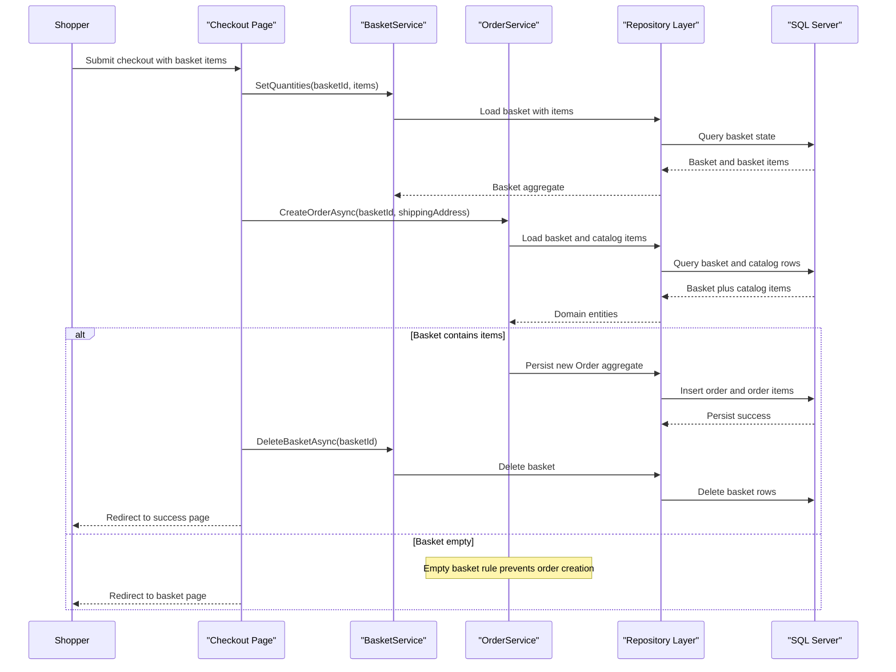

# Core Business Workflows

The application supports core e-commerce workflows including browsing catalog items, building a shopping basket, and placing orders. Business logic is concentrated in domain services and Razor/API entry points that enforce ordering and basket integrity rules.

## Domain Entities

| Entity | Service / Bounded Context | Description | Key Relationships |
|---|---|---|---|
| `CatalogItem` | Catalog Management | Sellable product in storefront/admin catalog | Belongs to `CatalogBrand` and `CatalogType` |
| `CatalogBrand` | Catalog Management | Product brand classification | One brand to many catalog items |
| `CatalogType` | Catalog Management | Product category/type classification | One type to many catalog items |
| `Basket` | Shopping Basket | Customer shopping cart aggregate | Owns many `BasketItem` entries |
| `BasketItem` | Shopping Basket | Chosen product and quantity in cart | Linked to basket and catalog item id |
| `Order` | Order Management | Placed purchase containing checkout snapshot | Owns many `OrderItem` entries and shipping address |
| `OrderItem` | Order Management | Purchased item snapshot at order time | Child of order aggregate |
| `ApplicationUser` | Identity | Authenticated customer/admin identity | Provides claims used in user/order workflows |

## Service-to-Domain Mapping

| Service | Domain Context | Owned Entities | External Dependencies |
|---|---|---|---|
| ApplicationCore Services (`BasketService`, `OrderService`) | Basket and Order lifecycle | Basket, BasketItem, Order, OrderItem | Repository abstractions, URI composer |
| Web (Razor/MVC) | Storefront user interactions | Uses basket and order aggregates | ApplicationCore services, MediatR handlers, Identity |
| PublicApi | Catalog and auth API | Catalog entity APIs and auth responses | Repository abstractions, Identity token claims |
| Infrastructure | Persistence and identity context | Catalog/order tables and identity tables | EF Core + SQL Server |

## Primary Workflows

### Workflow 1: Browse catalog and add item to basket

1. User browses catalog from Web UI or API (`/api/catalog-items`).
2. Catalog filtering and paging are applied in specification-based queries.
3. User posts selected item to basket page handler.
4. `BasketService.AddItemToBasket` creates basket if needed and merges quantities for existing items.
5. Updated basket is persisted and returned as view model.

### Workflow 2: Checkout and create order

1. Authenticated user submits basket checkout form (`/Basket/Checkout`).
2. Basket quantities are synchronized through `BasketService.SetQuantities`.
3. `OrderService.CreateOrderAsync` validates basket existence and non-empty checkout condition.
4. Service loads current catalog item data, snapshots item details, and creates `Order` + `OrderItem` aggregate.
5. Basket is deleted after successful order creation and user is redirected to success page.

### Workflow 3: Authentication and session token handling

1. API client posts credentials to `/api/authenticate`.
2. Identity sign-in result is evaluated and token returned for successful logins.
3. Web logout flow signs out cookie auth and caches token identifier for configured validity window.

## Cross-Service Data Flows

The Web and PublicApi projects share domain and infrastructure layers rather than remote service-to-service calls. Catalog and basket/order flows compose data by combining repository query results (catalog entities) with user session context (identity claims/cookies). Business degradation path is explicit for checkout: if basket is empty, an `EmptyBasketOnCheckoutException` triggers redirect back to basket view instead of placing an order.

## Business Workflow Sequence

## Business Rules & Decision Logic

- Basket merge rule: adding an existing catalog item increases quantity instead of duplicating basket lines.
- Checkout guard rules: basket must exist and contain at least one item before order creation.
- Order pricing rule: each `OrderItem` stores unit price and catalog snapshot at checkout time.
- Basket cleanup rule: zero-quantity items are removed from basket before persistence.
- Authorization rule: order history/detail and checkout flows require authenticated user context.
