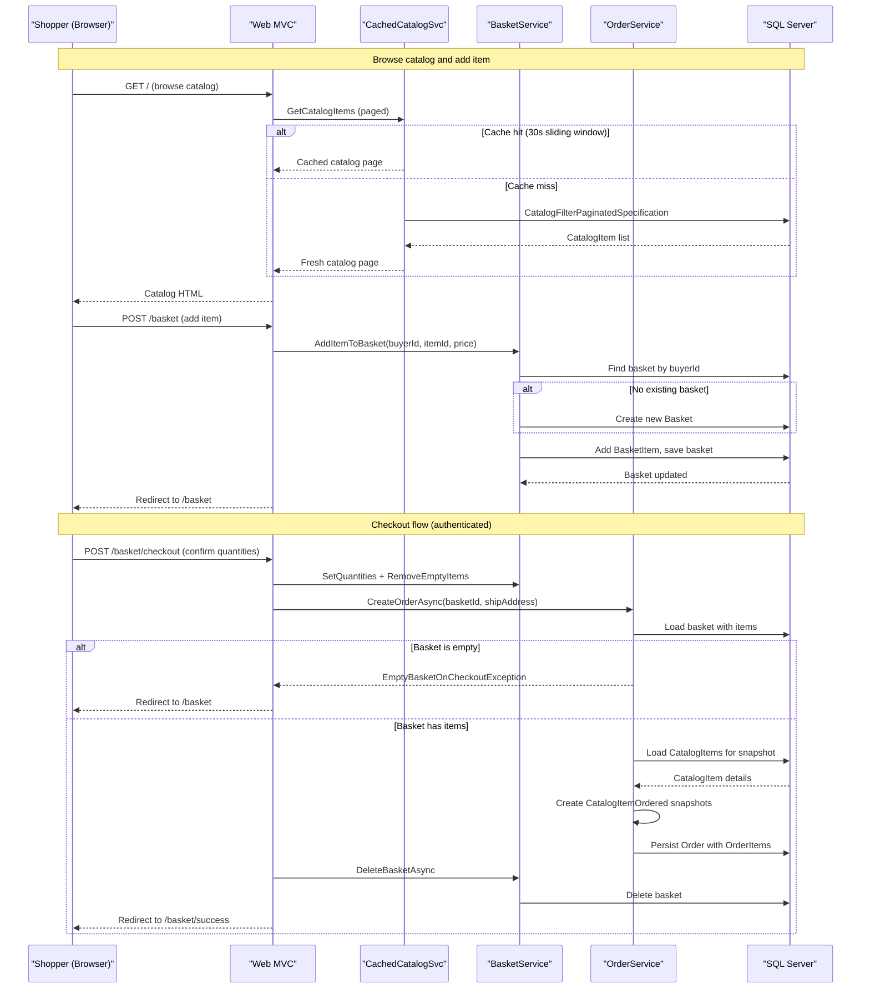

# Core Business Workflows

eShopOnWeb is an online e-commerce storefront that enables customers to browse a product catalog, manage a shopping basket, and place orders — while an administrative panel allows managers to maintain the product catalog.

## Domain Entities

| Entity | Service / Bounded Context | Description | Key Relationships |
|--------|--------------------------|-------------|------------------|
| CatalogItem | Catalog Management | A product for sale, identified by name, description, price, and image | Belongs to one CatalogBrand and one CatalogType |
| CatalogBrand | Catalog Management | A product brand classification (e.g., ".NET", "Azure") | Has many CatalogItems |
| CatalogType | Catalog Management | A product category classification (e.g., "T-Shirt", "Mug") | Has many CatalogItems |
| Basket | Shopping Basket | A customer's temporary shopping cart, identified by buyer ID | Contains many BasketItems |
| BasketItem | Shopping Basket | A single line item in a basket — references a catalog item, holds unit price and quantity | Belongs to one Basket; references CatalogItem by ID |
| Order | Order Management | A placed order with shipping address, buyer ID, and timestamp | Contains many OrderItems; immutable after creation |
| OrderItem | Order Management | A snapshot of a purchased item at the time of order | Belongs to one Order; holds a CatalogItemOrdered value object |
| CatalogItemOrdered | Order Management | Value object: immutable snapshot of catalog item name and image at order time | Embedded in OrderItem |
| Address | Order Management | Value object: shipping address (street, city, state, country, zip) | Owned by Order |
| Buyer | (Defined, unused) | Buyer profile entity with payment methods — defined but not used in active workflows | Has many PaymentMethods |
| ApplicationUser | Identity | ASP.NET Core Identity user — represents authenticated shoppers and admins | Referenced by Basket.BuyerId and Order.BuyerId |

## Service-to-Domain Mapping

| Service | Domain Context | Owned Entities | External Dependencies |
|---------|---------------|----------------|----------------------|
| Web (MVC Storefront) | Catalog Browsing, Basket Management, Order Placement | CatalogItem, CatalogBrand, CatalogType, Basket, BasketItem, Order, OrderItem (via Infrastructure) | Identity (ApplicationUser); IMemoryCache for catalog view caching |
| PublicApi (REST API) | Catalog Administration, Authentication | CatalogItem, CatalogBrand, CatalogType (CRUD); ApplicationUser (auth) | Identity (ApplicationUser via SignInManager) |
| BlazorAdmin (WASM) | Catalog Administration | None owned directly — accesses data via PublicApi REST calls | PublicApi endpoints for catalog CRUD |
| ApplicationCore (Domain) | All bounded contexts | Domain entities + business rules | No external dependencies (pure domain layer) |
| Infrastructure | Persistence | All EF Core entities via CatalogContext + AppIdentityDbContext | SQL Server / In-Memory DB |

## Primary Workflows

### Workflow 1: Browse Catalog and Add to Basket

**Actor**: Shopper (authenticated or anonymous)

1. Shopper visits the storefront index page (`GET /`).
2. `CachedCatalogViewModelService` checks in-process memory cache for the paged catalog list (brands, types, items). Cache entries use a 30-second sliding expiration — data served from cache reduces database load.
3. On cache miss, `CatalogViewModelService` queries `IReadRepository<CatalogItem>` using `CatalogFilterPaginatedSpecification` and returns a paginated `CatalogIndexViewModel`.
4. Shopper selects a product and submits a POST to `/basket` with product details.
5. `BasketService.AddItemToBasket(username, catalogItemId, price)` is called:
   - Queries for an existing basket for the buyer (anonymous cookie ID or username).
   - Creates a new `Basket` if none exists.
   - Calls `Basket.AddItem(catalogItemId, price, quantity)` — if the item already exists, increments its quantity.
   - Saves the basket via `IRepository<Basket>`.
6. Shopper is redirected to the basket page.

### Workflow 2: Basket Management and Checkout

**Actor**: Authenticated Shopper

1. Shopper views basket (`GET /basket`) — `BasketViewModelService` loads the basket for the current user (cookie-based anonymous ID or username after login).
2. **Anonymous-to-authenticated basket transfer**: When a previously anonymous shopper logs in, `BasketService.TransferBasketAsync(anonymousId, userName)` merges the anonymous basket into the user's basket and deletes the anonymous basket.
3. Shopper updates quantities or removes items (`POST /basket/update`) — `BasketService.SetQuantities` updates quantities and calls `Basket.RemoveEmptyItems()` to prune zero-quantity items.
4. Shopper proceeds to checkout (`GET /basket/checkout`) — page requires authentication (`[Authorize]`).
5. Shopper confirms order (`POST /basket/checkout` with item quantity confirmations):
   - `BasketService.SetQuantities` applies any last-minute quantity adjustments.
   - `OrderService.CreateOrderAsync(basketId, shippingAddress)` is called:
     - Loads basket with items using `BasketWithItemsSpecification`.
     - Guard: throws `EmptyBasketOnCheckoutException` if basket is empty.
     - Loads current `CatalogItem` records for all basket item IDs to resolve current names and image URIs.
     - Creates immutable `CatalogItemOrdered` value objects (snapshot of product name/image at order time).
     - Creates `Order` aggregate with buyer ID, shipping address, and list of `OrderItem` snapshots.
     - Persists the `Order` via `IRepository<Order>`.
   - `BasketService.DeleteBasketAsync` removes the basket after successful order placement.
6. On `EmptyBasketOnCheckoutException`, shopper is redirected back to the basket page.
7. On success, shopper is redirected to the checkout success page.

### Workflow 3: Admin — Catalog Item Management (BlazorAdmin)

**Actor**: Administrator (JWT-authenticated)

1. Admin navigates to `/admin` in the BlazorAdmin SPA — page requires `Administrators` role.
2. BlazorAdmin calls `GET /api/catalog-items?pageSize=N&pageIndex=0` to populate the catalog list.
3. Admin creates a new item: fills form → BlazorAdmin calls `POST /api/catalog-items` with `CreateCatalogItemRequest` (JWT required; Administrators role).
   - API guard: checks for duplicate name using `CatalogItemNameSpecification`. Throws `DuplicateException` if a match is found.
   - Creates `CatalogItem`, saves via repository, assigns a default placeholder image.
4. Admin edits an item: fills edit form → BlazorAdmin calls `PUT /api/catalog-items` (JWT required; Administrators role).
   - Loads item by ID; updates name, description, price, brand, type via domain methods.
5. Admin deletes an item: `DELETE /api/catalog-items/{id}` (JWT required; Administrators role).
6. Image upload is disabled for security (replaced with a default placeholder image).

### Workflow 4: User Authentication and JWT Issuance

**Actor**: User (Web or BlazorAdmin)

1. **MVC Cookie Auth**: Shopper signs in via the Identity UI (`/Account/Login`) — ASP.NET Core Identity validates credentials, issues a cookie session.
2. On sign-in, `UserController.GetCurrentUser()` is called by BlazorAdmin: `ITokenClaimsService.GetTokenAsync(username)` generates a JWT token containing user claims and roles. The JWT is returned to BlazorAdmin for subsequent REST API calls.
3. On sign-out (`POST /user/logout`): the session cookie is revoked; a revocation entry is stored in `IMemoryCache` keyed by `{userId}:{cookieIdentifier}` with a 60-minute TTL. Subsequent requests with the same cookie are rejected by `RevokeAuthenticationEvents.ValidatePrincipal`.
4. **PublicApi Direct Auth**: BlazorAdmin can also authenticate via `POST /api/authenticate` — password sign-in is performed by `SignInManager`, JWT token returned on success.

## Cross-Service Data Flows

eShopOnWeb is a single-deployment application — there are no independent microservices making remote calls to other services. The BlazorAdmin SPA is the only component that communicates across a network boundary (Blazor WASM → PublicApi REST). All other data flows are in-process:

- **BlazorAdmin → PublicApi**: BlazorAdmin fetches catalog data and submits mutations via the REST API. It holds a JWT token in local storage and passes it as a ****** on each admin request.
- **Web MVC → Infrastructure**: All catalog browsing, basket, and order data flows happen in-process through the domain service layer and EF Core repositories. There is no inter-process call for these operations.
- **Fallback behavior**: No circuit breaker is configured. If the PublicApi is unavailable, BlazorAdmin operations will fail with an HTTP error; no graceful degradation is implemented.

## Business Workflow Sequence

## Business Rules & Decision Logic

### Validation Rules

| Rule | Location | Behavior |
|------|----------|---------|
| Basket item quantity must be >= 0 | `BasketItem.SetQuantity` / `AddQuantity` | `Ardalis.GuardClauses.OutOfRange` — throws `ArgumentOutOfRangeException` |
| Basket must not be empty at checkout | `OrderService.CreateOrderAsync` | Custom guard `EmptyBasketOnCheckout` — throws `EmptyBasketOnCheckoutException` |
| Order buyer ID must not be null/empty | `Order` constructor | `Guard.Against.NullOrEmpty` |
| Catalog item name must be unique (admin create) | `CreateCatalogItemEndpoint` | `CatalogItemNameSpecification` count check — throws `DuplicateException` if name exists |
| Catalog item name, description must not be empty; price must be > 0 (admin update) | `CatalogItem.UpdateDetails` | `Guard.Against.NullOrEmpty`, `Guard.Against.NegativeOrZero` |
| CatalogItemOrdered catalog item ID must be >= 1 | `CatalogItemOrdered` constructor | `Guard.Against.OutOfRange` |
| Shopper must be authenticated to checkout | `CheckoutModel` | `[Authorize]` attribute — redirects to login if not authenticated |
| Admin write operations require Administrators role | `CreateCatalogItemEndpoint`, `UpdateCatalogItemEndpoint`, `DeleteCatalogItemEndpoint` | `[Authorize(Roles = "Administrators", AuthenticationSchemes = JwtBearer)]` |

### State Transitions

- **Basket lifecycle**: Created (on first add) → Updated (add/remove items, set quantities) → Deleted (after successful checkout or explicit deletion). Baskets are identified by buyer ID (anonymous cookie or username).
- **Order lifecycle**: Created (single-step, immutable) — no status progression is modeled. Orders cannot be modified after creation.
- **Anonymous-to-authenticated transition**: On login, `TransferBasketAsync` merges anonymous basket into the user's account basket and deletes the anonymous basket.

### Business Constraints

- **Product image upload disabled**: Image upload was removed due to a security concern (potential path traversal); catalog items receive a default placeholder image on creation.
- **Basket item aggregation**: Adding the same catalog item multiple times increments the existing item's quantity rather than creating a duplicate line item.
- **Order item snapshot immutability**: `CatalogItemOrdered` captures the product name and image URI at order creation time — future catalog edits do not retroactively change order records.
- **Cookie session revocation window**: Revoked sessions remain in `IMemoryCache` for 60 minutes; after that, the revocation entry expires and the same cookie (if still valid) would no longer be blocked.

### Transactions

No explicit `TransactionScope` or EF Core `BeginTransaction` calls are present. Each repository operation (e.g., `AddAsync`, `UpdateAsync`, `DeleteAsync`) is its own unit of work via EF Core's built-in `SaveChanges`. Checkout involves multiple sequential operations (SetQuantities → CreateOrder → DeleteBasket) without a wrapping transaction — a failure between steps could leave the basket un-deleted without losing the order.

### Error Handling

- `EmptyBasketOnCheckoutException` — caught in `CheckoutModel.OnPost`, redirects to basket page.
- `DuplicateException` — thrown by `CreateCatalogItemEndpoint`, propagates as an unhandled exception (no global exception middleware mapping it to a specific HTTP status code).
- `Guard.Against.*` violations — propagate as `ArgumentException` / `ArgumentNullException`; handled by ASP.NET Core's default developer exception page or production error page.
