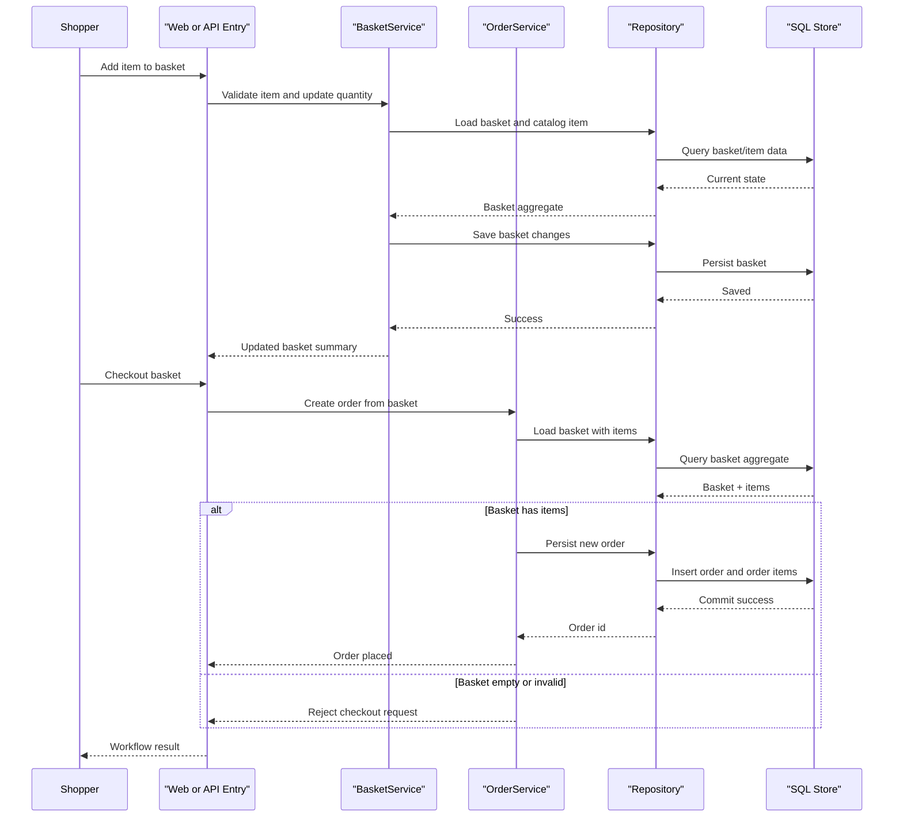

# Core Business Workflows

The application supports online catalog browsing, basket management, and checkout/order lifecycle for authenticated users. Business behavior is implemented through application services and repository-backed aggregate roots.

## Domain Entities

| Entity | Service / Bounded Context | Description | Key Relationships |
|---|---|---|---|
| CatalogItem | Catalog Management | Sellable product entry with pricing/media metadata | Linked to CatalogBrand and CatalogType |
| CatalogBrand | Catalog Management | Product brand taxonomy | One brand to many catalog items |
| CatalogType | Catalog Management | Product category taxonomy | One type to many catalog items |
| Basket | Shopping Context | Buyer shopping cart aggregate | Contains BasketItem entries |
| BasketItem | Shopping Context | Product selection with quantity in basket | References CatalogItem by identifier |
| Order | Order Context | Confirmed checkout record for a buyer | Contains OrderItem lines and shipping address |
| OrderItem | Order Context | Snapshot of purchased item and quantity | Child of Order aggregate |

## Service-to-Domain Mapping

| Service | Domain Context | Owned Entities | External Dependencies |
|---|---|---|---|
| Web host | Storefront and account workflow | Basket, Order views, user account interactions | ApplicationCore services, Identity, Catalog/Order repositories |
| PublicApi host | Catalog and authentication APIs | Catalog DTO contracts, token issuance | ApplicationCore services, repositories, identity context |
| ApplicationCore | Domain logic orchestration | Basket, Order, Catalog entities (business rules) | Repository abstractions |
| Infrastructure | Persistence boundary | Catalog, basket, order, identity storage representations | EF Core + SQL Server/localdb |

## Primary Workflows

### Workflow 1: Browse catalog and filter products

User requests catalog pages, optional brand/type filters are applied, and the system queries repository specifications to return paged product results. Business logic ensures consistent pagination and filter composition before rendering Web UI or API responses.

### Workflow 2: Manage basket and checkout

Authenticated user adds/updates/removes basket items. Basket service validates item existence, adjusts quantities, and persists basket state. During checkout, order service validates buyer basket state, converts basket lines into order items, and persists an Order aggregate.

### Workflow 3: Authenticate API client and manage catalog items

Client posts credentials to authenticate endpoint, receives JWT claims token, then performs catalog CRUD operations through protected API routes where request DTO validation and repository operations enforce catalog integrity.

## Cross-Service Data Flows

The main business flow is cross-layer rather than cross-microservice: UI/API entry points delegate to shared application services which read/write persistence through repository abstractions. Data composition happens when catalog data is merged with basket/order state during checkout and order display. If downstream persistence operations fail, exception middleware and error handling paths return controlled failures rather than partial order completion.

## Business Workflow Sequence

## Business Rules & Decision Logic

- Checkout requires a non-empty basket; empty basket attempts are rejected through domain exception logic.
- Order totals are computed from immutable order item snapshots (`unit price × units`) at order creation time.
- Basket mutation rules include quantity updates and automatic removal when quantity reaches zero.
- Authentication and authorization gates protect user/order-specific operations in Web and token-protected API operations in PublicApi.
