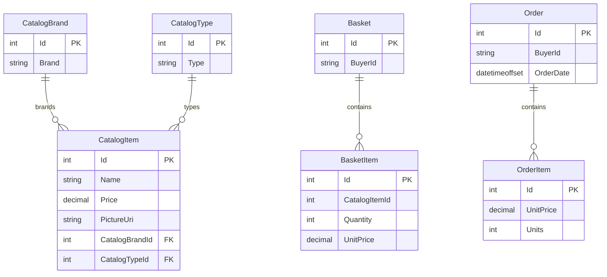

# Data Architecture & Persistence Layer

The solution uses EF Core-based persistence with a catalog/order context and an identity context backed primarily by SQL Server. The core domain model includes catalog, basket, order, and identity-related entities with repository abstractions mediating data access.

## Database Configuration

| Service/Module | DB Type | Profile | Driver | Connection | Migration Tool |
|---|---|---|---|---|---|
| Web | SQL Server | Development | EF Core SqlServer | LocalDB catalog/identity connections from `appsettings.json` | EF Core migrations + seeding |
| Web | SQL Server container | Docker | EF Core SqlServer | `sqlserver,1433` with SQL auth in `appsettings.Docker.json` | EF Core migrations + seeding |
| Web | SQL Server (Azure) | Production | EF Core SqlServer + Azure Key Vault secret lookup | Key-based connection string lookup from Key Vault | EF Core migrations + seeding |
| PublicApi | SQL Server | Development | EF Core SqlServer | LocalDB catalog/identity connections from `appsettings.json` | EF Core migrations + seeding |
| Infrastructure/Test paths | InMemory provider | Test/non-prod usage | EF Core InMemory | In-process provider for tests/simplified execution | Seed code |

## Data Ownership per Service

| Service | Tables Owned | ORM Framework | Caching | Notes |
|---|---|---|---|---|
| Catalog and Ordering (ApplicationCore + Infrastructure) | CatalogItem, CatalogBrand, CatalogType, Basket, BasketItem, Order, OrderItem | EF Core with Ardalis.Specification | No persistent cache | Aggregate roots enforce domain boundaries |
| Identity (Infrastructure.Identity) | ASP.NET Identity user/role tables | EF Core IdentityDbContext | No persistent cache | Token/auth concerns split from catalog data |
| Web Session/User Controller | No primary tables (uses identity + basket/order reads) | Repository abstraction over EF Core | IMemoryCache | Cache used for logout token tracking |

## Entity Model

## Key Repository Methods

| Service | Repository | Notable Methods | Purpose |
|---|---|---|---|
| Basket workflow | `IRepository<Basket>` | `FirstOrDefaultAsync(BasketWithItemsSpecification)`, `UpdateAsync`, `DeleteAsync` | Load basket with items, mutate quantities, clear basket after checkout |
| Order workflow | `IRepository<Order>` | `AddAsync(order)` | Persist new order aggregate from checkout |
| Catalog workflow | `IRepository<CatalogItem>` | `CountAsync(CatalogFilterSpecification)`, `ListAsync(CatalogFilterPaginatedSpecification)` | Filtered and paged catalog listing |
| Query-side order views | `IReadRepository<Order>` | `ListAsync(spec)` and `FirstOrDefaultAsync(spec)` in MediatR handlers | Read-only order history/detail projections |

## Caching Strategy

Caching is in-process and limited in scope: the Web app registers `AddMemoryCache` and uses `IMemoryCache` in `UserController` to store logout token identifiers with an absolute expiration window. No distributed cache provider or second-level ORM cache configuration is present.

## Data Ownership Boundaries

Data is logically separated by bounded context but physically stored in SQL Server databases managed by the solution. Catalog, basket, and ordering data are owned by the core domain context, while identity/auth tables are owned by `AppIdentityDbContext`. Cross-module data access occurs through repository abstractions rather than direct cross-context SQL joins in application code. The architecture follows a command/query-style separation in places (MediatR handlers for reads) but does not implement full distributed CQRS.

### Data Classification & Sensitivity

| Entity | Sensitive Fields | Classification (PII/PHI/PCI/None) | Controls in Place |
|---|---|---|---|
| `Order` (value object `Address`) | Street, city, state, country, zip code | PII | Authentication/authorization controls; no explicit field-level encryption configured in code |
| Identity user tables (`ApplicationUser`) | Username/email and identity claims | PII | ASP.NET Identity auth stack; no explicit masking/encryption-at-rest settings in repository code |
| `Basket`, `CatalogItem`, `CatalogBrand`, `CatalogType`, `OrderItem` | Product and quantity/price data | None | Standard app access controls |
