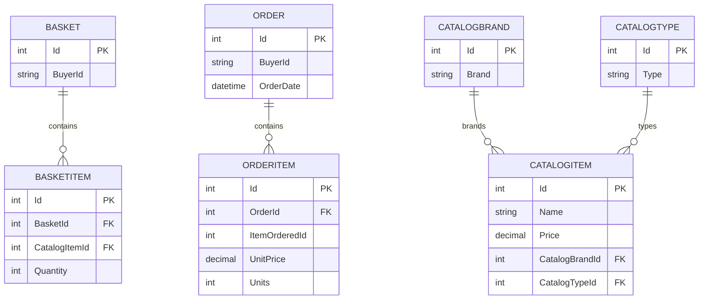

# Data Architecture & Persistence Layer

The data layer is centered on EF Core with two DbContexts for catalog/order and identity concerns. Persistence targets SQL Server/localdb with seeded initial data and repository abstractions used by application services.

## Database Configuration

| Service/Module | DB Type | Profile | Driver | Connection | Migration Tool |
|---|---|---|---|---|---|
| Web | SQL Server (or localdb) | Development/Docker | EF Core SqlServer provider | `ConnectionStrings:CatalogConnection`, `IdentityConnection` | EF Core migrations + seeders |
| PublicApi | SQL Server (or localdb) | Development/Docker/Test | EF Core SqlServer provider | `ConnectionStrings:CatalogConnection`, `IdentityConnection` | EF Core migrations + seeders |
| Web (production path) | Azure SQL (SQL Server compatible) | Non-development | EF Core SqlServer provider + Key Vault secret resolution | Key Vault-backed connection string lookup | EF Core migrations |

## Data Ownership per Service

| Service | Tables Owned | ORM Framework | Caching | Notes |
|---|---|---|---|---|
| Infrastructure/Catalog context | `CatalogItems`, `CatalogBrands`, `CatalogTypes`, `Baskets`, `BasketItems`, `Orders`, `OrderItems` | EF Core 8 | In-memory cache at app layer | Main commerce data boundary |
| Infrastructure/Identity context | ASP.NET Identity user/role tables | EF Core Identity | None explicit at persistence layer | Authentication/authorization data boundary |

## Entity Model

## Key Repository Methods

| Service | Repository | Notable Methods | Purpose |
|---|---|---|---|
| ApplicationCore | `IRepository<T>` / `IReadRepository<T>` | `AddAsync`, `UpdateAsync`, `DeleteAsync`, `ListAsync`, `FirstOrDefaultAsync` | Generic aggregate persistence and query operations |
| Basket workflows | `IRepository<Basket>` | `FirstOrDefaultAsync(BasketWithItemsSpecification)` | Load buyer basket with item graph |
| Order workflows | `IRepository<Order>` | `AddAsync(order)` with aggregate items | Persist completed checkout order |
| Catalog query workflows | `IRepository<CatalogItem>` | `ListAsync(CatalogFilterSpecification)`, `CountAsync` | Paged/filter catalog browsing |

## Caching Strategy

Web and PublicApi register in-memory cache services (`AddMemoryCache`) for application-level caching and transient request optimization. No distributed cache provider or explicit cache region/TTL configuration was identified in this repository.

## Data Ownership Boundaries

Data ownership is logically separated by DbContext rather than by independently deployed microservices: catalog/order entities are managed in `CatalogContext` and identity entities in `AppIdentityDbContext`. Cross-boundary interactions occur through in-process service calls and shared repository abstractions, not through external service-to-service database access. Read/write patterns are standard CRUD with specification-based querying; no CQRS split storage model was detected.

### Data Classification & Sensitivity

| Entity | Sensitive Fields | Classification (PII/PHI/PCI/None) | Controls in Place |
|---|---|---|---|
| Basket/Order | `BuyerId`, shipping address value object | PII | Access control through authenticated flows; no explicit field-level masking in code |
| ASP.NET Identity user | User identity/account attributes | PII | Identity framework protections and auth controls; no explicit masking/encryption-at-field declarations in repository |
| CatalogItem/CatalogBrand/CatalogType | Product metadata and pricing | None | Standard persistence controls |
