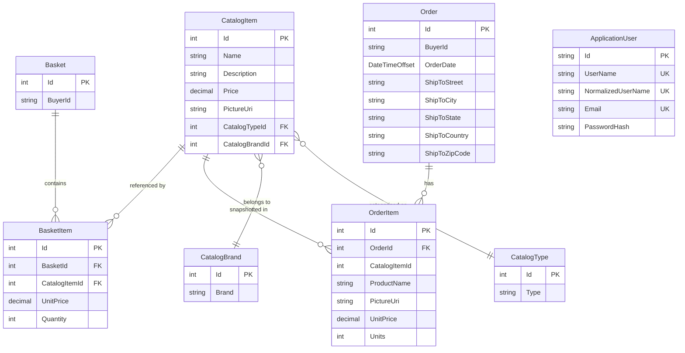

# Data Architecture & Persistence Layer

eShopOnWeb persists 9 domain entities across two EF Core 8 DbContexts backed by SQL Server (production) or an in-memory provider (development/test), with no distributed cache layer.

## Database Configuration

| Service/Module | DB Type | Profile/Environment | Driver | Connection | Migration Tool |
|---------------|---------|--------------------|---------|---------|----|
| Infrastructure (CatalogContext) | SQL Server | Production / Docker | `Microsoft.EntityFrameworkCore.SqlServer` 8.0.2 | `CatalogConnection` from `appsettings.json` or Azure Key Vault | EF Core Migrations (applied via `Database.Migrate()` at startup) |
| Infrastructure (CatalogContext) | In-Memory | Development (`UseOnlyInMemoryDatabase=true`) | `Microsoft.EntityFrameworkCore.InMemory` 8.0.2 | Named DB `"Catalog"` | None — schema created at runtime |
| Infrastructure (AppIdentityDbContext) | SQL Server | Production / Docker | `Microsoft.EntityFrameworkCore.SqlServer` 8.0.2 | `IdentityConnection` from `appsettings.json` or Azure Key Vault | EF Core Migrations (Identity) |
| Infrastructure (AppIdentityDbContext) | In-Memory | Development (`UseOnlyInMemoryDatabase=true`) | `Microsoft.EntityFrameworkCore.InMemory` 8.0.2 | Named DB `"Identity"` | None — schema created at runtime |

Schema management: `CatalogContextSeed.SeedAsync()` calls `Database.Migrate()` on SQL Server at application startup, then seeds brand, type, and item reference data if the tables are empty. Identity schema is managed by ASP.NET Core Identity's own EF Core migrations.

## Data Ownership per Service

| Service | Tables/Entities Owned | ORM Framework | Caching | Notes |
|---------|----------------------|---------------|---------|-------|
| Web + PublicApi (via Infrastructure) | Catalog (CatalogItem), CatalogBrand, CatalogType, Basket, BasketItem, Order, OrderItem | EF Core 8 (`CatalogContext`) | None | Single shared `CatalogContext`; HiLo sequences for Catalog/Brand/Type IDs |
| Web + PublicApi (via Infrastructure) | ApplicationUser, IdentityRole, IdentityUserClaim, IdentityUserLogin, IdentityUserToken, IdentityRoleClaim | EF Core 8 (`AppIdentityDbContext`) | IMemoryCache (user token blacklist) | Standard ASP.NET Core Identity schema; Web stores revoked tokens in `IMemoryCache` |

## Entity Model

**Notes:**
- `Order.ShipToAddress` is an EF Core owned entity (`Address` value object) stored as columns on the `Orders` table.
- `OrderItem.ItemOrdered` is an EF Core owned entity (`CatalogItemOrdered` value object) stored as columns on the `OrderItems` table — it captures a snapshot of the catalog item at order time.
- `CatalogItem` uses the HiLo sequence `catalog_hilo`; `CatalogBrand` uses `catalog_brand_hilo`; `CatalogType` uses `catalog_type_hilo`.
- `ApplicationUser` is the standard ASP.NET Core Identity user; its full schema (claims, roles, logins, tokens) is managed by `AppIdentityDbContext`.

## Key Repository Methods

| Service | Repository / Interface | Notable Methods | Purpose |
|---------|----------------------|-----------------|---------|
| Infrastructure | `EfRepository<T>` implements `IRepository<T>`, `IReadRepository<T>` | `GetByIdAsync(id)`, `ListAsync(spec)`, `AddAsync(entity)`, `UpdateAsync(entity)`, `DeleteAsync(entity)`, `CountAsync(spec)` | Generic CRUD via Ardalis.Specification.EntityFrameworkCore; all queries are expressed as `Specification<T>` objects |
| Infrastructure | `BasketQueryService` implements `IBasketQueryService` | `CountTotalBasketItems(username): Task<int>` | Performs a database-side `SUM(Quantity)` across all basket items for a given buyer — avoids loading full basket graph into memory |
| ApplicationCore | `IBasketService` | `AddItemToBasket`, `DeleteBasketAsync`, `TransferBasketAsync`, `SetQuantities` | Domain service operations; delegates persistence to `IRepository<Basket>` |
| ApplicationCore | `IOrderService` | `CreateOrderAsync(basketId, shipToAddress)` | Creates an `Order` from a `Basket`, saving item snapshots; delegates to `IRepository<Order>` |

Specifications used for querying (selected):

| Specification | Entity | Purpose |
|--------------|--------|---------|
| `CatalogFilterSpecification` | CatalogItem | Count filter by brand and type for pagination |
| `CatalogFilterPaginatedSpecification` | CatalogItem | Paged list by brand/type with skip/take |
| `CatalogItemNameSpecification` | CatalogItem | Duplicate name check on create |
| `BasketWithItemsSpecification` | Basket | Load basket including all `BasketItem` child entities |
| `CustomerOrdersWithItemsSpecification` | Order | Load all orders for a buyer including `OrderItem` children |

## Caching Strategy

| Layer | Provider | TTL | Pattern | Rationale |
|-------|----------|-----|---------|-----------|
| User token revocation | `IMemoryCache` (in-process) | `ConfigureCookieSettings.ValidityMinutesPeriod` | Write-on-logout, check-on-request | Tracks recently logged-out user sessions by identity+cookie-key to prevent token reuse after logout |

No distributed cache (Redis, Azure Cache for Redis, etc.) is configured. No EF Core second-level cache or query result caching is in place. Catalog data (brands, types, items) is read directly from SQL Server on every request without caching.

## Data Ownership Boundaries

**Shared logical database, separate DbContexts**: Both the Web storefront and the PublicApi share the same SQL Server instance (`CatalogDb` and `IdentityDb`), configured via the same `Infrastructure.Dependencies.ConfigureServices` method. There is no database-per-service isolation; all write operations flow through the same EF Core `CatalogContext`.

**Cross-service data access**: The BlazorAdmin panel accesses catalog and identity data exclusively through the PublicApi REST endpoints — it has no direct database access. The Web MVC storefront accesses data directly through the Infrastructure layer. No CQRS segregation exists; the same repository is used for reads and writes.

**Read/write patterns**: All entities use a single write model. There are no read-model projections or materialized views. The `BasketQueryService.CountTotalBasketItems` is the only optimized read path (performs aggregation at the database level), while all other queries load full entity graphs through the specification pattern.

### Data Classification & Sensitivity

| Entity | Sensitive Fields | Classification | Controls in Place |
|--------|-----------------|----------------|-------------------|
| Order | `BuyerId` (username/email), `ShipToAddress` (Street, City, State, Country, ZipCode) | PII | None — stored in plaintext in SQL Server; no encryption-at-rest, field masking, or audit logging configured |
| Basket | `BuyerId` (username/email) | PII | None — stored in plaintext |
| ApplicationUser | `UserName`, `Email`, `NormalizedEmail`, `PasswordHash` | PII | Passwords are hashed (ASP.NET Core Identity default PBKDF2); email stored in plaintext; no encryption-at-rest |
| OrderItem | `ProductName`, `PictureUri` (snapshot) | Non-sensitive | N/A |
| CatalogItem / CatalogBrand / CatalogType | Product catalog data | Non-sensitive | N/A |

**Summary**: PII is present in `Order` (shipping address) and `Basket`/`ApplicationUser` (buyer identifier / email). No payment card data (PCI) or health records (PHI) are stored. Passwords are protected by PBKDF2 hashing; all other sensitive fields are unencrypted plaintext with no field-level access controls or encryption-at-rest configured.
