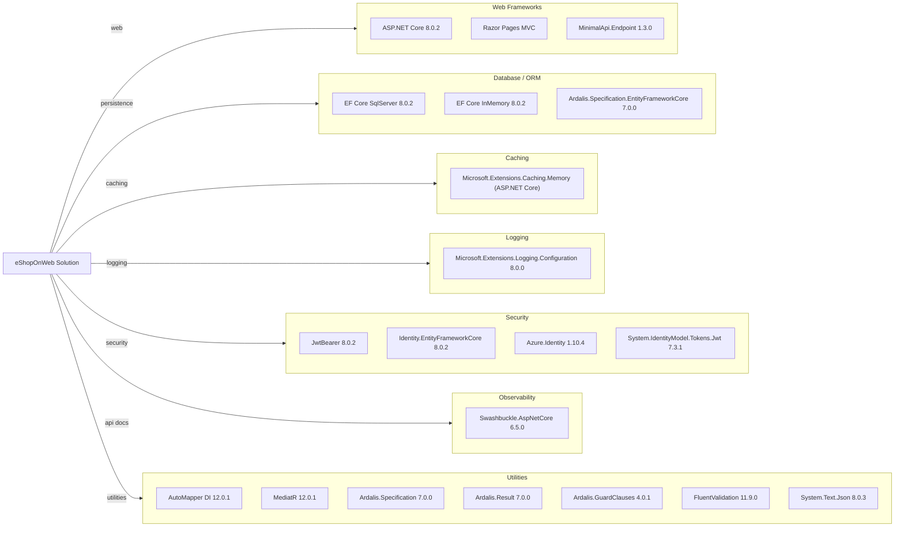

# Dependency Map

This eShopOnWeb solution uses centrally managed NuGet versions and shared dependencies across Web, PublicApi, and supporting libraries. The map below summarizes the major non-test dependency groups.

## Dependencies

### Dependency Summary

| Category | Count | Key Libraries | Notes |
|---|---:|---|---|
| Web Frameworks | 3 | ASP.NET Core, Razor Pages MVC, MinimalApi.Endpoint | Primary hosting stack for Web and PublicApi |
| Database / ORM | 3 | EF Core SqlServer, EF Core InMemory, Ardalis.Specification.EntityFrameworkCore | SQL + in-memory development/testing support |
| Caching | 1 | In-memory cache services | No distributed cache package declared |
| Logging | 1 | Microsoft.Extensions.Logging.Configuration | Console/app logging configuration |
| Security | 4 | JwtBearer, Identity EF Core, Azure.Identity, JWT tokens | Cookie/JWT auth plus Key Vault access support |
| Observability | 1 | Swashbuckle.AspNetCore | API discovery and Swagger UI |
| Utilities | 7 | AutoMapper, MediatR, Ardalis libraries, FluentValidation | Domain/service utility and mapping support |

### Version & Compatibility Risks

`System.Text.Json` (8.0.3) and `Azure.Identity` (1.10.4) are currently flagged by restore warnings for known advisories. Target framework is .NET 8; modernization should account for vulnerable package updates while planning future framework upgrades.

### Notable Observations

- Package versions are centrally managed in `Directory.Packages.props`, reducing version drift across projects.
- EF Core InMemory and SQL Server providers are both present, indicating environment-specific storage behavior.
- Both cookie/identity and JWT bearer dependencies are used, reflecting separate Web and API auth paths.
- Swagger/OpenAPI dependencies are present only for API-facing projects.

## Test Dependencies

| Framework | Version | Notes |
|---|---|---|
| xUnit | 2.7.0 | Primary unit/integration test framework |
| Microsoft.NET.Test.Sdk | 17.9.0 | Test execution infrastructure |
| coverlet.collector | 6.0.2 | Coverage collector |
| NSubstitute | 5.1.0 | Mocking in tests |
| MSTest.TestFramework / Adapter | 3.2.2 | Additional test stack packages declared centrally |

Total test-scope dependencies: 6

The solution has mature test tooling (unit, integration, functional, API integration) with mostly xUnit-centric execution.
