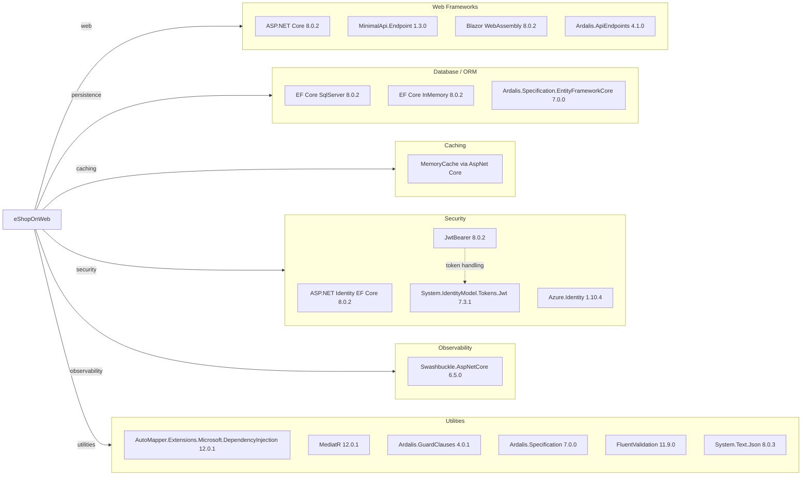

# Dependency Map

This .NET solution declares external dependencies through centralized package management (`Directory.Packages.props`) with approximately 40 production packages and additional test-only packages.

## Dependencies

### Dependency Summary

| Category | Count | Key Libraries | Notes |
|---|---:|---|---|
| Web Frameworks | 4 | ASP.NET Core, MinimalApi.Endpoint, Blazor WebAssembly | Multi-frontend setup (MVC/Razor + Minimal API + Blazor admin) |
| Database / ORM | 3 | EF Core SqlServer, EF Core InMemory, Ardalis.Specification.EntityFrameworkCore | SQL Server primary, InMemory used in non-prod/test scenarios |
| Caching | 1 | ASP.NET Core MemoryCache | Local in-process cache only |
| Security | 4 | ASP.NET Identity, JwtBearer, System.IdentityModel.Tokens.Jwt, Azure.Identity | JWT auth and optional Azure Key Vault integration |
| Observability | 1 | Swashbuckle.AspNetCore | Swagger/OpenAPI docs for Public API |
| Utilities | 6 | AutoMapper, MediatR, Ardalis packages, FluentValidation, System.Text.Json | Core application utility stack |

### Version & Compatibility Risks

The codebase targets `net8.0`, which is current LTS. However, `System.Text.Json 8.0.3` and `Azure.Identity 1.10.4` are already reported with known advisories during restore, and these should be prioritized for upgrade planning. `Microsoft.AspNetCore.Mvc 2.2.0` remains declared and is older than the rest of the ASP.NET Core 8 stack.

### Notable Observations

- Central package version management is enabled, simplifying solution-wide dependency upgrades.
- Security-critical dependencies (JWT/auth/token handling) are concentrated in `Web` and `PublicApi` projects.
- The solution uses both endpoint styles (`Ardalis.ApiEndpoints` and `MinimalApi.Endpoint`), indicating mixed API composition approaches.
- EF Core InMemory appears in production projects for environment-specific behavior and in tests for integration testing.

## Test Dependencies

| Framework | Version | Notes |
|---|---|---|
| xUnit | 2.7.0 | Primary unit/functional test framework |
| xUnit runner (VS + console) | 2.5.6 / 2.7.0 | Test execution in IDE and CLI |
| MSTest.TestFramework | 3.2.2 | Used by PublicApi integration tests |
| Microsoft.NET.Test.Sdk | 17.9.0 | Test host SDK |
| NSubstitute + Analyzer | 5.1.0 / 1.0.17 | Mocking framework |
| coverlet.collector | 6.0.2 | Coverage collection |
| Microsoft.AspNetCore.Mvc.Testing | 8.0.2 | ASP.NET integration test host |

Total test-scope dependencies: 9

Test infrastructure covers unit, integration, and functional scenarios; no dedicated contract-testing package was detected.
