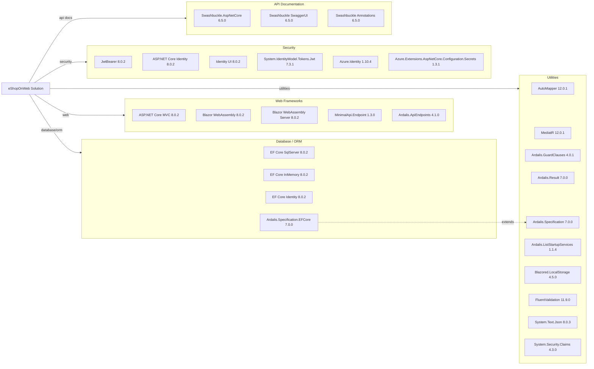

# Dependency Map

eShopOnWeb is an ASP.NET Core 8 multi-project solution with approximately 38 declared external dependencies (excluding test packages), managed centrally via `Directory.Packages.props`.

## Dependencies

### Dependency Summary

| Category | Count | Key Libraries | Notes |
|----------|-------|--------------|-------|
| Web Frameworks | 5 | ASP.NET Core MVC 8.0.2, Blazor WebAssembly 8.0.2, MinimalApi.Endpoint 1.3.0, Ardalis.ApiEndpoints 4.1.0 | Dual-front-end: MVC storefront + Blazor WASM admin |
| Database / ORM | 4 | EF Core SqlServer 8.0.2, EF Core InMemory 8.0.2, Ardalis.Specification.EFCore 7.0.0 | SQL Server production; In-Memory for dev/test |
| Security | 6 | JwtBearer 8.0.2, ASP.NET Core Identity 8.0.2, System.IdentityModel.Tokens.Jwt 7.3.1, Azure.Identity 1.10.4 | JWT for API; Cookies for MVC; Managed Identity for Azure |
| API Documentation | 3 | Swashbuckle.AspNetCore 6.5.0 | OpenAPI/Swagger for PublicApi project |
| Utilities | 10 | AutoMapper 12.0.1, MediatR 12.0.1, Ardalis.* 4-7, FluentValidation 11.9.0 | Heavy use of Ardalis suite patterns |

### Version & Compatibility Risks

All runtime packages target .NET 8.0, which is in active LTS support (until November 2026). The `System.IdentityModel.Tokens.Jwt` library is at version 7.3.1 (Microsoft.IdentityModel), which is current. `Ardalis.Specification` 7.0.0 and `Ardalis.Specification.EntityFrameworkCore` 7.0.0 are compatible with EF Core 8. `Swashbuckle.AspNetCore` 6.5.0 is the last stable Swashbuckle release before the project was archived; the Microsoft.AspNetCore.OpenApi package is the recommended replacement for .NET 9+. `Azure.Identity` 1.10.4 is slightly behind the latest 1.x releases but remains supported. `BlazorInputFile` 0.2.0 (declared but referenced in BlazorAdmin) is a community package with limited maintenance activity.

### Notable Observations

- **Ardalis pattern suite dominance**: The application leans heavily on the Ardalis library ecosystem (`GuardClauses`, `Result`, `Specification`, `ApiEndpoints`, `ListStartupServices`) — 5 separate packages — creating a soft vendor lock-in on a single author's opinionated libraries.
- **Duplicate MVC abstraction layers**: Both `Ardalis.ApiEndpoints` and `MinimalApi.Endpoint` are declared for the PublicApi project, providing two different approaches to endpoint encapsulation that serve overlapping purposes.
- **Swashbuckle end-of-life risk**: `Swashbuckle.AspNetCore` 6.5.0 is the last maintained version; Microsoft dropped first-party support for it in .NET 9 templates, recommending migration to `Microsoft.AspNetCore.OpenApi` for future upgrades.
- **Central version management**: `Directory.Packages.props` with `ManagePackageVersionsCentrally=true` enforces consistent package versions across all six projects, reducing version-conflict risk.

## Test Dependencies

| Framework | Version | Notes |
|-----------|---------|-------|
| xunit | 2.7.0 | Primary test framework |
| xunit.runner.visualstudio | 2.5.6 | VS/dotnet test runner integration |
| xunit.runner.console | 2.7.0 | CLI runner |
| Microsoft.NET.Test.Sdk | 17.9.0 | MSBuild test host |
| Microsoft.AspNetCore.Mvc.Testing | 8.0.2 | Integration test web application factory |
| NSubstitute | 5.1.0 | Mocking framework |
| NSubstitute.Analyzers.CSharp | 1.0.17 | Roslyn analyzer for NSubstitute |
| MSTest.TestAdapter | 3.2.2 | MSTest adapter (secondary) |
| MSTest.TestFramework | 3.2.2 | MSTest framework (secondary) |
| coverlet.collector | 6.0.2 | Code coverage collector |

Total test-scope dependencies: 10

The test stack is modern and well-rounded: xUnit 2.7 is the current stable release, `Microsoft.AspNetCore.Mvc.Testing` enables realistic end-to-end integration tests against the real HTTP pipeline, and `NSubstitute` provides clean mocking. Both xUnit and MSTest adapters are declared, suggesting tests may span both frameworks across different test projects. No contract-testing library (e.g., Pact.NET) is included.
