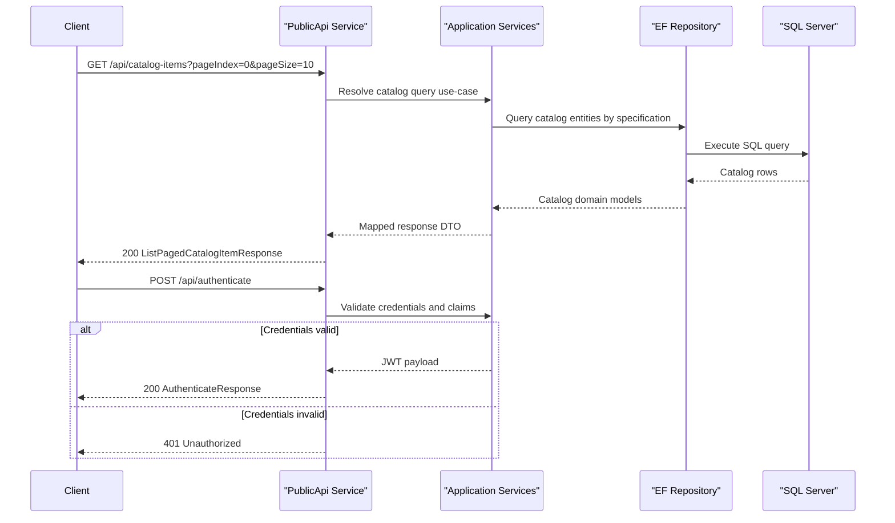

# API & Service Communication Contracts

The application exposes a REST-oriented API surface through a dedicated PublicApi project plus user/account endpoints in the Web project, with mostly synchronous request-response communication over HTTP.

## Service Catalog

| Service | Port | Category | Purpose |
|---|---|---|---|
| Web | 5000/5001 (dev), 8080 (docker) | API Layer | MVC storefront, Razor Pages, and account endpoints |
| PublicApi | 5098/5099 (dev), 8080 (docker) | API Layer | Catalog and authentication API contracts |
| ApplicationCore | N/A (library) | Business | Domain services, specifications, entities |
| Infrastructure | N/A (library) | Infrastructure | EF Core repositories and DbContext wiring |
| SQL Server container | 1433 | Infrastructure | Persistent catalog and identity relational store |

## API Endpoints Inventory

| Service | Method | Path | Request Type | Response Type |
|---|---|---|---|---|
| PublicApi | POST | /api/authenticate | AuthenticateRequest DTO | AuthenticateResponse DTO / 401 |
| PublicApi | GET | /api/catalog-items | query params (pageSize,pageIndex,catalogBrandId,catalogTypeId) | ListPagedCatalogItemResponse / 200 |
| PublicApi | GET | /api/catalog-items/{catalogItemId} | route param | CatalogItemDto / 200,404 |
| PublicApi | POST | /api/catalog-items | CreateCatalogItemRequest DTO | CreateCatalogItemResponse / 201 |
| PublicApi | PUT | /api/catalog-items | UpdateCatalogItemRequest DTO | UpdateCatalogItemResponse / 200,404 |
| PublicApi | DELETE | /api/catalog-items/{catalogItemId} | route param | status only / 204,404 |
| PublicApi | GET | /api/catalog-brands | none | CatalogBrandDto[] / 200 |
| PublicApi | GET | /api/catalog-types | none | CatalogTypeDto[] / 200 |
| Web | GET | /user | bearer token (header) | UserInfo endpoint payload |
| Web | POST | /user/logout | form/body | redirect or status |

## Management & Observability Endpoints

| Service | Endpoint | Custom Metrics (if any) |
|---|---|---|
| Web | /health | Health check aggregate response |
| Web | /home_page_health_check | Home page content health check |
| Web | /api_health_check | Public API availability health check |
| PublicApi | /swagger, /swagger/v1/swagger.json | Swagger/OpenAPI exposure |

## DTOs & Contracts

Public API contracts are defined via request/response DTO types under endpoint modules (for example `CreateCatalogItemRequest`, `ListPagedCatalogItemResponse`, `AuthenticateRequest`). Domain entities (`CatalogItem`, `Order`, `Basket`) remain service-level models owned by ApplicationCore/Infrastructure and are mapped to transport DTOs before being returned. DTOs include immutable C# `record` usage in selected response models and value-objects such as `CatalogItemDetails` (record struct). Serialization is handled by default ASP.NET Core JSON configuration and Swagger metadata in `Program.cs`.

## Communication Patterns

Communication is primarily synchronous HTTP between clients and Web/PublicApi. Internal communication is in-process via dependency-injected services and repositories. Data operations go through EF Core and SQL Server; memory cache is used in-process for read optimization. Retry/circuit-breaker frameworks are not explicitly configured in this solution (SQL retry-on-failure is enabled for production SQL configuration in Web). Service discovery and API gateway layers are not present; URLs are configured directly via appsettings and environment variables. Security posture includes cookie auth in Web and JWT bearer in PublicApi, with HTTPS redirection enabled in both hosts.

## Service Technology Matrix

| Service | Web | Data Access | Discovery | Gateway | Actuator | Cache | Metrics |
|---|---|---|---|---|---|---|---|
| Web | MVC + Razor Pages + Blazor host | EF Core via Infrastructure | None | No | Health checks | In-memory | Health endpoints |
| PublicApi | Minimal API + Controllers | EF Core via Infrastructure | None | No | Swagger | In-memory | Swagger/standard logging |
| Infrastructure | N/A | EF Core Repository | None | No | No | No | No |

## Service Communication Sequence

