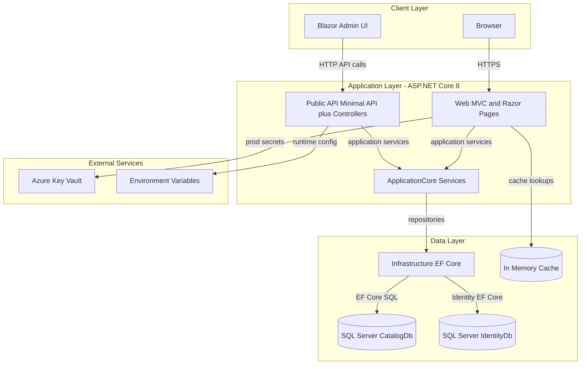
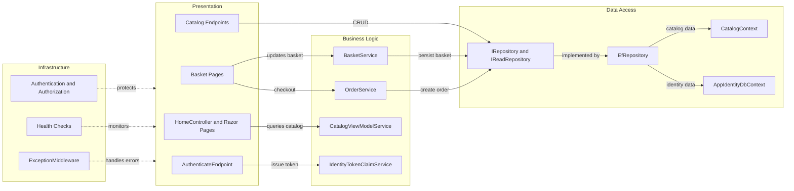

# Architecture Diagram

This repository is a .NET 8 multi-project solution centered on an ASP.NET Core web storefront plus a companion public API and shared domain/infrastructure libraries.

## Application Architecture

### Technology Stack Summary

| Layer | Technology | Version | Purpose |
|---|---|---|---|
| Presentation | ASP.NET Core MVC, Razor Pages, Blazor Server | .NET 8 | Web UI and admin UI |
| API | ASP.NET Core Minimal API + Controllers, Swagger | .NET 8 / Swashbuckle 6.5.0 | Programmatic catalog and auth endpoints |
| Business | ApplicationCore domain services + Ardalis libraries | .NET 8 | Core business logic and specifications |
| Data | EF Core + SQL Server providers | EF Core 8.0.2 | Persistence for catalog and identity data |
| Security/Config | ASP.NET Identity, Azure Key Vault, environment variables | Azure.Identity 1.10.4 | Authentication and secret/config sourcing |

### Data Storage & External Services

The solution uses SQL Server-backed `CatalogContext` and `AppIdentityDbContext` as primary storage, with optional in-memory provider for test/development switches. Runtime configuration and secrets are externalized through appsettings, environment variables, and Azure Key Vault in non-development environments.

### Key Architectural Decisions

- Uses layered separation with `ApplicationCore` domain logic and `Infrastructure` persistence concerns.
- Registers generic repository interfaces (`IRepository<>`, `IReadRepository<>`) mapped to `EfRepository<>` for data access abstraction.
- Supports environment-aware infrastructure wiring (LocalDB/in-memory in development, Azure Key Vault + SQL in production).

## Component Relationships

### Component Inventory

| Component | Layer | Type | Responsibility |
|---|---|---|---|
| HomeController and Razor Pages | Presentation | MVC Controller/PageModel | Render storefront pages and user flows |
| CatalogItem endpoints | Presentation | Minimal API endpoints | Expose catalog CRUD/list/get API contracts |
| AuthenticateEndpoint | Presentation | API endpoint | Validate credentials and return JWT |
| BasketService | Business Logic | Service | Basket lifecycle operations and pricing state |
| OrderService | Business Logic | Service | Checkout workflow and order creation |
| CatalogViewModelService | Business Logic | Service | Catalog filtering, pagination, and view-model composition |
| IRepository/IReadRepository | Data Access | Abstraction | Unified persistence contract |
| EfRepository | Data Access | Repository implementation | EF Core-backed repository behavior |
| CatalogContext/AppIdentityDbContext | Data Access | DbContext | ORM mapping for catalog and identity data |
| ExceptionMiddleware / health checks | Infrastructure | Middleware/monitoring | Cross-cutting exception and health reporting |
