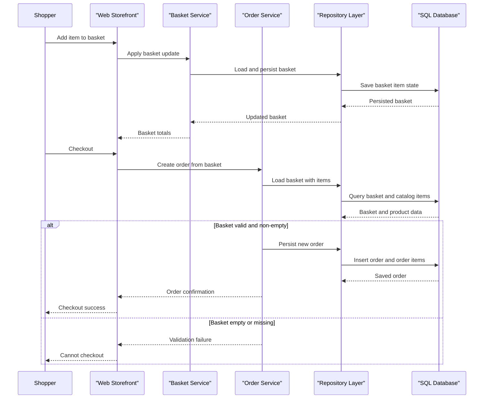

# Core Business Workflows

The application supports e-commerce storefront operations where users browse catalog items, manage baskets, authenticate, and place orders through web and API entry points.

## Domain Entities

| Entity | Service / Bounded Context | Description | Key Relationships |
|---|---|---|---|
| CatalogItem | Catalog | Sellable product and pricing unit | Linked to CatalogBrand and CatalogType |
| CatalogBrand | Catalog | Product branding taxonomy | One brand to many catalog items |
| CatalogType | Catalog | Product category taxonomy | One type to many catalog items |
| Basket | Shopping | User shopping session aggregate | Owns many BasketItems |
| BasketItem | Shopping | Line-item in basket | References CatalogItem |
| Order | Ordering | Completed purchase aggregate | Owns many OrderItems |
| OrderItem | Ordering | Frozen purchase line for checkout | Embeds ordered item snapshot |
| Identity User | Identity | Authenticated user account | Drives buyer-scoped data access |

## Service-to-Domain Mapping

| Service | Domain Context | Owned Entities | External Dependencies |
|---|---|---|---|
| Web | Storefront + account management | Basket, Order (through services) | PublicApi base URL, SQL contexts |
| PublicApi | Catalog and auth API | CatalogItem, CatalogBrand, CatalogType | SQL contexts, JWT settings |
| ApplicationCore | Domain logic | All aggregate contracts and domain services | Repository abstractions |
| Infrastructure | Persistence | EF entity mappings and DbContexts | SQL Server provider |

## Primary Workflows

### Workflow 1: Browse Catalog and Manage Basket

1. User opens storefront and requests paged catalog listing.
2. Catalog service layer queries repository using specifications and maps results to view models.
3. User adds/removes items in basket; basket aggregate enforces quantity and empty-item rules.
4. Basket state is persisted through repository abstraction.

### Workflow 2: Checkout and Create Order

1. Authenticated user starts checkout from basket page.
2. `OrderService` validates basket existence and non-empty constraint.
3. Service resolves current catalog item data, creates order item snapshots, and computes total.
4. Order aggregate is persisted as final business state transition from basket -> order.

### Workflow 3: API Catalog Management

1. Client invokes PublicApi catalog endpoints for list/get/create/update/delete.
2. Endpoints validate request payload shape and route parameters.
3. Repository operations update catalog entities and return API DTO responses.
4. Swagger-exposed contract enables external integration and documentation.

## Cross-Service Data Flows

The Web app and PublicApi both access shared domain services and repositories over the same database contexts. Client-side flows call Web pages or PublicApi endpoints directly (configured by base URLs), while internal composition occurs in-process via DI. Degradation behavior is simple: if database/auth dependencies fail, exception middleware/health endpoints surface failure rather than cross-service fallback aggregation.

## Business Workflow Sequence

## Business Rules & Decision Logic

- Basket items must have non-negative quantities; zero-quantity entries are removed from the aggregate.
- Checkout requires a non-empty basket (`EmptyBasketOnCheckout` guard) before order creation.
- Order total is derived from immutable order item snapshots (`unit price * units`) at checkout time.
- Catalog updates enforce required details (name/description/price > 0) through guard clause validation.
- Authentication/authorization gates sensitive account/order actions (cookie auth in Web, JWT in PublicApi).
