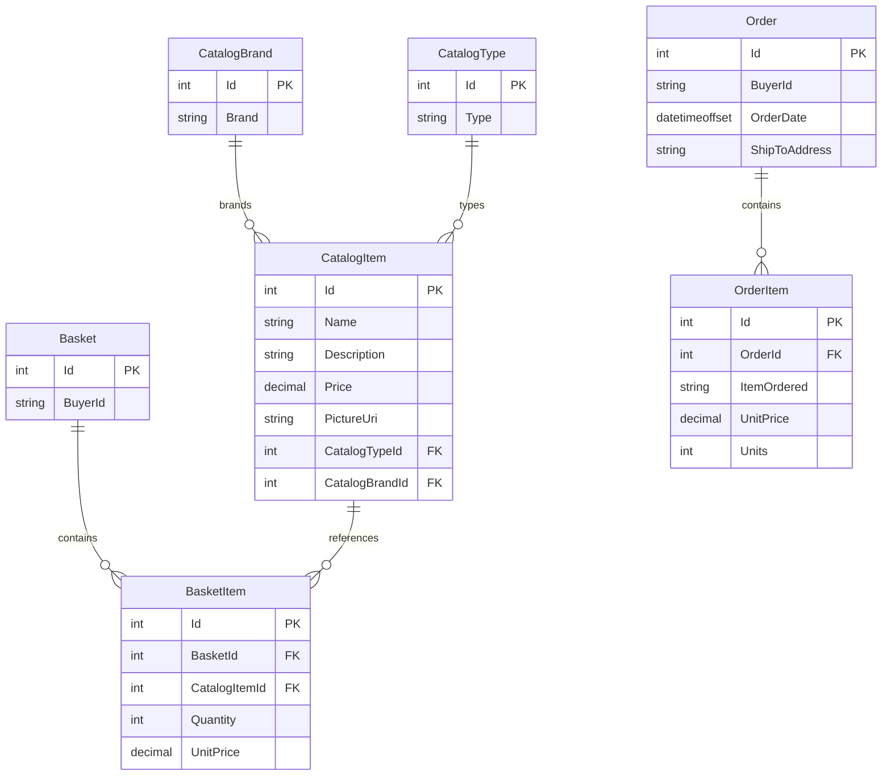

# Data Architecture & Persistence Layer

The data layer is centered on EF Core with SQL Server-backed catalog and identity stores, with aggregate-root entities in ApplicationCore and repository implementations in Infrastructure.

## Database Configuration

| Service/Module | DB Type | Profile | Driver | Connection | Migration Tool |
|---|---|---|---|---|---|
| Web | SQL Server LocalDB | Development | EF Core SqlServer | `ConnectionStrings:CatalogConnection`, `IdentityConnection` from appsettings | EF Core migrations endpoint enabled in development |
| Web | SQL Server (Azure/hosted) | Production | EF Core SqlServer + Azure Key Vault secret source | Connection string keys resolved via Key Vault references | EF Core migration-style initialization plus seed routines |
| Web/PublicApi | SQL Server container | Docker | EF Core SqlServer | `Server=sqlserver,1433` connection strings | Seed methods at startup |
| Web/PublicApi | InMemory provider (optional) | Toggle (`UseOnlyInMemoryDatabase`) | EF Core InMemory | in-process named DBs Catalog/Identity | None |

## Data Ownership per Service

| Service | Tables Owned | ORM Framework | Caching | Notes |
|---|---|---|---|---|
| Web + PublicApi | CatalogItems, CatalogBrands, CatalogTypes, Orders, OrderItems, Baskets, BasketItems | EF Core | In-memory cache | Shared CatalogContext for read/write operations |
| Web + PublicApi | AspNetUsers and Identity tables | EF Core Identity | None explicit | AppIdentityDbContext for authentication/authorization data |
| ApplicationCore | Domain entity definitions only | N/A (domain model) | N/A | Source-of-truth domain contracts consumed by Infrastructure |

## Entity Model

## Key Repository Methods

| Service | Repository | Notable Methods | Purpose |
|---|---|---|---|
| ApplicationCore OrderService | `IRepository<Basket>` | `FirstOrDefaultAsync(BasketWithItemsSpecification)` | Load basket with item graph for checkout |
| ApplicationCore OrderService | `IRepository<CatalogItem>` | `ListAsync(CatalogItemsSpecification)` | Bulk-load catalog item snapshots for order creation |
| ApplicationCore OrderService | `IRepository<Order>` | `AddAsync(order)` | Persist completed order aggregate |
| Web features | `IReadRepository<Order>` | `ListAsync`, `FirstOrDefaultAsync` with order specifications | Render order history/details |
| PublicApi endpoints | `IRepository<CatalogItem>` | `ListAsync`, `GetByIdAsync`, `AddAsync`, `UpdateAsync`, `DeleteAsync` | Expose catalog CRUD over API |

## Caching Strategy

The solution enables in-process memory caching via `AddMemoryCache()` in Web and PublicApi. Caching is used as application-level optimization rather than distributed cache coordination; no explicit TTL/eviction policy definitions were found in checked-in configuration. Client-side admin interactions also use browser local storage (`Blazored.LocalStorage`) for UI state.

## Data Ownership Boundaries

The solution uses a shared relational data store model across Web and PublicApi hosts, both wired to the same catalog and identity contexts rather than database-per-service isolation. Cross-layer data access follows repository abstraction boundaries (controllers/endpoints -> services -> repositories -> DbContext). CQRS separation is light-weight: read and write concerns are differentiated through `IReadRepository` and `IRepository` interfaces over the same underlying database.

### Data Classification & Sensitivity

| Entity | Sensitive Fields | Classification (PII/PHI/PCI/None) | Controls in Place |
|---|---|---|---|
| Basket / Order | BuyerId | PII (indirect identifier) | Application auth enforced; no field-level masking noted |
| ASP.NET Identity user records | username/email/password hash | PII | ASP.NET Identity hashing/auth model; no explicit masking in code |
| Catalog entities | product name/description/price | None | Standard application access controls |

No PHI or PCI-specific data fields were detected in the core catalog domain model.
