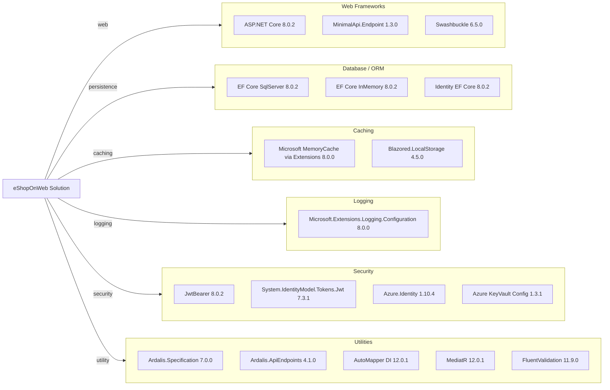

# Dependency Map

This .NET 8 solution declares a centrally managed package set across web, API, domain, and test projects, with dependencies grouped below by functional responsibility.

## Dependencies

### Dependency Summary

| Category | Count | Key Libraries | Notes |
|---|---:|---|---|
| Web Frameworks | 3 | ASP.NET Core, MinimalApi.Endpoint, Swashbuckle | Powers Web and PublicApi presentation layers |
| Database / ORM | 3 | EF Core SqlServer, EF Core InMemory, Identity EF Core | Relational persistence and test/dev in-memory mode |
| Caching | 2 | Memory cache, Blazored.LocalStorage | Server-side cache and client-side local storage |
| Logging | 1 | Microsoft.Extensions.Logging.Configuration | Console/config-based logging pipeline |
| Security | 4 | JwtBearer, Jwt, Azure.Identity, KeyVault config | Auth token flow and production secret retrieval |
| Utilities | 5 | Ardalis libs, AutoMapper, MediatR, FluentValidation | Domain patterns and mapping/validation helpers |

### Version & Compatibility Risks

Most dependencies align to .NET 8, but AppCAT and restore warnings indicate known advisories on `Azure.Identity` 1.10.4 and `System.Text.Json` 8.0.3. `Microsoft.AspNetCore.Mvc` 2.2.0 is legacy relative to the rest of the stack and may increase future upgrade friction.

### Notable Observations

- Package versions are centrally managed in `Directory.Packages.props`, simplifying coordinated upgrades.
- Solution contains both modern Minimal API style and classic MVC/Razor patterns.
- Includes both SQL Server and in-memory EF providers to support environment-dependent execution.
- Swagger and JWT dependencies are isolated in API-facing projects.

## Test Dependencies

| Framework | Version | Notes |
|---|---|---|
| xUnit | 2.7.0 | Primary unit/integration/functional test framework |
| xunit.runner.visualstudio | 2.5.6 | IDE and CI test execution |
| xunit.runner.console | 2.7.0 | CLI-based test execution |
| Microsoft.NET.Test.Sdk | 17.9.0 | Test host/runtime integration |
| MSTest.TestAdapter | 3.2.2 | Additional adapter support |
| MSTest.TestFramework | 3.2.2 | Additional test framework package |
| coverlet.collector | 6.0.2 | Code coverage collection |
| NSubstitute / analyzers | 5.1.0 / 1.0.17 | Test doubles and analyzer support |

Total test-scope dependencies: 8

Test infrastructure is mature with unit, integration, functional, and API integration test projects using xUnit as the dominant framework.
