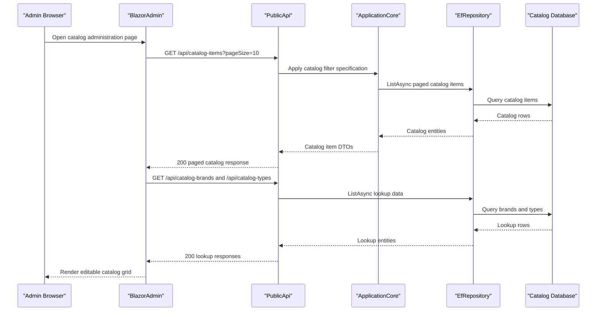

# API & Service Communication Contracts

The repository exposes a small set of human-facing HTTP surfaces: a storefront web app, a JSON-based public API for catalog and authentication operations, and a Blazor admin UI that consumes the JSON API synchronously over HTTP.

## Service Catalog

| Service | Port | Category | Purpose |
| --- | --- | --- | --- |
| `Web` | `https://localhost:5001`, `http://localhost:5000`, IIS Express `44315` | API Layer | Server-rendered storefront with Razor Pages, MVC controllers, identity UI, and health checks |
| `PublicApi` | `https://localhost:5099`, `http://localhost:5098` | API Layer | Catalog CRUD, lookup, and authentication endpoints used by admin and external clients |
| `BlazorAdmin` | `https://localhost:5001`, `http://localhost:5000` | Business | Browser-hosted admin client for catalog management |
| `sqlserver` (docker-compose) | `1433` | Infrastructure | SQL Edge container backing catalog and identity databases in Docker scenarios |

## API Endpoints Inventory

| Service | Method | Path | Request Type | Response Type |
| --- | --- | --- | --- | --- |
| `PublicApi` | POST | `/api/authenticate` | `AuthenticateRequest` body | `AuthenticateResponse` with token and sign-in flags |
| `PublicApi` | GET | `/api/catalog-items` | Query parameters `pageSize`, `pageIndex`, `catalogBrandId`, `catalogTypeId` | `ListPagedCatalogItemResponse` |
| `PublicApi` | GET | `/api/catalog-items/{catalogItemId}` | Route parameter `catalogItemId` | `GetByIdCatalogItemResponse` |
| `PublicApi` | POST | `/api/catalog-items` | `CreateCatalogItemRequest` body | `CreateCatalogItemResponse` |
| `PublicApi` | PUT | `/api/catalog-items` | `UpdateCatalogItemRequest` body | `UpdateCatalogItemResponse` |
| `PublicApi` | DELETE | `/api/catalog-items/{catalogItemId}` | Route parameter `catalogItemId` | `DeleteCatalogItemResponse` |
| `PublicApi` | GET | `/api/catalog-brands` | None | `ListCatalogBrandsResponse` |
| `PublicApi` | GET | `/api/catalog-types` | None | `ListCatalogTypesResponse` |
| `Web` | GET | `/User` | Authenticated cookie principal | `UserInfo` JSON |
| `Web` | POST | `/User/Logout` | Cookie-authenticated session | `200 OK` |
| `Web` | GET | `/Order/MyOrders` | Authenticated user context | MVC view model list from `GetMyOrders` |
| `Web` | GET | `/Order/Detail/{orderId}` | Route parameter `orderId` | MVC view model from `GetOrderDetails` |
| `Web` | GET and POST | `/Basket`, `/Basket/Checkout` | Cookie-based basket id, posted `BasketItemViewModel` list | Razor Pages, redirects, and order creation side effects |
| `Web` | GET and POST | `/Manage/*` | Identity profile forms and route values | MVC views for profile, password, 2FA, logins, and personal data flows |

## Management & Observability Endpoints

| Service | Endpoint | Custom Metrics (if any) |
| --- | --- | --- |
| `Web` | `/health` | None detected |
| `Web` | `/home_page_health_check` | None detected |
| `Web` | `/api_health_check` | None detected |
| `PublicApi` | `/swagger` | None detected |
| `PublicApi` | `/swagger/v1/swagger.json` | OpenAPI document |

## DTOs & Contracts

`PublicApi` uses dedicated request/response models such as `AuthenticateRequest`, `AuthenticateResponse`, `CatalogItemDto`, `ListPagedCatalogItemRequest`, `ListPagedCatalogItemResponse`, `CreateCatalogItemRequest`, `CreateCatalogItemResponse`, `UpdateCatalogItemRequest`, and `DeleteCatalogItemResponse`. The web storefront uses view-model contracts like `BasketViewModel`, `BasketItemViewModel`, `CatalogItemViewModel`, `OrderViewModel`, and `OrderDetailViewModel` for server-rendered pages. `CatalogItem.CatalogItemDetails` is an immutable `record struct`, while most HTTP contracts are mutable classes designed for JSON serialization via ASP.NET Core and `System.Text.Json`. Swagger is enabled through Swashbuckle; no protobuf or GraphQL schemas were found.

## Communication Patterns

Communication is primarily synchronous. `Web` and `PublicApi` call application services and repositories in-process, while `BlazorAdmin` uses `HttpClient` to call `PublicApi` endpoints such as `catalog-items`, `catalog-brands`, and `catalog-types`. There is no asynchronous messaging layer, service bus, or event broker. Resilience behavior is limited to SQL Server connection retry (`EnableRetryOnFailure`) in the production web host; no Polly-style circuit breaker or retry middleware was found for HTTP calls. Service discovery is static and configuration-driven through `baseUrls`. HTTPS redirection is enabled in both server apps; `Web` uses ASP.NET Core Identity with cookies, and `PublicApi` uses JWT bearer tokens with issuer/audience validation disabled by configuration defaults. Startup dependency ordering matters mainly in Docker, where both web-facing services depend on the `sqlserver` container.

## Service Technology Matrix

| Service | Web | Data Access | Discovery | Gateway | Actuator | Cache | Metrics |
| --- | --- | --- | --- | --- | --- | --- | --- |
| `Web` | MVC, Razor Pages, Blazor host | EF Core via repositories and MediatR queries | None | No | Health checks | `IMemoryCache` | Health checks only |
| `PublicApi` | Minimal API plus controllers | EF Core via repositories | None | No | Swagger/OpenAPI | None | None detected |
| `BlazorAdmin` | Blazor WebAssembly | HTTP to `PublicApi` only | Static `baseUrls` | No | None | Browser local storage | None detected |

## Service Communication Sequence

