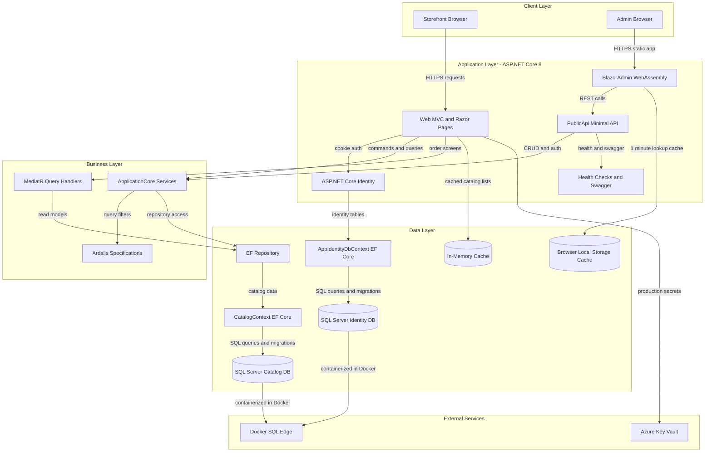
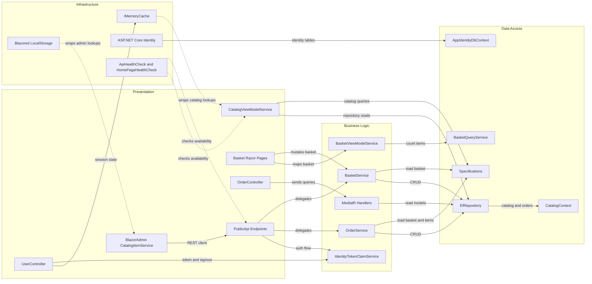

# Architecture Diagram

This repository implements eShopOnWeb as a layered ASP.NET Core solution with a server-rendered web storefront, a minimal-API based public API, and a Blazor admin client sharing the same domain and persistence layers.

## Application Architecture

### Technology Stack Summary

| Layer | Technology | Version | Purpose |
| --- | --- | --- | --- |
| Client | Razor Pages, MVC Views, Blazor WebAssembly | .NET 8 / ASP.NET Core 8.0.2 | Storefront UI, account flows, and admin catalog UI |
| Presentation | ASP.NET Core MVC, MinimalApi.Endpoint, Swashbuckle | ASP.NET Core 8.0.2, MinimalApi.Endpoint 1.3.0, Swashbuckle 6.5.0 | Hosts HTML pages, JSON endpoints, and Swagger documentation |
| Business | ApplicationCore services, MediatR, Ardalis.Specification | MediatR 12.0.1, Ardalis.Specification 7.0.0 | Encapsulates basket, order, and catalog business logic |
| Data | EF Core repositories and DbContexts | EF Core 8.0.2 | Persists catalog, basket, order, and identity data |
| Infrastructure | ASP.NET Core Identity, Azure Key Vault, MemoryCache | Identity 8.0.2, Azure.Identity 1.10.4 | Authentication, secret loading, and caching |

### Data Storage & External Services

The solution stores business data in a SQL Server-backed `CatalogContext` and authentication data in a separate `AppIdentityDbContext`. Development and tests can switch to EF Core InMemory stores, Docker scenarios point both connection strings at a SQL Edge container, and production web deployments optionally pull secret-backed connection string keys from Azure Key Vault.

### Key Architectural Decisions

- Uses a layered monolith: `Web`, `PublicApi`, and `BlazorAdmin` stay presentation-focused while `ApplicationCore` and `Infrastructure` own domain logic and persistence.
- Relies on a generic EF Core repository plus Ardalis specifications instead of exposing DbContext directly to UI code.
- Keeps admin catalog management decoupled from the storefront by having the Blazor admin UI talk to `PublicApi` over HTTP instead of sharing server-side page handlers.

## Component Relationships

### Component Inventory

| Component | Layer | Type | Responsibility |
| --- | --- | --- | --- |
| `CatalogViewModelService` | Presentation | UI service | Builds storefront catalog pages, filters, pagination, and lookup lists |
| `Basket` Razor Pages (`Index`, `Checkout`) | Presentation | Razor Page models | Adds items, updates quantities, and submits checkout |
| `OrderController` | Presentation | MVC controller | Displays a signed-in user's order history and details |
| `UserController` | Presentation | API controller | Returns current user info and handles logout/token refresh |
| `PublicApi` catalog endpoints | Presentation | Minimal API endpoints | Exposes catalog CRUD and lookup APIs for admin and other clients |
| `BasketService` | Business Logic | Domain service | Creates baskets, merges anonymous baskets, and updates quantities |
| `OrderService` | Business Logic | Domain service | Converts a basket into an order snapshot and persists it |
| `BasketViewModelService` | Business Logic | Application service | Maps basket entities to web view models and item counts |
| MediatR order handlers | Business Logic | Query handlers | Produces read models for order listings and order details |
| `EfRepository<T>` | Data Access | Generic repository | Central repository abstraction over EF Core |
| `BasketQueryService` | Data Access | Query service | Executes aggregate basket item counts in SQL |
| `CatalogContext` | Data Access | EF Core DbContext | Persists catalog, basket, order, and buyer aggregates |
| `AppIdentityDbContext` | Data Access | EF Core Identity DbContext | Persists ASP.NET Core Identity users, roles, and claims |
| `IMemoryCache` wrappers | Infrastructure | Cache layer | Caches catalog pages, brands, and types in the web app |
| `Blazored.LocalStorage` decorators | Infrastructure | Client cache layer | Caches admin lookup and catalog data in the browser |
