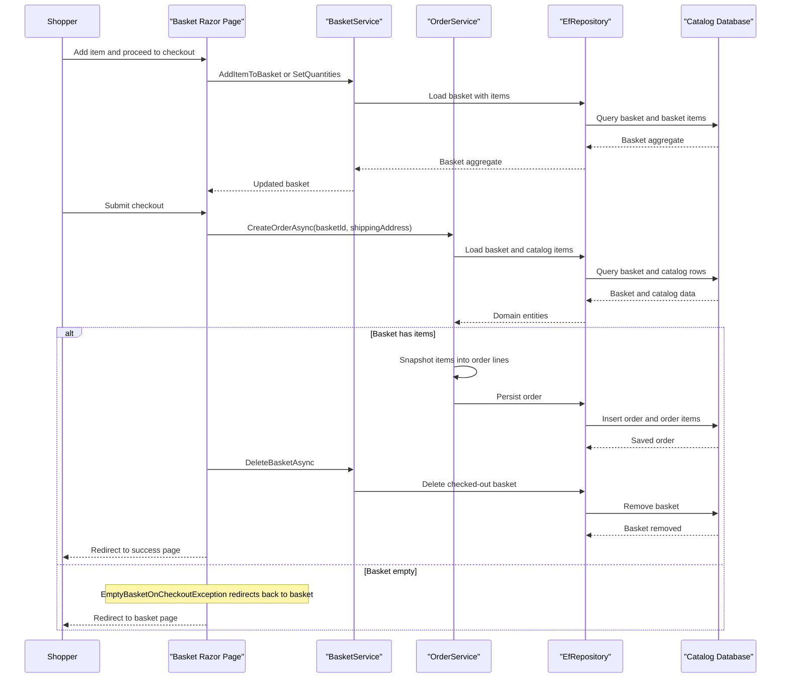

# Core Business Workflows

The application models a straightforward e-commerce storefront where users browse merchandise, manage a basket, complete checkout into an order, and administrators maintain the product catalog through a separate admin experience.

## Domain Entities

| Entity | Service / Bounded Context | Description | Key Relationships |
| --- | --- | --- | --- |
| `CatalogItem` | Catalog | Sellable merchandise entry with price, brand, type, and image metadata | Belongs to one `CatalogBrand` and one `CatalogType`; referenced by baskets and orders |
| `CatalogBrand` | Catalog | Brand lookup used to classify items | One-to-many with `CatalogItem` |
| `CatalogType` | Catalog | Product type lookup used for filtering | One-to-many with `CatalogItem` |
| `Basket` | Shopping | Customer or anonymous shopping basket | Owns multiple `BasketItem` entries |
| `BasketItem` | Shopping | Quantity and unit-price selection for a catalog item in a basket | References one `CatalogItem`; belongs to one `Basket` |
| `Order` | Ordering | Finalized purchase record with shipping address snapshot | Owns multiple `OrderItem` entries; associated with a buyer identifier |
| `OrderItem` | Ordering | Immutable line item snapshot captured at checkout time | Belongs to one `Order`; stores catalog snapshot details |
| `Buyer` | Identity / Ordering | Customer aggregate linking identity to orders and payment methods | Associated with one or more orders |

## Service-to-Domain Mapping

| Service | Domain Context | Owned Entities | External Dependencies |
| --- | --- | --- | --- |
| `Web` | Storefront and account management | Operates on `CatalogItem`, `Basket`, `Order`, identity user projections | `ApplicationCore`, `Infrastructure`, ASP.NET Core Identity |
| `PublicApi` | Catalog administration and authentication | Operates on `CatalogItem`, `CatalogBrand`, `CatalogType`, identity auth contracts | `ApplicationCore`, `Infrastructure`, JWT auth |
| `BlazorAdmin` | Admin catalog management | No owned entities; edits catalog via DTOs | `PublicApi` over HTTP |
| `ApplicationCore` | Basket and ordering rules | `Basket`, `BasketItem`, `Order`, `OrderItem`, `Buyer` | Repository abstractions, specifications |
| `Infrastructure` | Persistence and identity storage | Physical persistence for catalog/order and identity models | SQL Server / InMemory EF Core providers |

## Primary Workflows

### Workflow 1: Browse catalog and filter products

A shopper lands on the storefront, `CatalogViewModelService` applies optional brand/type filters with `CatalogFilterSpecification` and `CatalogFilterPaginatedSpecification`, and the resulting `CatalogItem` entities are mapped to lightweight view models. Brand and type lookups are cached in memory for 30 seconds to reduce repetitive reads.

### Workflow 2: Add items to basket and maintain quantities

The basket page creates or retrieves a buyer-scoped basket identifier, loads item pricing from the catalog repository, and then uses `BasketService.AddItemToBasket` or `BasketService.SetQuantities` to mutate basket state. The basket aggregate enforces item merging by catalog item id and removes zero-quantity lines before persistence.

### Workflow 3: Checkout basket into order

During checkout the user must be authenticated, the posted basket quantities are validated through standard model binding, and `OrderService.CreateOrderAsync` reloads the basket plus current catalog items. It guards against empty baskets, snapshots the current catalog item metadata into `CatalogItemOrdered`, persists the new `Order`, and finally deletes the checked-out basket.

### Workflow 4: Admin catalog maintenance

The Blazor admin UI fetches catalog items, brands, and types from `PublicApi`, allows create/edit/delete operations, and refreshes browser local-storage caches after mutations. This keeps administration separate from the storefront while reusing the same underlying domain model.

## Cross-Service Data Flows

Cross-project data flow is simple and synchronous. The most notable composed flow is the admin experience: `BlazorAdmin` concurrently fetches catalog items plus brand/type lookup data from `PublicApi`, then merges the lookup names into the catalog-item models before rendering. Storefront flows stay in-process and do not call external services beyond SQL Server and optional Key Vault. If the public API is unavailable, the admin UI cannot hydrate or mutate catalog data; if the SQL database is unavailable, both `Web` and `PublicApi` fail during startup seeding or runtime queries.

## Business Workflow Sequence

## Business Rules & Decision Logic

- Basket lines are keyed by catalog item id; adding the same item increases quantity instead of creating duplicate lines.
- Basket quantity updates reject negative values and remove zero-quantity rows, preserving a clean aggregate.
- Checkout requires a non-empty basket and an authenticated user; otherwise the flow redirects rather than creating an order.
- Order creation snapshots catalog item name, picture URI, and price into `OrderItem` data so later catalog edits do not rewrite past orders.
- Anonymous baskets use a long-lived cookie identifier and can be transferred into an authenticated user's basket during sign-in flows.
- Administrative catalog workflows rely on synchronous API calls and refresh cached browser data after each mutation to prevent stale product metadata.
