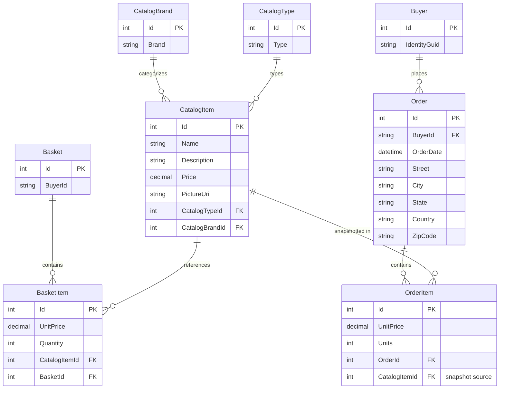

# Data Architecture & Persistence Layer

The solution uses EF Core over SQL Server for its primary persistence model, with a compact set of catalog, basket, order, buyer, and identity entities plus optional in-memory providers for tests and local-only execution.

## Database Configuration

| Service/Module | DB Type | Profile | Driver | Connection | Migration Tool |
| --- | --- | --- | --- | --- | --- |
| `Web` catalog store | SQL Server | Default / Development | `Microsoft.EntityFrameworkCore.SqlServer` | `ConnectionStrings:CatalogConnection` from `appsettings*.json`; Docker points to `sqlserver:1433` | EF Core migrations triggered by `CatalogContextSeed` |
| `Web` identity store | SQL Server | Default / Development | `Microsoft.EntityFrameworkCore.SqlServer` | `ConnectionStrings:IdentityConnection` from `appsettings*.json`; Docker points to `sqlserver:1433` | EF Core identity migrations triggered by `AppIdentityDbContextSeed` |
| `Web` and `PublicApi` production mode | SQL Server | Production | SQL Server provider with retry enabled | Connection string keys are resolved indirectly through Azure Key Vault-backed configuration | EF Core migrations during startup seeding |
| `Infrastructure` fallback mode | InMemory | `UseOnlyInMemoryDatabase=true` | `Microsoft.EntityFrameworkCore.InMemory` | No external connection; named stores `Catalog` and `Identity` | None |
| `PublicApi` | Shares catalog and identity databases | Development / Docker | Same providers as `Web` | Loads appsettings and delegates setup to `Infrastructure.Dependencies.ConfigureServices` | EF Core migrations during startup seeding |

## Data Ownership per Service

| Service | Tables Owned | ORM Framework | Caching | Notes |
| --- | --- | --- | --- | --- |
| `CatalogContext` consumers (`Web`, `PublicApi`) | `CatalogItems`, `CatalogBrands`, `CatalogTypes`, `Baskets`, `BasketItems`, `Orders`, `OrderItems`, `Buyers` | EF Core 8 | `IMemoryCache` in web projections, browser local storage in admin projections | Shared logical database for catalog, shopping basket, and order data |
| `AppIdentityDbContext` consumers (`Web`, `PublicApi`) | ASP.NET Core Identity tables for users, roles, claims, logins | EF Core Identity | None | Separate DbContext and connection string for identity concerns |
| `BlazorAdmin` | None | None direct | Browser local storage | Reads and mutates catalog data only through `PublicApi` |
| `ApplicationCore` | Domain model only | None direct | None | Owns aggregate definitions but not physical connection management |

## Entity Model

## Key Repository Methods

| Service | Repository | Notable Methods | Purpose |
| --- | --- | --- | --- |
| `ApplicationCore` | `IRepository<Basket>` via `EfRepository<Basket>` | `FirstOrDefaultAsync(BasketWithItemsSpecification)`, `AddAsync`, `UpdateAsync`, `DeleteAsync` | Load baskets with items, mutate quantities, merge anonymous baskets, and delete checked-out baskets |
| `ApplicationCore` | `IRepository<CatalogItem>` via `EfRepository<CatalogItem>` | `ListAsync(CatalogItemsSpecification)`, `CountAsync(CatalogFilterSpecification)` | Support storefront filtering, basket item enrichment, and order snapshot creation |
| `ApplicationCore` | `IRepository<Order>` via `EfRepository<Order>` | `AddAsync`, `ListAsync(CustomerOrdersSpecification)`, `FirstOrDefaultAsync(OrderWithItemsByIdSpec)` | Persist orders and read order history/details |
| `Infrastructure` | `BasketQueryService` | `CountTotalBasketItems(string username)` | Executes basket item aggregation in SQL rather than in memory |
| `ApplicationCore` | Specifications | `CatalogFilterPaginatedSpecification`, `BasketWithItemsSpecification`, `CustomerOrdersWithItemsSpecification` | Encapsulate includes, paging, and buyer-scoped filters without exposing raw SQL |

## Caching Strategy

| Cache Layer | Provider | TTL / Expiration | Pattern | Rationale |
| --- | --- | --- | --- | --- |
| Storefront catalog lists, brands, and types | `IMemoryCache` | Sliding expiration of 30 seconds | Cache-aside | Reduces repeated lookup and paging queries for frequently viewed catalog pages |
| Admin catalog items and lookup data | `Blazored.LocalStorage` | One minute based on `DateCreated.AddMinutes(1)` | Cache-aside in browser | Keeps the Blazor admin UI responsive while avoiding constant API reads |
| Session / identity data | Cookie auth plus occasional logout marker in `IMemoryCache` | Absolute expiration tied to cookie validity period | Session support | Tracks logout invalidation without a distributed cache |

## Data Ownership Boundaries

The repository uses a shared-database monolith pattern. `Web` and `PublicApi` both depend on the same `CatalogContext` schema for catalog, basket, buyer, and order aggregates, and they share a separate identity schema through `AppIdentityDbContext`. There is no database-per-service isolation, no CQRS read store, and no cross-service REST data composition inside the server applications. Instead, module boundaries are enforced in code: `ApplicationCore` defines aggregates and specifications, `Infrastructure` owns EF mappings, and presentation projects access data through repositories or HTTP APIs.

### Data Classification & Sensitivity

| Entity | Sensitive Fields | Classification (PII/PHI/PCI/None) | Controls in Place |
| --- | --- | --- | --- |
| `Order` | `Street`, `City`, `State`, `Country`, `ZipCode`, `BuyerId` | PII | Access is mediated through authenticated web flows; no field-level masking or encryption settings were found in code |
| ASP.NET Identity user records | Username, email, password hash, claims | PII | Managed by ASP.NET Core Identity; no additional custom masking or encryption-at-rest settings were found in this repository |
| `Basket` | `BuyerId` cookie/user identifier | PII | Cookie-based identifier and authenticated user context; no custom encryption beyond framework defaults |
| `CatalogItem`, `CatalogBrand`, `CatalogType` | None | None | Public catalog metadata |
| `Buyer` | `IdentityGuid` | PII | Stored as part of order ownership; no explicit masking or encryption configuration found |

No PHI or PCI-specific entities were detected in the modeled domain.
