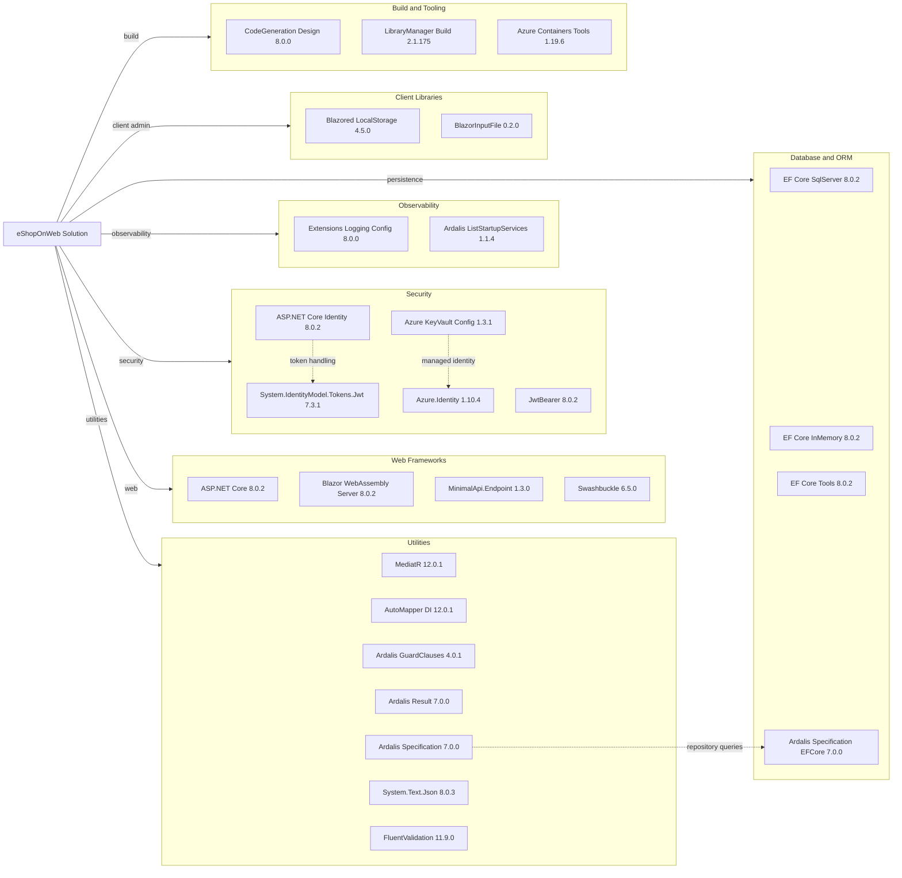

# Dependency Map

This .NET solution uses centrally managed NuGet versions with roughly 30 runtime-oriented dependencies across the application projects and 7 additional test-only libraries.

## Dependencies

### Dependency Summary

| Category | Count | Key Libraries | Notes |
| --- | --- | --- | --- |
| Web Frameworks | 4 | ASP.NET Core, Blazor WebAssembly Server, MinimalApi.Endpoint, Swashbuckle | Mixes MVC/Razor UI with endpoint-style JSON APIs and a Blazor admin client |
| Database / ORM | 4 | EF Core SqlServer, EF Core InMemory, EF Tools, Ardalis Specification EFCore | SQL Server is the primary store; InMemory is used for tests and local-only modes |
| Security | 5 | ASP.NET Core Identity, JwtBearer, Azure.Identity, Key Vault config | Cookie auth in `Web` and JWT bearer auth in `PublicApi` |
| Observability | 2 | Logging.Configuration, Ardalis.ListStartupServices | Health checks are framework-provided rather than separate packages |
| Utilities | 7 | MediatR, AutoMapper, GuardClauses, Result, Specification, System.Text.Json, FluentValidation | Domain orchestration and DTO mapping rely heavily on these packages |
| Client Libraries | 2 | Blazored.LocalStorage, BlazorInputFile | Support the browser-based admin experience |
| Build / Tooling | 3 | CodeGeneration.Design, LibraryManager.Build, Azure Containers Tools | Mainly scaffolding and container-development helpers |

### Version & Compatibility Risks

The upgrade assessment already flags several dependency concerns: `Azure.Identity` 1.10.4 and `System.Text.Json` 8.0.3 have security advisories, `AutoMapper.Extensions.Microsoft.DependencyInjection` is deprecated, and most ASP.NET Core / EF Core packages will require coordinated upgrades for a `net10.0` target. `Microsoft.VisualStudio.Azure.Containers.Tools.Targets` is also reported as incompatible in the `PublicApi` project.

### Notable Observations

- Central package management in `Directory.Packages.props` keeps versions aligned across all projects, which should simplify future upgrades.
- The solution uses both cookie-based web authentication and JWT bearer authentication, so security package updates have cross-project impact.
- EF Core appears in both runtime and test projects because the repository uses the same persistence stack with `InMemory` providers for integration-style testing.
- Most non-test dependencies are application-platform libraries rather than niche packages, which lowers migration complexity but increases the need for coordinated framework upgrades.

## Test Dependencies

| Framework | Version | Notes |
| --- | --- | --- |
| xUnit | 2.7.0 | Primary unit, integration, functional, and API integration test framework |
| xUnit runner Visual Studio | 2.5.6 | Test runner integration for IDE and CLI discovery |
| xUnit runner console | 2.7.0 | Console-based test execution support |
| Microsoft.NET.Test.Sdk | 17.9.0 | Shared .NET test host infrastructure |
| MSTest.TestAdapter | 3.2.2 | Present only in `PublicApiIntegrationTests`; upgrade assessment marks it deprecated |
| MSTest.TestFramework | 3.2.2 | Present only in `PublicApiIntegrationTests`; upgrade assessment marks it deprecated |
| NSubstitute / Analyzer | 5.1.0 / 1.0.17 | Mocking and analyzer support for unit and integration tests |
| coverlet.collector | 6.0.2 | Code coverage collection |

Total test-scope dependencies: 8

The test stack is healthy overall, but it mixes xUnit and MSTest-related packages. The deprecated MSTest packages in the API integration tests are the main test-infrastructure concern surfaced by the upgrade assessment.
