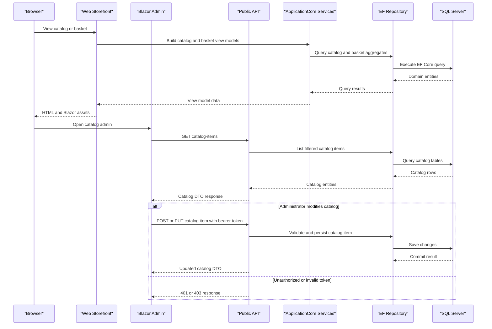

# API & Service Communication Contracts

The application exposes a storefront web surface and a Public API for catalog management and authentication. Communication is synchronous HTTP plus in-process service calls; no message broker or asynchronous integration contract was detected.

## Service Catalog

| Service | Port | Category | Purpose |
|---|---|---|---|
| Web | 5106 in Docker, launch settings for local HTTPS | API Layer | Razor Pages MVC storefront and host for the Blazor admin client |
| PublicApi | 5200 in Docker, launch settings for local HTTPS | API Layer | Catalog lookup and administration REST API plus authentication |
| BlazorAdmin | hosted by Web | API Layer | Browser-based catalog administration UI calling PublicApi |
| ApplicationCore | n/a | Business | Domain services, entities, repository interfaces, specifications |
| Infrastructure | n/a | Infrastructure | EF Core persistence, identity stores, migrations, logging adapters |
| sqlserver | 1433 in Docker | Infrastructure | Azure SQL Edge container for local Docker persistence |

## API Endpoints Inventory

| Service | Method | Path | Request Type | Response Type |
|---|---|---|---|---|
| PublicApi | POST | `/api/authenticate` | AuthenticateRequest body | AuthenticateResponse with token state |
| PublicApi | GET | `/api/catalog-items` | pageSize, pageIndex, catalogBrandId, catalogTypeId query | ListPagedCatalogItemResponse |
| PublicApi | GET | `/api/catalog-items/{catalogItemId}` | catalogItemId path | GetByIdCatalogItemResponse or 404 |
| PublicApi | POST | `/api/catalog-items` | CreateCatalogItemRequest body | CreateCatalogItemResponse, 201 |
| PublicApi | PUT | `/api/catalog-items` | UpdateCatalogItemRequest body | UpdateCatalogItemResponse or 404 |
| PublicApi | DELETE | `/api/catalog-items/{catalogItemId}` | catalogItemId path | DeleteCatalogItemResponse |
| PublicApi | GET | `/api/catalog-brands` | none | ListCatalogBrandsResponse |
| PublicApi | GET | `/api/catalog-types` | none | ListCatalogTypesResponse |
| Web | GET | `/Order/MyOrders` | authenticated user context | My orders view |
| Web | GET | `/Order/Detail/{orderId}` | orderId path | Order detail view |
| Web | GET POST | `/User/Logout` | form post for logout | Redirect or logout view |
| Web | GET POST | `/Manage/*` | identity management models | Account management views |
| Web | Razor Pages | `/Basket`, `/Basket/Checkout`, `/Admin/*` | Page models and forms | Storefront and admin pages |

## Management & Observability Endpoints

| Service | Endpoint | Custom Metrics |
|---|---|---|
| Web | `/health` | None detected |
| Web | `home_page_health_check` | Tagged health check for storefront home page |
| Web | `api_health_check` | Tagged health check that probes PublicApi base URL |
| Web | `/allservices` | Development ListStartupServices diagnostic middleware |
| PublicApi | `/swagger/v1/swagger.json`, Swagger UI | OpenAPI document, no custom metrics detected |

## DTOs & Contracts

PublicApi uses request and response classes per endpoint, including AuthenticateRequest, AuthenticateResponse, CatalogItemDto, CreateCatalogItemRequest and Response, UpdateCatalogItemRequest and Response, DeleteCatalogItemRequest and Response, GetByIdCatalogItemRequest and Response, ListPagedCatalogItemRequest and Response, CatalogBrandDto, CatalogTypeDto, and lookup response models. BlazorShared contains client-side gateway DTOs such as CatalogItem, CatalogBrand, CatalogType, LookupData, and response wrappers consumed by BlazorAdmin. Service-level domain entities remain in ApplicationCore; their persistence details are documented in `data-architecture.md`. Serialization uses System.Text.Json and ASP.NET Core defaults, with Swagger and schema filters for OpenAPI metadata.

## Communication Patterns

All communication is synchronous. Browser clients call Web and BlazorAdmin, BlazorAdmin calls PublicApi through HttpClient helper methods, and Web and PublicApi call ApplicationCore services and EF repositories in process. No service discovery, API gateway, circuit breaker, retry library, message queue, gRPC, or event bus was detected. SQL Server retry-on-failure is enabled in the Web production Azure SQL path; the shared local Infrastructure configuration does not specify retry policy. Docker Compose starts Web and PublicApi after sqlserver using `depends_on`, but no health-gated startup wait is configured. PublicApi supports JWT bearer authentication and administrator role authorization on write catalog endpoints; catalog read endpoints and authenticate are public. Web uses cookie authentication and authorizes checkout and identity management pages. HTTPS redirection is enabled in both Web and PublicApi, while Docker overrides expose HTTP inside containers.

## Service Technology Matrix

| Service | Web | Data Access | Discovery | Gateway | Actuator | Cache | Metrics |
|---|---|---|---|---|---|---|---|
| Web | MVC, Razor Pages, hosted Blazor | EF Core via Infrastructure | none | none | Health checks | IMemoryCache | Health status only |
| PublicApi | Minimal API, controllers, Swagger | EF Core via Infrastructure | none | none | Swagger | IMemoryCache | none detected |
| BlazorAdmin | Blazor WebAssembly | PublicApi over HttpClient | none | none | none | client service decorators | none detected |
| ApplicationCore | none | repository abstractions | none | none | none | none | none |
| Infrastructure | none | EF Core, Identity EF Core | none | none | none | none | none |

## Service Communication Sequence

