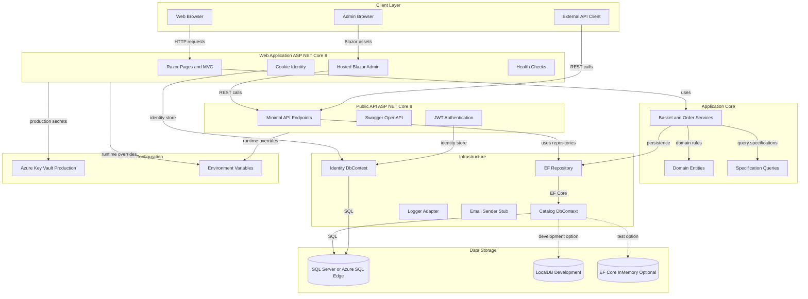
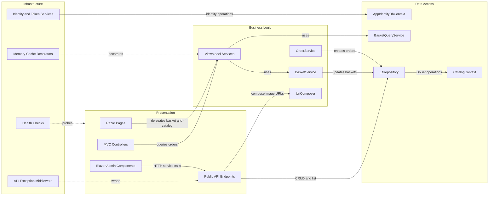

# Architecture Diagram

eShopOnWeb is a multi-project ASP.NET Core reference application with a Razor Pages MVC storefront, a Blazor WebAssembly admin client, a Public API, shared domain logic, and EF Core infrastructure.

## Application Architecture

### Technology Stack Summary

| Layer | Technology | Version | Purpose |
|---|---:|---:|---|
| Presentation | ASP.NET Core Razor Pages MVC | 8.0 | Storefront, identity UI, basket and order pages |
| Admin UI | Blazor WebAssembly hosted by Web | 8.0.2 packages | Catalog administration client |
| API | ASP.NET Core Minimal API and Ardalis.ApiEndpoints | 8.0 / 4.1.0 | Public catalog and authentication API |
| Business Logic | ApplicationCore services and specifications | net8.0 | Basket, order, catalog query rules |
| Data Access | EF Core, Identity EF Core, Ardalis Specification | 8.0.2 / 7.0.0 | Repository pattern over catalog and identity stores |
| Storage | SQL Server, LocalDB, Azure SQL Edge, EF InMemory | configured | Runtime and test persistence options |
| Security | ASP.NET Core Identity, Cookie auth, JWT bearer | 8.0.2 / 7.3.1 | Web session auth and API bearer tokens |

### Data Storage & External Services

The application uses EF Core contexts for catalog, basket, order, and identity data. Development defaults use SQL Server LocalDB, Docker uses Azure SQL Edge, production can load Azure SQL connection strings from Azure Key Vault, and tests or configured deployments can use EF Core InMemory databases.

### Key Architectural Decisions

- Uses a clean architecture style with ApplicationCore isolated from Infrastructure and Web concerns.
- Uses the repository and specification patterns for persistence queries through EF Core.
- Separates browser storefront concerns from Public API endpoints while sharing domain and infrastructure projects.

## Component Relationships

### Component Inventory

| Component | Layer | Type | Responsibility |
|---|---|---|---|
| Web | Presentation | ASP.NET Core web app | Storefront, Razor Pages, MVC controllers, hosted Blazor admin |
| PublicApi | Presentation | ASP.NET Core API | Catalog CRUD, lookup endpoints, authentication endpoint, Swagger |
| BlazorAdmin | Presentation | Blazor WebAssembly | Catalog administration UI and client-side services |
| ApplicationCore | Business Logic | Class library | Domain entities, services, specifications, interfaces |
| Infrastructure | Data Access | Class library | EF Core contexts, migrations, repositories, identity, logging |
| BasketService | Business Logic | Domain service | Create, merge, update, and delete customer baskets |
| OrderService | Business Logic | Domain service | Convert a checked-out basket into an order |
| EfRepository | Data Access | Repository | Generic repository backed by EF Core and Ardalis Specification |
| CatalogContext | Data Access | DbContext | Catalog, basket, and order persistence |
| AppIdentityDbContext | Data Access | DbContext | ASP.NET Core Identity persistence |
