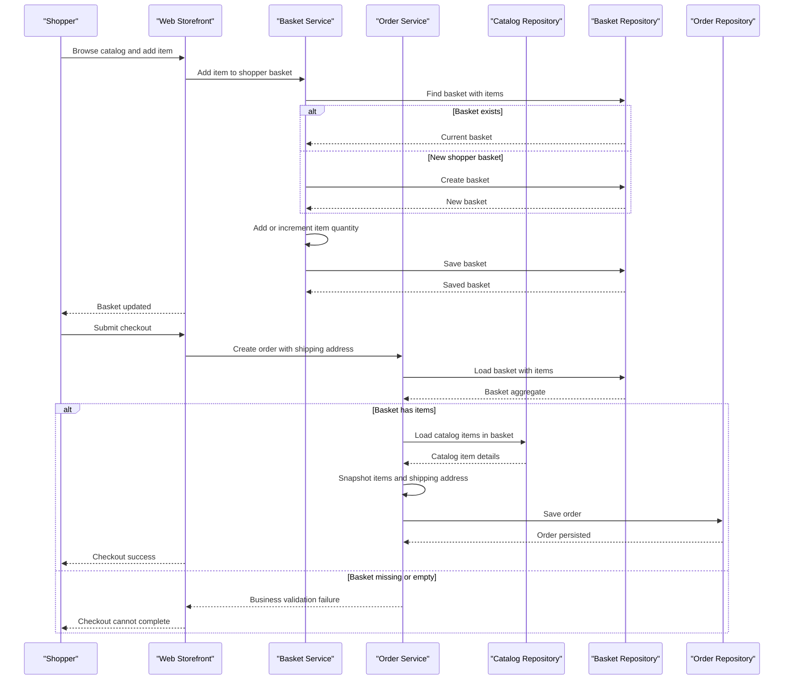

# Core Business Workflows

eShopOnWeb models an online store where shoppers browse a catalog, maintain a basket, authenticate, check out orders, and administrators manage catalog items.

## Domain Entities

| Entity | Service / Bounded Context | Description | Key Relationships |
|---|---|---|---|
| CatalogItem | Catalog Management | Sellable product with brand, type, description, price, and picture | Classified by CatalogBrand and CatalogType; referenced by BasketItem and OrderItem snapshots |
| CatalogBrand | Catalog Management | Product brand lookup | Groups catalog items |
| CatalogType | Catalog Management | Product type lookup | Groups catalog items |
| Basket | Shopping | Shopper basket before checkout | Contains BasketItems for a buyer identity |
| BasketItem | Shopping | Product quantity and price selected by shopper | Belongs to Basket and references a catalog item |
| Order | Ordering | Completed purchase for a buyer and shipping destination | Contains OrderItems created from basket contents |
| OrderItem | Ordering | Purchased item snapshot at checkout | Belongs to Order and stores item details at order time |
| ApplicationUser | Identity | Authenticated account for customers and administrators | Used by Web Identity and token authentication |
| Buyer and PaymentMethod | Customer Profile | Buyer profile and payment method token references | Payment methods belong to Buyer |

## Service-to-Domain Mapping

| Service | Domain Context | Owned Entities | External Dependencies |
|---|---|---|---|
| Web | Storefront, Basket, Orders, Identity UI | None directly; uses ApplicationCore aggregates | Infrastructure repositories, Identity, PublicApi health check |
| PublicApi | Catalog API and Authentication | Catalog DTOs over CatalogItem, CatalogBrand, CatalogType | Infrastructure repositories, Identity token service |
| BlazorAdmin | Catalog Administration | Client models mirroring catalog DTOs | PublicApi HTTP endpoints |
| ApplicationCore | Domain Model | Catalog, Basket, Order, Buyer aggregates | Repository abstractions and specifications |
| Infrastructure | Persistence and Identity | EF Core table mappings for all aggregates and identity tables | SQL Server or InMemory provider |

## Primary Workflows

### Workflow 1: Browse Catalog and Add Item to Basket

A shopper views catalog pages in Web. The catalog view model service uses catalog specifications through repositories and caches read-heavy lookup data. When the shopper adds an item, BasketService loads or creates the buyer basket, adds or increments a BasketItem, removes no data, and persists the updated aggregate.

### Workflow 2: Checkout Basket and Create Order

An authenticated shopper submits checkout with a shipping address. OrderService loads the basket with items, applies guard rules for a missing or empty basket, retrieves referenced catalog items in a batch, snapshots product identity and image URI into OrderItems, creates an Order aggregate, and persists it.

### Workflow 3: Catalog Administration

An administrator signs in, receives a bearer token through the authentication endpoint, and uses BlazorAdmin to call PublicApi. Catalog create checks for duplicate names, stores a new catalog item, assigns the placeholder image, and returns a DTO. Updates load the existing catalog item, mutate details, brand, and type, and return the updated DTO. Deletes remove catalog items through the repository.

### Workflow 4: View Customer Orders

An authenticated customer requests order history or details. Web MediatR handlers query orders by buyer identity and order ID using specifications, then return view models scoped to the current user.

## Cross-Service Data Flows

BlazorAdmin composes its catalog administration experience by calling PublicApi for catalog items, brands, and types, then merging those responses into page models in the browser. Web and PublicApi share the same Infrastructure persistence instead of using service-to-service calls for core data. No circuit breaker fallback is implemented; when PublicApi or the database is unavailable, BlazorAdmin or Web health checks surface failures instead of returning degraded catalog data.

## Business Workflow Sequence

## Business Rules & Decision Logic

- Basket creation is lazy: the first add-item operation creates a basket for the buyer when none exists.
- Basket item quantity updates remove empty items after applying submitted quantities.
- Anonymous baskets can be transferred to an authenticated user by merging all items and deleting the anonymous basket.
- Checkout requires a non-null basket and at least one basket item; guard clauses raise domain exceptions otherwise.
- Order items snapshot catalog item identity, name, picture URI, price, and quantity so later catalog changes do not rewrite order history.
- Catalog item creation checks for duplicate names before persistence and assigns a placeholder image rather than accepting arbitrary uploads.
- PublicApi catalog writes require administrator role authorization; Web checkout and order history require an authenticated user.
