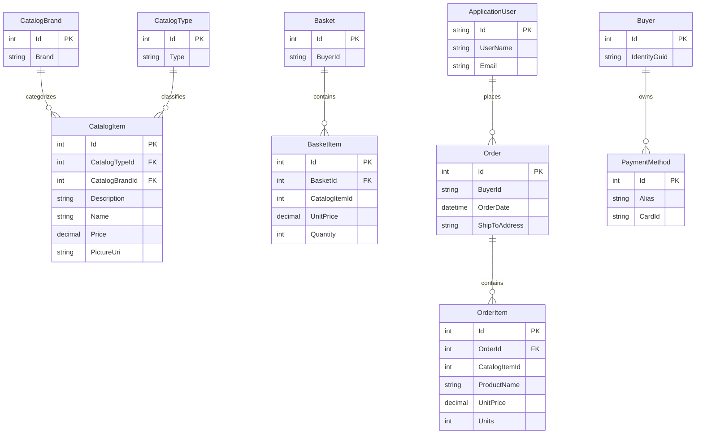

# Data Architecture & Persistence Layer

eShopOnWeb uses EF Core for catalog, basket, order, and identity persistence with two DbContext classes and a SQL Server primary database option. EF Core migrations and seed routines define and populate the data model.

## Database Configuration

| Service/Module | DB Type | Profile | Driver | Connection | Migration Tool |
|---|---|---|---|---|---|
| Web and PublicApi catalog data | SQL Server LocalDB | Development default | Microsoft.EntityFrameworkCore.SqlServer | CatalogConnection from appsettings | EF Core migrations under Infrastructure/Data/Migrations |
| Web and PublicApi identity data | SQL Server LocalDB | Development default | Microsoft.EntityFrameworkCore.SqlServer | IdentityConnection from appsettings | EF Core migrations under Infrastructure/Identity/Migrations |
| Web and PublicApi catalog and identity | Azure SQL Edge | Docker | Microsoft.EntityFrameworkCore.SqlServer | Docker appsettings and environment overrides | EF Core migrations at startup tooling path |
| Web production catalog and identity | Azure SQL Database compatible | Non-development | Microsoft.EntityFrameworkCore.SqlServer | Connection string loaded from Azure Key Vault configured keys | EF Core migrations present in Infrastructure |
| Tests or configured local mode | EF Core InMemory | UseOnlyInMemoryDatabase true | Microsoft.EntityFrameworkCore.InMemory | Named in-memory stores Catalog and Identity | No migrations for in-memory mode |

## Data Ownership per Service

| Service | Tables Owned | ORM Framework | Caching | Notes |
|---|---|---|---|---|
| Infrastructure CatalogContext | Catalog, CatalogBrands, CatalogTypes, Baskets, BasketItems, Orders, OrderItems | EF Core 8 | none at DbContext layer | Shared by Web and PublicApi through repositories |
| Infrastructure AppIdentityDbContext | AspNetUsers, AspNetRoles, AspNetUserClaims, AspNetRoleClaims, AspNetUserLogins, AspNetUserRoles, AspNetUserTokens | ASP.NET Core Identity EF Core | none at DbContext layer | Shared identity store for cookie and token authentication |
| Web view model services | no owned tables | Repository abstractions | IMemoryCache decorators | Caches catalog view models and lookup data |
| BlazorAdmin | no owned tables | PublicApi client DTOs | client-side decorator cache | Reads and writes catalog through PublicApi |

## Entity Model

## Key Repository Methods

| Service | Repository | Notable Methods | Purpose |
|---|---|---|---|
| ApplicationCore | IRepository Basket | FirstOrDefaultAsync with BasketWithItemsSpecification, UpdateAsync, DeleteAsync | Load, mutate, merge, and delete baskets |
| ApplicationCore | IRepository CatalogItem | CountAsync CatalogItemNameSpecification, ListAsync CatalogItemsSpecification | Duplicate catalog item detection and batch lookup during checkout |
| ApplicationCore | IRepository Order | AddAsync | Persist completed orders |
| Infrastructure | EfRepository | Inherited RepositoryBase methods | Generic EF Core repository implementation for aggregate roots |
| Infrastructure | BasketQueryService | Query basket details for buyer | Query optimized basket read model using CatalogContext |
| Web MediatR handlers | IReadRepository Order | FirstOrDefaultAsync CustomerOrdersWithItemsSpecification and OrderWithItemsByIdSpec | Retrieve customer order lists and details |

## Caching Strategy

Web registers IMemoryCache and wraps ICatalogViewModelService with CachedCatalogViewModelService to cache catalog page, brand, type, and item lookups. BlazorAdmin registers cached decorators for catalog item and lookup-data services on the client side. No distributed cache, EF second-level cache, Redis, cache TTL configuration, or write-through pattern was detected.

## Data Ownership Boundaries

The repository is a modular monolith rather than isolated database-per-service architecture. Web and PublicApi share the same catalog and identity persistence through Infrastructure; cross-module access is by in-process repository calls or PublicApi HTTP calls from BlazorAdmin rather than direct database access from the client. Order creation joins basket items with catalog item data in ApplicationCore using a batch catalog item specification. There is no CQRS split beyond query specifications and BasketQueryService read optimization.

### Data Classification & Sensitivity

| Entity | Sensitive Fields | Classification (PII/PHI/PCI/None) | Controls in Place |
|---|---|---|---|
| ApplicationUser | UserName, Email, password hashes in Identity tables | PII | ASP.NET Core Identity hashing; no field-level masking documented |
| Order | BuyerId, shipping address value object | PII | Authenticated access controls in Web; no encryption-at-rest configuration in app |
| Buyer | IdentityGuid | PII | Repository access only; no masking documented |
| PaymentMethod | Alias, CardId | PCI-related token reference | Stores card identifier reference, not raw card number; no field-level encryption documented |
| Basket | BuyerId | PII | Repository access only; no masking documented |
| CatalogItem, CatalogBrand, CatalogType | none | None | n/a |
