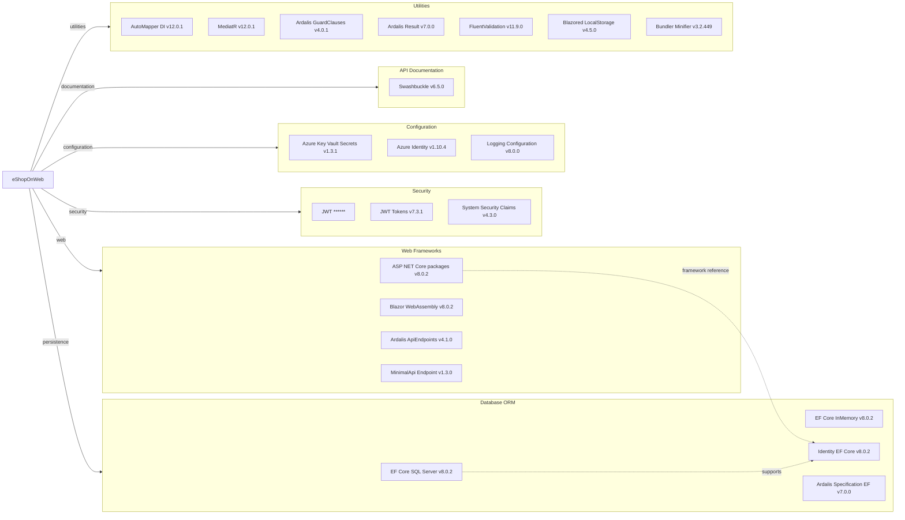

# Dependency Map

eShopOnWeb declares 36 central NuGet package versions across production and test projects, with ASP.NET Core, EF Core, Identity, Blazor, and Ardalis libraries as the primary dependency groups.

## Dependencies

### Dependency Summary

| Category | Count | Key Libraries | Notes |
|---|---:|---|---|
| Web Frameworks | 8 | ASP.NET Core packages, Blazor WebAssembly, Ardalis.ApiEndpoints, MinimalApi.Endpoint | Main web and API hosting stack |
| Database / ORM | 4 | EF Core SQL Server, EF Core InMemory, Identity EF Core, Ardalis Specification EF | SQL Server runtime and InMemory test option |
| Security | 3 | JWT Bearer, System.IdentityModel.Tokens.Jwt, System.Security.Claims | API bearer auth and claims generation |
| Observability / API Docs | 3 | Swashbuckle.AspNetCore packages | Swagger and OpenAPI UI for PublicApi |
| Configuration | 3 | Azure Key Vault Secrets, Azure Identity, Logging Configuration | Production secret loading and logging configuration |
| Utilities | 10 | AutoMapper, MediatR, Ardalis, FluentValidation, Blazored.LocalStorage | Mapping, mediator handlers, guard clauses, admin client helpers |
| Build Tooling | 5 | Web CodeGeneration, Containers Tools Targets, LibraryManager, BundlerMinifier | Build and development support packages |

### Version & Compatibility Risks

The solution targets net8.0 and uses centrally managed package versions. The .NET upgrade assessment flags several NuGet upgrade, deprecation, compatibility, and vulnerability findings for a future net10.0 move; packages such as older MVC tooling, container tooling, and some framework-included packages should be reviewed during modernization.

### Notable Observations

- Central package management in `Directory.Packages.props` keeps versions consistent across projects.
- EF Core SQL Server and EF Core InMemory are both declared, enabling runtime SQL Server and test or demo in-memory modes.
- PublicApi combines Minimal API endpoint registration with Ardalis.ApiEndpoints for authentication.
- Azure Key Vault and Azure Identity dependencies are only used by the Web project production startup path.

## Test Dependencies

| Framework | Version | Notes |
|---|---:|---|
| xUnit | 2.7.0 | Unit, integration, and functional tests |
| xUnit runner visualstudio | 2.5.6 | Test discovery in Visual Studio and dotnet test |
| xUnit runner console | 2.7.0 | Console runner dependency in UnitTests |
| Microsoft.NET.Test.Sdk | 17.9.0 | Common test SDK |
| Microsoft.AspNetCore.Mvc.Testing | 8.0.2 | Functional and API integration test hosting |
| MSTest TestFramework and Adapter | 3.2.2 | PublicApiIntegrationTests use MSTest |
| NSubstitute and analyzers | 5.1.0 / 1.0.17 | Test doubles and analyzer support |
| coverlet.collector | 6.0.2 | Coverage collector for PublicApiIntegrationTests |

Total test-scope dependencies: 9
The repository has mature unit, integration, functional, and API integration test infrastructure. The mixed xUnit and MSTest usage is intentional by project but should be considered when consolidating test tooling.
