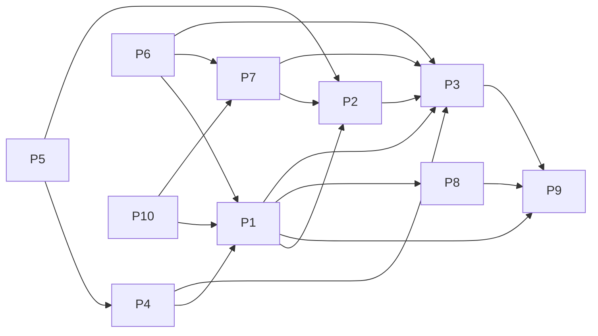

# Projects and dependencies analysis

This document provides a comprehensive overview of the projects and their dependencies in the context of upgrading to .NETCoreApp,Version=v10.0.

## Table of Contents

- [Executive Summary](#executive-Summary)
  - [Highlevel Metrics](#highlevel-metrics)
  - [Projects Compatibility](#projects-compatibility)
  - [Package Compatibility](#package-compatibility)
  - [API Compatibility](#api-compatibility)
  - [Binding Redirect Configuration](#binding-redirect-configuration)
- [Aggregate NuGet packages details](#aggregate-nuget-packages-details)
- [Top API Migration Challenges](#top-api-migration-challenges)
  - [Technologies and Features](#technologies-and-features)
  - [Most Frequent API Issues](#most-frequent-api-issues)
- [Projects Relationship Graph](#projects-relationship-graph)
- [Project Details](#project-details)

  - [src/ApplicationCore/ApplicationCore.csproj](#srcapplicationcoreapplicationcorecsproj)
  - [src/BlazorAdmin/BlazorAdmin.csproj](#srcblazoradminblazoradmincsproj)
  - [src/BlazorShared/BlazorShared.csproj](#srcblazorsharedblazorsharedcsproj)
  - [src/Infrastructure/Infrastructure.csproj](#srcinfrastructureinfrastructurecsproj)
  - [src/PublicApi/PublicApi.csproj](#srcpublicapipublicapicsproj)
  - [src/Web/Web.csproj](#srcwebwebcsproj)
  - [tests/FunctionalTests/FunctionalTests.csproj](#testsfunctionaltestsfunctionaltestscsproj)
  - [tests/IntegrationTests/IntegrationTests.csproj](#testsintegrationtestsintegrationtestscsproj)
  - [tests/PublicApiIntegrationTests/PublicApiIntegrationTests.csproj](#testspublicapiintegrationtestspublicapiintegrationtestscsproj)
  - [tests/UnitTests/UnitTests.csproj](#testsunittestsunittestscsproj)

## Executive Summary

### Highlevel Metrics

| Metric | Count | Status |
| :--- | :---: | :--- |
| Total Projects | 10 | All require upgrade |
| Total NuGet Packages | 301 | 26 need upgrade |
| Total Code Files | 302 |  |
| Total Code Files with Incidents | 32 |  |
| Total Lines of Code | 12159 |  |
| Total Number of Issues | 119 |  |
| Estimated LOC to modify | 61+ | at least 0.5% of codebase |

### Projects Compatibility

| Project | Target Framework | Difficulty | Package Issues | API Issues | Binding Issues | Est. LOC Impact | Description |
| :--- | :---: | :---: | :---: | :---: | :---: | :---: | :--- |
| [src/ApplicationCore/ApplicationCore.csproj](#srcapplicationcoreapplicationcorecsproj) | net8.0 | 🟢 Low | 3 | 2 | 0 | 2+ | ClassLibrary, Sdk Style = True |
| [src/BlazorAdmin/BlazorAdmin.csproj](#srcblazoradminblazoradmincsproj) | net8.0 | 🟢 Low | 7 | 3 | 0 | 3+ | AspNetCore, Sdk Style = True |
| [src/BlazorShared/BlazorShared.csproj](#srcblazorsharedblazorsharedcsproj) | net8.0 | 🟢 Low | 0 | 0 | 0 |  | ClassLibrary, Sdk Style = True |
| [src/Infrastructure/Infrastructure.csproj](#srcinfrastructureinfrastructurecsproj) | net8.0 | 🟢 Low | 4 | 0 | 0 |  | ClassLibrary, Sdk Style = True |
| [src/PublicApi/PublicApi.csproj](#srcpublicapipublicapicsproj) | net8.0 | 🟢 Low | 11 | 5 | 0 | 5+ | AspNetCore, Sdk Style = True |
| [src/Web/Web.csproj](#srcwebwebcsproj) | net8.0 | 🟢 Low | 13 | 15 | 0 | 15+ | AspNetCore, Sdk Style = True |
| [tests/FunctionalTests/FunctionalTests.csproj](#testsfunctionaltestsfunctionaltestscsproj) | net8.0 | 🟢 Low | 3 | 29 | 0 | 29+ | ClassLibrary, Sdk Style = True |
| [tests/IntegrationTests/IntegrationTests.csproj](#testsintegrationtestsintegrationtestscsproj) | net8.0 | 🟢 Low | 2 | 0 | 0 |  | ClassLibrary, Sdk Style = True |
| [tests/PublicApiIntegrationTests/PublicApiIntegrationTests.csproj](#testspublicapiintegrationtestspublicapiintegrationtestscsproj) | net8.0 | 🟢 Low | 3 | 7 | 0 | 7+ | ClassLibrary, Sdk Style = True |
| [tests/UnitTests/UnitTests.csproj](#testsunittestsunittestscsproj) | net8.0 | 🟢 Low | 2 | 0 | 0 |  | ClassLibrary, Sdk Style = True |

### Package Compatibility

| Status | Count | Percentage |
| :--- | :---: | :---: |
| ✅ Compatible | 275 | 91.4% |
| ⚠️ Incompatible | 7 | 2.3% |
| 🔄 Upgrade Recommended | 19 | 6.3% |
| ***Total NuGet Packages*** | ***301*** | ***100%*** |

### API Compatibility

| Category | Count | Impact |
| :--- | :---: | :--- |
| 🔴 Binary Incompatible | 9 | High - Require code changes |
| 🟡 Source Incompatible | 3 | Medium - Needs re-compilation and potential conflicting API error fixing |
| 🔵 Behavioral change | 49 | Low - Behavioral changes that may require testing at runtime |
| ✅ Compatible | 7070 |  |
| ***Total APIs Analyzed*** | ***7131*** |  |

## Aggregate NuGet packages details

| Package | Current Version | Suggested Version | Projects | Description |
| :--- | :---: | :---: | :--- | :--- |
| Ardalis.ApiEndpoints | 4.1.0 |  | [FunctionalTests.csproj](#testsfunctionaltestsfunctionaltestscsproj) [PublicApi.csproj](#srcpublicapipublicapicsproj) [PublicApiIntegrationTests.csproj](#testspublicapiintegrationtestspublicapiintegrationtestscsproj) | ✅Compatible |
| Ardalis.ApiEndpoints.CodeAnalyzers | 4.0.0 |  | [FunctionalTests.csproj](#testsfunctionaltestsfunctionaltestscsproj) [PublicApi.csproj](#srcpublicapipublicapicsproj) [PublicApiIntegrationTests.csproj](#testspublicapiintegrationtestspublicapiintegrationtestscsproj) | ✅Compatible |
| Ardalis.GuardClauses | 4.0.1 |  | [ApplicationCore.csproj](#srcapplicationcoreapplicationcorecsproj) [FunctionalTests.csproj](#testsfunctionaltestsfunctionaltestscsproj) [Infrastructure.csproj](#srcinfrastructureinfrastructurecsproj) [IntegrationTests.csproj](#testsintegrationtestsintegrationtestscsproj) [PublicApi.csproj](#srcpublicapipublicapicsproj) [PublicApiIntegrationTests.csproj](#testspublicapiintegrationtestspublicapiintegrationtestscsproj) [UnitTests.csproj](#testsunittestsunittestscsproj) [Web.csproj](#srcwebwebcsproj) | ✅Compatible |
| Ardalis.ListStartupServices | 1.1.4 |  | [FunctionalTests.csproj](#testsfunctionaltestsfunctionaltestscsproj) [IntegrationTests.csproj](#testsintegrationtestsintegrationtestscsproj) [PublicApiIntegrationTests.csproj](#testspublicapiintegrationtestspublicapiintegrationtestscsproj) [UnitTests.csproj](#testsunittestsunittestscsproj) [Web.csproj](#srcwebwebcsproj) | ✅Compatible |
| Ardalis.Result | 7.0.0 |  | [ApplicationCore.csproj](#srcapplicationcoreapplicationcorecsproj) [FunctionalTests.csproj](#testsfunctionaltestsfunctionaltestscsproj) [Infrastructure.csproj](#srcinfrastructureinfrastructurecsproj) [IntegrationTests.csproj](#testsintegrationtestsintegrationtestscsproj) [PublicApi.csproj](#srcpublicapipublicapicsproj) [PublicApiIntegrationTests.csproj](#testspublicapiintegrationtestspublicapiintegrationtestscsproj) [UnitTests.csproj](#testsunittestsunittestscsproj) [Web.csproj](#srcwebwebcsproj) | ✅Compatible |
| Ardalis.Specification | 7.0.0 |  | [ApplicationCore.csproj](#srcapplicationcoreapplicationcorecsproj) [FunctionalTests.csproj](#testsfunctionaltestsfunctionaltestscsproj) [Infrastructure.csproj](#srcinfrastructureinfrastructurecsproj) [IntegrationTests.csproj](#testsintegrationtestsintegrationtestscsproj) [PublicApi.csproj](#srcpublicapipublicapicsproj) [PublicApiIntegrationTests.csproj](#testspublicapiintegrationtestspublicapiintegrationtestscsproj) [UnitTests.csproj](#testsunittestsunittestscsproj) [Web.csproj](#srcwebwebcsproj) | ✅Compatible |
| Ardalis.Specification.EntityFrameworkCore | 7.0.0 |  | [FunctionalTests.csproj](#testsfunctionaltestsfunctionaltestscsproj) [Infrastructure.csproj](#srcinfrastructureinfrastructurecsproj) [IntegrationTests.csproj](#testsintegrationtestsintegrationtestscsproj) [PublicApi.csproj](#srcpublicapipublicapicsproj) [PublicApiIntegrationTests.csproj](#testspublicapiintegrationtestspublicapiintegrationtestscsproj) [UnitTests.csproj](#testsunittestsunittestscsproj) [Web.csproj](#srcwebwebcsproj) | ✅Compatible |
| AutoMapper | 12.0.1 |  | [FunctionalTests.csproj](#testsfunctionaltestsfunctionaltestscsproj) [IntegrationTests.csproj](#testsintegrationtestsintegrationtestscsproj) [PublicApi.csproj](#srcpublicapipublicapicsproj) [PublicApiIntegrationTests.csproj](#testspublicapiintegrationtestspublicapiintegrationtestscsproj) [UnitTests.csproj](#testsunittestsunittestscsproj) [Web.csproj](#srcwebwebcsproj) | ✅Compatible |
| AutoMapper.Extensions.Microsoft.DependencyInjection | 12.0.1 |  | [FunctionalTests.csproj](#testsfunctionaltestsfunctionaltestscsproj) [IntegrationTests.csproj](#testsintegrationtestsintegrationtestscsproj) [PublicApi.csproj](#srcpublicapipublicapicsproj) [PublicApiIntegrationTests.csproj](#testspublicapiintegrationtestspublicapiintegrationtestscsproj) [UnitTests.csproj](#testsunittestsunittestscsproj) [Web.csproj](#srcwebwebcsproj) | ⚠️NuGet package is deprecated |
| Azure.Core | 1.35.0 |  | [Infrastructure.csproj](#srcinfrastructureinfrastructurecsproj) [PublicApi.csproj](#srcpublicapipublicapicsproj) | ✅Compatible |
| Azure.Core | 1.37.0 |  | [FunctionalTests.csproj](#testsfunctionaltestsfunctionaltestscsproj) [IntegrationTests.csproj](#testsintegrationtestsintegrationtestscsproj) [PublicApiIntegrationTests.csproj](#testspublicapiintegrationtestspublicapiintegrationtestscsproj) [UnitTests.csproj](#testsunittestsunittestscsproj) [Web.csproj](#srcwebwebcsproj) | ✅Compatible |
| Azure.Extensions.AspNetCore.Configuration.Secrets | 1.3.1 |  | [FunctionalTests.csproj](#testsfunctionaltestsfunctionaltestscsproj) [IntegrationTests.csproj](#testsintegrationtestsintegrationtestscsproj) [PublicApiIntegrationTests.csproj](#testspublicapiintegrationtestspublicapiintegrationtestscsproj) [UnitTests.csproj](#testsunittestsunittestscsproj) [Web.csproj](#srcwebwebcsproj) | ✅Compatible |
| Azure.Identity | 1.10.3 |  | [Infrastructure.csproj](#srcinfrastructureinfrastructurecsproj) [PublicApi.csproj](#srcpublicapipublicapicsproj) | ✅Compatible |
| Azure.Identity | 1.10.4 | 1.21.0 | [FunctionalTests.csproj](#testsfunctionaltestsfunctionaltestscsproj) [IntegrationTests.csproj](#testsintegrationtestsintegrationtestscsproj) [PublicApiIntegrationTests.csproj](#testspublicapiintegrationtestspublicapiintegrationtestscsproj) [UnitTests.csproj](#testsunittestsunittestscsproj) [Web.csproj](#srcwebwebcsproj) | NuGet package contains security vulnerability |
| Azure.Security.KeyVault.Secrets | 4.2.0 |  | [FunctionalTests.csproj](#testsfunctionaltestsfunctionaltestscsproj) [IntegrationTests.csproj](#testsintegrationtestsintegrationtestscsproj) [PublicApiIntegrationTests.csproj](#testspublicapiintegrationtestspublicapiintegrationtestscsproj) [UnitTests.csproj](#testsunittestsunittestscsproj) [Web.csproj](#srcwebwebcsproj) | ✅Compatible |
| Blazored.LocalStorage | 4.5.0 |  | [BlazorAdmin.csproj](#srcblazoradminblazoradmincsproj) [FunctionalTests.csproj](#testsfunctionaltestsfunctionaltestscsproj) [IntegrationTests.csproj](#testsintegrationtestsintegrationtestscsproj) [PublicApiIntegrationTests.csproj](#testspublicapiintegrationtestspublicapiintegrationtestscsproj) [UnitTests.csproj](#testsunittestsunittestscsproj) [Web.csproj](#srcwebwebcsproj) | ✅Compatible |
| BlazorInputFile | 0.2.0 |  | [ApplicationCore.csproj](#srcapplicationcoreapplicationcorecsproj) [BlazorAdmin.csproj](#srcblazoradminblazoradmincsproj) [BlazorShared.csproj](#srcblazorsharedblazorsharedcsproj) [FunctionalTests.csproj](#testsfunctionaltestsfunctionaltestscsproj) [Infrastructure.csproj](#srcinfrastructureinfrastructurecsproj) [IntegrationTests.csproj](#testsintegrationtestsintegrationtestscsproj) [PublicApi.csproj](#srcpublicapipublicapicsproj) [PublicApiIntegrationTests.csproj](#testspublicapiintegrationtestspublicapiintegrationtestscsproj) [UnitTests.csproj](#testsunittestsunittestscsproj) [Web.csproj](#srcwebwebcsproj) | ✅Compatible |
| Castle.Core | 5.1.1 |  | [IntegrationTests.csproj](#testsintegrationtestsintegrationtestscsproj) [UnitTests.csproj](#testsunittestsunittestscsproj) | ✅Compatible |
| coverlet.collector | 6.0.2 |  | [PublicApiIntegrationTests.csproj](#testspublicapiintegrationtestspublicapiintegrationtestscsproj) | ✅Compatible |
| FluentValidation | 11.9.0 |  | [ApplicationCore.csproj](#srcapplicationcoreapplicationcorecsproj) [BlazorAdmin.csproj](#srcblazoradminblazoradmincsproj) [BlazorShared.csproj](#srcblazorsharedblazorsharedcsproj) [FunctionalTests.csproj](#testsfunctionaltestsfunctionaltestscsproj) [Infrastructure.csproj](#srcinfrastructureinfrastructurecsproj) [IntegrationTests.csproj](#testsintegrationtestsintegrationtestscsproj) [PublicApi.csproj](#srcpublicapipublicapicsproj) [PublicApiIntegrationTests.csproj](#testspublicapiintegrationtestspublicapiintegrationtestscsproj) [UnitTests.csproj](#testsunittestsunittestscsproj) [Web.csproj](#srcwebwebcsproj) | ✅Compatible |
| Humanizer | 2.14.1 |  | [FunctionalTests.csproj](#testsfunctionaltestsfunctionaltestscsproj) [IntegrationTests.csproj](#testsintegrationtestsintegrationtestscsproj) [PublicApi.csproj](#srcpublicapipublicapicsproj) [PublicApiIntegrationTests.csproj](#testspublicapiintegrationtestspublicapiintegrationtestscsproj) [UnitTests.csproj](#testsunittestsunittestscsproj) [Web.csproj](#srcwebwebcsproj) | ✅Compatible |
| Humanizer.Core | 2.14.1 |  | [FunctionalTests.csproj](#testsfunctionaltestsfunctionaltestscsproj) [IntegrationTests.csproj](#testsintegrationtestsintegrationtestscsproj) [PublicApi.csproj](#srcpublicapipublicapicsproj) [PublicApiIntegrationTests.csproj](#testspublicapiintegrationtestspublicapiintegrationtestscsproj) [UnitTests.csproj](#testsunittestsunittestscsproj) [Web.csproj](#srcwebwebcsproj) | ✅Compatible |
| Humanizer.Core.af | 2.14.1 |  | [FunctionalTests.csproj](#testsfunctionaltestsfunctionaltestscsproj) [IntegrationTests.csproj](#testsintegrationtestsintegrationtestscsproj) [PublicApi.csproj](#srcpublicapipublicapicsproj) [PublicApiIntegrationTests.csproj](#testspublicapiintegrationtestspublicapiintegrationtestscsproj) [UnitTests.csproj](#testsunittestsunittestscsproj) [Web.csproj](#srcwebwebcsproj) | ✅Compatible |
| Humanizer.Core.ar | 2.14.1 |  | [FunctionalTests.csproj](#testsfunctionaltestsfunctionaltestscsproj) [IntegrationTests.csproj](#testsintegrationtestsintegrationtestscsproj) [PublicApi.csproj](#srcpublicapipublicapicsproj) [PublicApiIntegrationTests.csproj](#testspublicapiintegrationtestspublicapiintegrationtestscsproj) [UnitTests.csproj](#testsunittestsunittestscsproj) [Web.csproj](#srcwebwebcsproj) | ✅Compatible |
| Humanizer.Core.az | 2.14.1 |  | [FunctionalTests.csproj](#testsfunctionaltestsfunctionaltestscsproj) [IntegrationTests.csproj](#testsintegrationtestsintegrationtestscsproj) [PublicApi.csproj](#srcpublicapipublicapicsproj) [PublicApiIntegrationTests.csproj](#testspublicapiintegrationtestspublicapiintegrationtestscsproj) [UnitTests.csproj](#testsunittestsunittestscsproj) [Web.csproj](#srcwebwebcsproj) | ✅Compatible |
| Humanizer.Core.bg | 2.14.1 |  | [FunctionalTests.csproj](#testsfunctionaltestsfunctionaltestscsproj) [IntegrationTests.csproj](#testsintegrationtestsintegrationtestscsproj) [PublicApi.csproj](#srcpublicapipublicapicsproj) [PublicApiIntegrationTests.csproj](#testspublicapiintegrationtestspublicapiintegrationtestscsproj) [UnitTests.csproj](#testsunittestsunittestscsproj) [Web.csproj](#srcwebwebcsproj) | ✅Compatible |
| Humanizer.Core.bn-BD | 2.14.1 |  | [FunctionalTests.csproj](#testsfunctionaltestsfunctionaltestscsproj) [IntegrationTests.csproj](#testsintegrationtestsintegrationtestscsproj) [PublicApi.csproj](#srcpublicapipublicapicsproj) [PublicApiIntegrationTests.csproj](#testspublicapiintegrationtestspublicapiintegrationtestscsproj) [UnitTests.csproj](#testsunittestsunittestscsproj) [Web.csproj](#srcwebwebcsproj) | ✅Compatible |
| Humanizer.Core.cs | 2.14.1 |  | [FunctionalTests.csproj](#testsfunctionaltestsfunctionaltestscsproj) [IntegrationTests.csproj](#testsintegrationtestsintegrationtestscsproj) [PublicApi.csproj](#srcpublicapipublicapicsproj) [PublicApiIntegrationTests.csproj](#testspublicapiintegrationtestspublicapiintegrationtestscsproj) [UnitTests.csproj](#testsunittestsunittestscsproj) [Web.csproj](#srcwebwebcsproj) | ✅Compatible |
| Humanizer.Core.da | 2.14.1 |  | [FunctionalTests.csproj](#testsfunctionaltestsfunctionaltestscsproj) [IntegrationTests.csproj](#testsintegrationtestsintegrationtestscsproj) [PublicApi.csproj](#srcpublicapipublicapicsproj) [PublicApiIntegrationTests.csproj](#testspublicapiintegrationtestspublicapiintegrationtestscsproj) [UnitTests.csproj](#testsunittestsunittestscsproj) [Web.csproj](#srcwebwebcsproj) | ✅Compatible |
| Humanizer.Core.de | 2.14.1 |  | [FunctionalTests.csproj](#testsfunctionaltestsfunctionaltestscsproj) [IntegrationTests.csproj](#testsintegrationtestsintegrationtestscsproj) [PublicApi.csproj](#srcpublicapipublicapicsproj) [PublicApiIntegrationTests.csproj](#testspublicapiintegrationtestspublicapiintegrationtestscsproj) [UnitTests.csproj](#testsunittestsunittestscsproj) [Web.csproj](#srcwebwebcsproj) | ✅Compatible |
| Humanizer.Core.el | 2.14.1 |  | [FunctionalTests.csproj](#testsfunctionaltestsfunctionaltestscsproj) [IntegrationTests.csproj](#testsintegrationtestsintegrationtestscsproj) [PublicApi.csproj](#srcpublicapipublicapicsproj) [PublicApiIntegrationTests.csproj](#testspublicapiintegrationtestspublicapiintegrationtestscsproj) [UnitTests.csproj](#testsunittestsunittestscsproj) [Web.csproj](#srcwebwebcsproj) | ✅Compatible |
| Humanizer.Core.es | 2.14.1 |  | [FunctionalTests.csproj](#testsfunctionaltestsfunctionaltestscsproj) [IntegrationTests.csproj](#testsintegrationtestsintegrationtestscsproj) [PublicApi.csproj](#srcpublicapipublicapicsproj) [PublicApiIntegrationTests.csproj](#testspublicapiintegrationtestspublicapiintegrationtestscsproj) [UnitTests.csproj](#testsunittestsunittestscsproj) [Web.csproj](#srcwebwebcsproj) | ✅Compatible |
| Humanizer.Core.fa | 2.14.1 |  | [FunctionalTests.csproj](#testsfunctionaltestsfunctionaltestscsproj) [IntegrationTests.csproj](#testsintegrationtestsintegrationtestscsproj) [PublicApi.csproj](#srcpublicapipublicapicsproj) [PublicApiIntegrationTests.csproj](#testspublicapiintegrationtestspublicapiintegrationtestscsproj) [UnitTests.csproj](#testsunittestsunittestscsproj) [Web.csproj](#srcwebwebcsproj) | ✅Compatible |
| Humanizer.Core.fi-FI | 2.14.1 |  | [FunctionalTests.csproj](#testsfunctionaltestsfunctionaltestscsproj) [IntegrationTests.csproj](#testsintegrationtestsintegrationtestscsproj) [PublicApi.csproj](#srcpublicapipublicapicsproj) [PublicApiIntegrationTests.csproj](#testspublicapiintegrationtestspublicapiintegrationtestscsproj) [UnitTests.csproj](#testsunittestsunittestscsproj) [Web.csproj](#srcwebwebcsproj) | ✅Compatible |
| Humanizer.Core.fr | 2.14.1 |  | [FunctionalTests.csproj](#testsfunctionaltestsfunctionaltestscsproj) [IntegrationTests.csproj](#testsintegrationtestsintegrationtestscsproj) [PublicApi.csproj](#srcpublicapipublicapicsproj) [PublicApiIntegrationTests.csproj](#testspublicapiintegrationtestspublicapiintegrationtestscsproj) [UnitTests.csproj](#testsunittestsunittestscsproj) [Web.csproj](#srcwebwebcsproj) | ✅Compatible |
| Humanizer.Core.fr-BE | 2.14.1 |  | [FunctionalTests.csproj](#testsfunctionaltestsfunctionaltestscsproj) [IntegrationTests.csproj](#testsintegrationtestsintegrationtestscsproj) [PublicApi.csproj](#srcpublicapipublicapicsproj) [PublicApiIntegrationTests.csproj](#testspublicapiintegrationtestspublicapiintegrationtestscsproj) [UnitTests.csproj](#testsunittestsunittestscsproj) [Web.csproj](#srcwebwebcsproj) | ✅Compatible |
| Humanizer.Core.he | 2.14.1 |  | [FunctionalTests.csproj](#testsfunctionaltestsfunctionaltestscsproj) [IntegrationTests.csproj](#testsintegrationtestsintegrationtestscsproj) [PublicApi.csproj](#srcpublicapipublicapicsproj) [PublicApiIntegrationTests.csproj](#testspublicapiintegrationtestspublicapiintegrationtestscsproj) [UnitTests.csproj](#testsunittestsunittestscsproj) [Web.csproj](#srcwebwebcsproj) | ✅Compatible |
| Humanizer.Core.hr | 2.14.1 |  | [FunctionalTests.csproj](#testsfunctionaltestsfunctionaltestscsproj) [IntegrationTests.csproj](#testsintegrationtestsintegrationtestscsproj) [PublicApi.csproj](#srcpublicapipublicapicsproj) [PublicApiIntegrationTests.csproj](#testspublicapiintegrationtestspublicapiintegrationtestscsproj) [UnitTests.csproj](#testsunittestsunittestscsproj) [Web.csproj](#srcwebwebcsproj) | ✅Compatible |
| Humanizer.Core.hu | 2.14.1 |  | [FunctionalTests.csproj](#testsfunctionaltestsfunctionaltestscsproj) [IntegrationTests.csproj](#testsintegrationtestsintegrationtestscsproj) [PublicApi.csproj](#srcpublicapipublicapicsproj) [PublicApiIntegrationTests.csproj](#testspublicapiintegrationtestspublicapiintegrationtestscsproj) [UnitTests.csproj](#testsunittestsunittestscsproj) [Web.csproj](#srcwebwebcsproj) | ✅Compatible |
| Humanizer.Core.hy | 2.14.1 |  | [FunctionalTests.csproj](#testsfunctionaltestsfunctionaltestscsproj) [IntegrationTests.csproj](#testsintegrationtestsintegrationtestscsproj) [PublicApi.csproj](#srcpublicapipublicapicsproj) [PublicApiIntegrationTests.csproj](#testspublicapiintegrationtestspublicapiintegrationtestscsproj) [UnitTests.csproj](#testsunittestsunittestscsproj) [Web.csproj](#srcwebwebcsproj) | ✅Compatible |
| Humanizer.Core.id | 2.14.1 |  | [FunctionalTests.csproj](#testsfunctionaltestsfunctionaltestscsproj) [IntegrationTests.csproj](#testsintegrationtestsintegrationtestscsproj) [PublicApi.csproj](#srcpublicapipublicapicsproj) [PublicApiIntegrationTests.csproj](#testspublicapiintegrationtestspublicapiintegrationtestscsproj) [UnitTests.csproj](#testsunittestsunittestscsproj) [Web.csproj](#srcwebwebcsproj) | ✅Compatible |
| Humanizer.Core.is | 2.14.1 |  | [FunctionalTests.csproj](#testsfunctionaltestsfunctionaltestscsproj) [IntegrationTests.csproj](#testsintegrationtestsintegrationtestscsproj) [PublicApi.csproj](#srcpublicapipublicapicsproj) [PublicApiIntegrationTests.csproj](#testspublicapiintegrationtestspublicapiintegrationtestscsproj) [UnitTests.csproj](#testsunittestsunittestscsproj) [Web.csproj](#srcwebwebcsproj) | ✅Compatible |
| Humanizer.Core.it | 2.14.1 |  | [FunctionalTests.csproj](#testsfunctionaltestsfunctionaltestscsproj) [IntegrationTests.csproj](#testsintegrationtestsintegrationtestscsproj) [PublicApi.csproj](#srcpublicapipublicapicsproj) [PublicApiIntegrationTests.csproj](#testspublicapiintegrationtestspublicapiintegrationtestscsproj) [UnitTests.csproj](#testsunittestsunittestscsproj) [Web.csproj](#srcwebwebcsproj) | ✅Compatible |
| Humanizer.Core.ja | 2.14.1 |  | [FunctionalTests.csproj](#testsfunctionaltestsfunctionaltestscsproj) [IntegrationTests.csproj](#testsintegrationtestsintegrationtestscsproj) [PublicApi.csproj](#srcpublicapipublicapicsproj) [PublicApiIntegrationTests.csproj](#testspublicapiintegrationtestspublicapiintegrationtestscsproj) [UnitTests.csproj](#testsunittestsunittestscsproj) [Web.csproj](#srcwebwebcsproj) | ✅Compatible |
| Humanizer.Core.ko-KR | 2.14.1 |  | [FunctionalTests.csproj](#testsfunctionaltestsfunctionaltestscsproj) [IntegrationTests.csproj](#testsintegrationtestsintegrationtestscsproj) [PublicApi.csproj](#srcpublicapipublicapicsproj) [PublicApiIntegrationTests.csproj](#testspublicapiintegrationtestspublicapiintegrationtestscsproj) [UnitTests.csproj](#testsunittestsunittestscsproj) [Web.csproj](#srcwebwebcsproj) | ✅Compatible |
| Humanizer.Core.ku | 2.14.1 |  | [FunctionalTests.csproj](#testsfunctionaltestsfunctionaltestscsproj) [IntegrationTests.csproj](#testsintegrationtestsintegrationtestscsproj) [PublicApi.csproj](#srcpublicapipublicapicsproj) [PublicApiIntegrationTests.csproj](#testspublicapiintegrationtestspublicapiintegrationtestscsproj) [UnitTests.csproj](#testsunittestsunittestscsproj) [Web.csproj](#srcwebwebcsproj) | ✅Compatible |
| Humanizer.Core.lv | 2.14.1 |  | [FunctionalTests.csproj](#testsfunctionaltestsfunctionaltestscsproj) [IntegrationTests.csproj](#testsintegrationtestsintegrationtestscsproj) [PublicApi.csproj](#srcpublicapipublicapicsproj) [PublicApiIntegrationTests.csproj](#testspublicapiintegrationtestspublicapiintegrationtestscsproj) [UnitTests.csproj](#testsunittestsunittestscsproj) [Web.csproj](#srcwebwebcsproj) | ✅Compatible |
| Humanizer.Core.ms-MY | 2.14.1 |  | [FunctionalTests.csproj](#testsfunctionaltestsfunctionaltestscsproj) [IntegrationTests.csproj](#testsintegrationtestsintegrationtestscsproj) [PublicApi.csproj](#srcpublicapipublicapicsproj) [PublicApiIntegrationTests.csproj](#testspublicapiintegrationtestspublicapiintegrationtestscsproj) [UnitTests.csproj](#testsunittestsunittestscsproj) [Web.csproj](#srcwebwebcsproj) | ✅Compatible |
| Humanizer.Core.mt | 2.14.1 |  | [FunctionalTests.csproj](#testsfunctionaltestsfunctionaltestscsproj) [IntegrationTests.csproj](#testsintegrationtestsintegrationtestscsproj) [PublicApi.csproj](#srcpublicapipublicapicsproj) [PublicApiIntegrationTests.csproj](#testspublicapiintegrationtestspublicapiintegrationtestscsproj) [UnitTests.csproj](#testsunittestsunittestscsproj) [Web.csproj](#srcwebwebcsproj) | ✅Compatible |
| Humanizer.Core.nb | 2.14.1 |  | [FunctionalTests.csproj](#testsfunctionaltestsfunctionaltestscsproj) [IntegrationTests.csproj](#testsintegrationtestsintegrationtestscsproj) [PublicApi.csproj](#srcpublicapipublicapicsproj) [PublicApiIntegrationTests.csproj](#testspublicapiintegrationtestspublicapiintegrationtestscsproj) [UnitTests.csproj](#testsunittestsunittestscsproj) [Web.csproj](#srcwebwebcsproj) | ✅Compatible |
| Humanizer.Core.nb-NO | 2.14.1 |  | [FunctionalTests.csproj](#testsfunctionaltestsfunctionaltestscsproj) [IntegrationTests.csproj](#testsintegrationtestsintegrationtestscsproj) [PublicApi.csproj](#srcpublicapipublicapicsproj) [PublicApiIntegrationTests.csproj](#testspublicapiintegrationtestspublicapiintegrationtestscsproj) [UnitTests.csproj](#testsunittestsunittestscsproj) [Web.csproj](#srcwebwebcsproj) | ✅Compatible |
| Humanizer.Core.nl | 2.14.1 |  | [FunctionalTests.csproj](#testsfunctionaltestsfunctionaltestscsproj) [IntegrationTests.csproj](#testsintegrationtestsintegrationtestscsproj) [PublicApi.csproj](#srcpublicapipublicapicsproj) [PublicApiIntegrationTests.csproj](#testspublicapiintegrationtestspublicapiintegrationtestscsproj) [UnitTests.csproj](#testsunittestsunittestscsproj) [Web.csproj](#srcwebwebcsproj) | ✅Compatible |
| Humanizer.Core.pl | 2.14.1 |  | [FunctionalTests.csproj](#testsfunctionaltestsfunctionaltestscsproj) [IntegrationTests.csproj](#testsintegrationtestsintegrationtestscsproj) [PublicApi.csproj](#srcpublicapipublicapicsproj) [PublicApiIntegrationTests.csproj](#testspublicapiintegrationtestspublicapiintegrationtestscsproj) [UnitTests.csproj](#testsunittestsunittestscsproj) [Web.csproj](#srcwebwebcsproj) | ✅Compatible |
| Humanizer.Core.pt | 2.14.1 |  | [FunctionalTests.csproj](#testsfunctionaltestsfunctionaltestscsproj) [IntegrationTests.csproj](#testsintegrationtestsintegrationtestscsproj) [PublicApi.csproj](#srcpublicapipublicapicsproj) [PublicApiIntegrationTests.csproj](#testspublicapiintegrationtestspublicapiintegrationtestscsproj) [UnitTests.csproj](#testsunittestsunittestscsproj) [Web.csproj](#srcwebwebcsproj) | ✅Compatible |
| Humanizer.Core.ro | 2.14.1 |  | [FunctionalTests.csproj](#testsfunctionaltestsfunctionaltestscsproj) [IntegrationTests.csproj](#testsintegrationtestsintegrationtestscsproj) [PublicApi.csproj](#srcpublicapipublicapicsproj) [PublicApiIntegrationTests.csproj](#testspublicapiintegrationtestspublicapiintegrationtestscsproj) [UnitTests.csproj](#testsunittestsunittestscsproj) [Web.csproj](#srcwebwebcsproj) | ✅Compatible |
| Humanizer.Core.ru | 2.14.1 |  | [FunctionalTests.csproj](#testsfunctionaltestsfunctionaltestscsproj) [IntegrationTests.csproj](#testsintegrationtestsintegrationtestscsproj) [PublicApi.csproj](#srcpublicapipublicapicsproj) [PublicApiIntegrationTests.csproj](#testspublicapiintegrationtestspublicapiintegrationtestscsproj) [UnitTests.csproj](#testsunittestsunittestscsproj) [Web.csproj](#srcwebwebcsproj) | ✅Compatible |
| Humanizer.Core.sk | 2.14.1 |  | [FunctionalTests.csproj](#testsfunctionaltestsfunctionaltestscsproj) [IntegrationTests.csproj](#testsintegrationtestsintegrationtestscsproj) [PublicApi.csproj](#srcpublicapipublicapicsproj) [PublicApiIntegrationTests.csproj](#testspublicapiintegrationtestspublicapiintegrationtestscsproj) [UnitTests.csproj](#testsunittestsunittestscsproj) [Web.csproj](#srcwebwebcsproj) | ✅Compatible |
| Humanizer.Core.sl | 2.14.1 |  | [FunctionalTests.csproj](#testsfunctionaltestsfunctionaltestscsproj) [IntegrationTests.csproj](#testsintegrationtestsintegrationtestscsproj) [PublicApi.csproj](#srcpublicapipublicapicsproj) [PublicApiIntegrationTests.csproj](#testspublicapiintegrationtestspublicapiintegrationtestscsproj) [UnitTests.csproj](#testsunittestsunittestscsproj) [Web.csproj](#srcwebwebcsproj) | ✅Compatible |
| Humanizer.Core.sr | 2.14.1 |  | [FunctionalTests.csproj](#testsfunctionaltestsfunctionaltestscsproj) [IntegrationTests.csproj](#testsintegrationtestsintegrationtestscsproj) [PublicApi.csproj](#srcpublicapipublicapicsproj) [PublicApiIntegrationTests.csproj](#testspublicapiintegrationtestspublicapiintegrationtestscsproj) [UnitTests.csproj](#testsunittestsunittestscsproj) [Web.csproj](#srcwebwebcsproj) | ✅Compatible |
| Humanizer.Core.sr-Latn | 2.14.1 |  | [FunctionalTests.csproj](#testsfunctionaltestsfunctionaltestscsproj) [IntegrationTests.csproj](#testsintegrationtestsintegrationtestscsproj) [PublicApi.csproj](#srcpublicapipublicapicsproj) [PublicApiIntegrationTests.csproj](#testspublicapiintegrationtestspublicapiintegrationtestscsproj) [UnitTests.csproj](#testsunittestsunittestscsproj) [Web.csproj](#srcwebwebcsproj) | ✅Compatible |
| Humanizer.Core.sv | 2.14.1 |  | [FunctionalTests.csproj](#testsfunctionaltestsfunctionaltestscsproj) [IntegrationTests.csproj](#testsintegrationtestsintegrationtestscsproj) [PublicApi.csproj](#srcpublicapipublicapicsproj) [PublicApiIntegrationTests.csproj](#testspublicapiintegrationtestspublicapiintegrationtestscsproj) [UnitTests.csproj](#testsunittestsunittestscsproj) [Web.csproj](#srcwebwebcsproj) | ✅Compatible |
| Humanizer.Core.th-TH | 2.14.1 |  | [FunctionalTests.csproj](#testsfunctionaltestsfunctionaltestscsproj) [IntegrationTests.csproj](#testsintegrationtestsintegrationtestscsproj) [PublicApi.csproj](#srcpublicapipublicapicsproj) [PublicApiIntegrationTests.csproj](#testspublicapiintegrationtestspublicapiintegrationtestscsproj) [UnitTests.csproj](#testsunittestsunittestscsproj) [Web.csproj](#srcwebwebcsproj) | ✅Compatible |
| Humanizer.Core.tr | 2.14.1 |  | [FunctionalTests.csproj](#testsfunctionaltestsfunctionaltestscsproj) [IntegrationTests.csproj](#testsintegrationtestsintegrationtestscsproj) [PublicApi.csproj](#srcpublicapipublicapicsproj) [PublicApiIntegrationTests.csproj](#testspublicapiintegrationtestspublicapiintegrationtestscsproj) [UnitTests.csproj](#testsunittestsunittestscsproj) [Web.csproj](#srcwebwebcsproj) | ✅Compatible |
| Humanizer.Core.uk | 2.14.1 |  | [FunctionalTests.csproj](#testsfunctionaltestsfunctionaltestscsproj) [IntegrationTests.csproj](#testsintegrationtestsintegrationtestscsproj) [PublicApi.csproj](#srcpublicapipublicapicsproj) [PublicApiIntegrationTests.csproj](#testspublicapiintegrationtestspublicapiintegrationtestscsproj) [UnitTests.csproj](#testsunittestsunittestscsproj) [Web.csproj](#srcwebwebcsproj) | ✅Compatible |
| Humanizer.Core.uz-Cyrl-UZ | 2.14.1 |  | [FunctionalTests.csproj](#testsfunctionaltestsfunctionaltestscsproj) [IntegrationTests.csproj](#testsintegrationtestsintegrationtestscsproj) [PublicApi.csproj](#srcpublicapipublicapicsproj) [PublicApiIntegrationTests.csproj](#testspublicapiintegrationtestspublicapiintegrationtestscsproj) [UnitTests.csproj](#testsunittestsunittestscsproj) [Web.csproj](#srcwebwebcsproj) | ✅Compatible |
| Humanizer.Core.uz-Latn-UZ | 2.14.1 |  | [FunctionalTests.csproj](#testsfunctionaltestsfunctionaltestscsproj) [IntegrationTests.csproj](#testsintegrationtestsintegrationtestscsproj) [PublicApi.csproj](#srcpublicapipublicapicsproj) [PublicApiIntegrationTests.csproj](#testspublicapiintegrationtestspublicapiintegrationtestscsproj) [UnitTests.csproj](#testsunittestsunittestscsproj) [Web.csproj](#srcwebwebcsproj) | ✅Compatible |
| Humanizer.Core.vi | 2.14.1 |  | [FunctionalTests.csproj](#testsfunctionaltestsfunctionaltestscsproj) [IntegrationTests.csproj](#testsintegrationtestsintegrationtestscsproj) [PublicApi.csproj](#srcpublicapipublicapicsproj) [PublicApiIntegrationTests.csproj](#testspublicapiintegrationtestspublicapiintegrationtestscsproj) [UnitTests.csproj](#testsunittestsunittestscsproj) [Web.csproj](#srcwebwebcsproj) | ✅Compatible |
| Humanizer.Core.zh-CN | 2.14.1 |  | [FunctionalTests.csproj](#testsfunctionaltestsfunctionaltestscsproj) [IntegrationTests.csproj](#testsintegrationtestsintegrationtestscsproj) [PublicApi.csproj](#srcpublicapipublicapicsproj) [PublicApiIntegrationTests.csproj](#testspublicapiintegrationtestspublicapiintegrationtestscsproj) [UnitTests.csproj](#testsunittestsunittestscsproj) [Web.csproj](#srcwebwebcsproj) | ✅Compatible |
| Humanizer.Core.zh-Hans | 2.14.1 |  | [FunctionalTests.csproj](#testsfunctionaltestsfunctionaltestscsproj) [IntegrationTests.csproj](#testsintegrationtestsintegrationtestscsproj) [PublicApi.csproj](#srcpublicapipublicapicsproj) [PublicApiIntegrationTests.csproj](#testspublicapiintegrationtestspublicapiintegrationtestscsproj) [UnitTests.csproj](#testsunittestsunittestscsproj) [Web.csproj](#srcwebwebcsproj) | ✅Compatible |
| Humanizer.Core.zh-Hant | 2.14.1 |  | [FunctionalTests.csproj](#testsfunctionaltestsfunctionaltestscsproj) [IntegrationTests.csproj](#testsintegrationtestsintegrationtestscsproj) [PublicApi.csproj](#srcpublicapipublicapicsproj) [PublicApiIntegrationTests.csproj](#testspublicapiintegrationtestspublicapiintegrationtestscsproj) [UnitTests.csproj](#testsunittestsunittestscsproj) [Web.csproj](#srcwebwebcsproj) | ✅Compatible |
| JetBrains.Annotations | 2021.3.0 |  | [ApplicationCore.csproj](#srcapplicationcoreapplicationcorecsproj) [FunctionalTests.csproj](#testsfunctionaltestsfunctionaltestscsproj) [Infrastructure.csproj](#srcinfrastructureinfrastructurecsproj) [IntegrationTests.csproj](#testsintegrationtestsintegrationtestscsproj) [PublicApi.csproj](#srcpublicapipublicapicsproj) [PublicApiIntegrationTests.csproj](#testspublicapiintegrationtestspublicapiintegrationtestscsproj) [UnitTests.csproj](#testsunittestsunittestscsproj) [Web.csproj](#srcwebwebcsproj) | ✅Compatible |
| MediatR | 12.0.1 |  | [FunctionalTests.csproj](#testsfunctionaltestsfunctionaltestscsproj) [IntegrationTests.csproj](#testsintegrationtestsintegrationtestscsproj) [PublicApiIntegrationTests.csproj](#testspublicapiintegrationtestspublicapiintegrationtestscsproj) [UnitTests.csproj](#testsunittestsunittestscsproj) [Web.csproj](#srcwebwebcsproj) | ✅Compatible |
| MediatR.Contracts | 2.0.1 |  | [FunctionalTests.csproj](#testsfunctionaltestsfunctionaltestscsproj) [IntegrationTests.csproj](#testsintegrationtestsintegrationtestscsproj) [PublicApiIntegrationTests.csproj](#testspublicapiintegrationtestspublicapiintegrationtestscsproj) [UnitTests.csproj](#testsunittestsunittestscsproj) [Web.csproj](#srcwebwebcsproj) | ✅Compatible |
| Microsoft.ApplicationInsights | 2.21.0 |  | [PublicApiIntegrationTests.csproj](#testspublicapiintegrationtestspublicapiintegrationtestscsproj) | ✅Compatible |
| Microsoft.AspNetCore.Authentication.JwtBearer | 8.0.2 | 10.0.12 | [FunctionalTests.csproj](#testsfunctionaltestsfunctionaltestscsproj) [IntegrationTests.csproj](#testsintegrationtestsintegrationtestscsproj) [PublicApi.csproj](#srcpublicapipublicapicsproj) [PublicApiIntegrationTests.csproj](#testspublicapiintegrationtestspublicapiintegrationtestscsproj) [UnitTests.csproj](#testsunittestsunittestscsproj) [Web.csproj](#srcwebwebcsproj) | NuGet package upgrade is recommended |
| Microsoft.AspNetCore.Authorization | 3.1.0-preview3.19555.2 |  | [ApplicationCore.csproj](#srcapplicationcoreapplicationcorecsproj) [BlazorShared.csproj](#srcblazorsharedblazorsharedcsproj) [Infrastructure.csproj](#srcinfrastructureinfrastructurecsproj) [PublicApi.csproj](#srcpublicapipublicapicsproj) | ✅Compatible |
| Microsoft.AspNetCore.Authorization | 8.0.2 |  | [BlazorAdmin.csproj](#srcblazoradminblazoradmincsproj) [FunctionalTests.csproj](#testsfunctionaltestsfunctionaltestscsproj) [IntegrationTests.csproj](#testsintegrationtestsintegrationtestscsproj) [PublicApiIntegrationTests.csproj](#testspublicapiintegrationtestspublicapiintegrationtestscsproj) [UnitTests.csproj](#testsunittestsunittestscsproj) [Web.csproj](#srcwebwebcsproj) | ✅Compatible |
| Microsoft.AspNetCore.Components | 3.1.0-preview3.19555.2 |  | [ApplicationCore.csproj](#srcapplicationcoreapplicationcorecsproj) [BlazorShared.csproj](#srcblazorsharedblazorsharedcsproj) [Infrastructure.csproj](#srcinfrastructureinfrastructurecsproj) [PublicApi.csproj](#srcpublicapipublicapicsproj) | ✅Compatible |
| Microsoft.AspNetCore.Components | 8.0.2 |  | [BlazorAdmin.csproj](#srcblazoradminblazoradmincsproj) [FunctionalTests.csproj](#testsfunctionaltestsfunctionaltestscsproj) [IntegrationTests.csproj](#testsintegrationtestsintegrationtestscsproj) [PublicApiIntegrationTests.csproj](#testspublicapiintegrationtestspublicapiintegrationtestscsproj) [UnitTests.csproj](#testsunittestsunittestscsproj) [Web.csproj](#srcwebwebcsproj) | ✅Compatible |
| Microsoft.AspNetCore.Components.Analyzers | 3.1.0-preview3.19555.2 |  | [ApplicationCore.csproj](#srcapplicationcoreapplicationcorecsproj) [BlazorShared.csproj](#srcblazorsharedblazorsharedcsproj) [Infrastructure.csproj](#srcinfrastructureinfrastructurecsproj) [PublicApi.csproj](#srcpublicapipublicapicsproj) | ✅Compatible |
| Microsoft.AspNetCore.Components.Analyzers | 8.0.2 |  | [BlazorAdmin.csproj](#srcblazoradminblazoradmincsproj) [FunctionalTests.csproj](#testsfunctionaltestsfunctionaltestscsproj) [IntegrationTests.csproj](#testsintegrationtestsintegrationtestscsproj) [PublicApiIntegrationTests.csproj](#testspublicapiintegrationtestspublicapiintegrationtestscsproj) [UnitTests.csproj](#testsunittestsunittestscsproj) [Web.csproj](#srcwebwebcsproj) | ✅Compatible |
| Microsoft.AspNetCore.Components.Authorization | 8.0.2 | 10.0.12 | [BlazorAdmin.csproj](#srcblazoradminblazoradmincsproj) [FunctionalTests.csproj](#testsfunctionaltestsfunctionaltestscsproj) [IntegrationTests.csproj](#testsintegrationtestsintegrationtestscsproj) [PublicApiIntegrationTests.csproj](#testspublicapiintegrationtestspublicapiintegrationtestscsproj) [UnitTests.csproj](#testsunittestsunittestscsproj) [Web.csproj](#srcwebwebcsproj) | NuGet package upgrade is recommended |
| Microsoft.AspNetCore.Components.Forms | 3.1.0-preview3.19555.2 |  | [ApplicationCore.csproj](#srcapplicationcoreapplicationcorecsproj) [BlazorShared.csproj](#srcblazorsharedblazorsharedcsproj) [Infrastructure.csproj](#srcinfrastructureinfrastructurecsproj) [PublicApi.csproj](#srcpublicapipublicapicsproj) | ✅Compatible |
| Microsoft.AspNetCore.Components.Forms | 8.0.2 |  | [BlazorAdmin.csproj](#srcblazoradminblazoradmincsproj) [FunctionalTests.csproj](#testsfunctionaltestsfunctionaltestscsproj) [IntegrationTests.csproj](#testsintegrationtestsintegrationtestscsproj) [PublicApiIntegrationTests.csproj](#testspublicapiintegrationtestspublicapiintegrationtestscsproj) [UnitTests.csproj](#testsunittestsunittestscsproj) [Web.csproj](#srcwebwebcsproj) | ✅Compatible |
| Microsoft.AspNetCore.Components.Web | 3.1.0-preview3.19555.2 |  | [ApplicationCore.csproj](#srcapplicationcoreapplicationcorecsproj) [BlazorShared.csproj](#srcblazorsharedblazorsharedcsproj) [Infrastructure.csproj](#srcinfrastructureinfrastructurecsproj) [PublicApi.csproj](#srcpublicapipublicapicsproj) | ✅Compatible |
| Microsoft.AspNetCore.Components.Web | 8.0.2 |  | [BlazorAdmin.csproj](#srcblazoradminblazoradmincsproj) [FunctionalTests.csproj](#testsfunctionaltestsfunctionaltestscsproj) [IntegrationTests.csproj](#testsintegrationtestsintegrationtestscsproj) [PublicApiIntegrationTests.csproj](#testspublicapiintegrationtestspublicapiintegrationtestscsproj) [UnitTests.csproj](#testsunittestsunittestscsproj) [Web.csproj](#srcwebwebcsproj) | ✅Compatible |
| Microsoft.AspNetCore.Components.WebAssembly | 8.0.2 | 10.0.12 | [BlazorAdmin.csproj](#srcblazoradminblazoradmincsproj) [FunctionalTests.csproj](#testsfunctionaltestsfunctionaltestscsproj) [IntegrationTests.csproj](#testsintegrationtestsintegrationtestscsproj) [PublicApiIntegrationTests.csproj](#testspublicapiintegrationtestspublicapiintegrationtestscsproj) [UnitTests.csproj](#testsunittestsunittestscsproj) [Web.csproj](#srcwebwebcsproj) | NuGet package upgrade is recommended |
| Microsoft.AspNetCore.Components.WebAssembly.Authentication | 8.0.2 | 10.0.12 | [BlazorAdmin.csproj](#srcblazoradminblazoradmincsproj) [FunctionalTests.csproj](#testsfunctionaltestsfunctionaltestscsproj) [IntegrationTests.csproj](#testsintegrationtestsintegrationtestscsproj) [PublicApiIntegrationTests.csproj](#testspublicapiintegrationtestspublicapiintegrationtestscsproj) [UnitTests.csproj](#testsunittestsunittestscsproj) [Web.csproj](#srcwebwebcsproj) | NuGet package upgrade is recommended |
| Microsoft.AspNetCore.Components.WebAssembly.DevServer | 8.0.2 | 10.0.12 | [BlazorAdmin.csproj](#srcblazoradminblazoradmincsproj) [FunctionalTests.csproj](#testsfunctionaltestsfunctionaltestscsproj) [IntegrationTests.csproj](#testsintegrationtestsintegrationtestscsproj) [PublicApiIntegrationTests.csproj](#testspublicapiintegrationtestspublicapiintegrationtestscsproj) [UnitTests.csproj](#testsunittestsunittestscsproj) [Web.csproj](#srcwebwebcsproj) | NuGet package upgrade is recommended |
| Microsoft.AspNetCore.Components.WebAssembly.Server | 8.0.2 | 10.0.12 | [FunctionalTests.csproj](#testsfunctionaltestsfunctionaltestscsproj) [IntegrationTests.csproj](#testsintegrationtestsintegrationtestscsproj) [PublicApiIntegrationTests.csproj](#testspublicapiintegrationtestspublicapiintegrationtestscsproj) [UnitTests.csproj](#testsunittestsunittestscsproj) [Web.csproj](#srcwebwebcsproj) | NuGet package upgrade is recommended |
| Microsoft.AspNetCore.Cryptography.Internal | 8.0.2 |  | [BlazorAdmin.csproj](#srcblazoradminblazoradmincsproj) [FunctionalTests.csproj](#testsfunctionaltestsfunctionaltestscsproj) [Infrastructure.csproj](#srcinfrastructureinfrastructurecsproj) [IntegrationTests.csproj](#testsintegrationtestsintegrationtestscsproj) [PublicApi.csproj](#srcpublicapipublicapicsproj) [PublicApiIntegrationTests.csproj](#testspublicapiintegrationtestspublicapiintegrationtestscsproj) [UnitTests.csproj](#testsunittestsunittestscsproj) [Web.csproj](#srcwebwebcsproj) | ✅Compatible |
| Microsoft.AspNetCore.Cryptography.KeyDerivation | 8.0.2 |  | [BlazorAdmin.csproj](#srcblazoradminblazoradmincsproj) [FunctionalTests.csproj](#testsfunctionaltestsfunctionaltestscsproj) [Infrastructure.csproj](#srcinfrastructureinfrastructurecsproj) [IntegrationTests.csproj](#testsintegrationtestsintegrationtestscsproj) [PublicApi.csproj](#srcpublicapipublicapicsproj) [PublicApiIntegrationTests.csproj](#testspublicapiintegrationtestspublicapiintegrationtestscsproj) [UnitTests.csproj](#testsunittestsunittestscsproj) [Web.csproj](#srcwebwebcsproj) | ✅Compatible |
| Microsoft.AspNetCore.Diagnostics.EntityFrameworkCore | 8.0.2 | 10.0.12 | [FunctionalTests.csproj](#testsfunctionaltestsfunctionaltestscsproj) [IntegrationTests.csproj](#testsintegrationtestsintegrationtestscsproj) [PublicApi.csproj](#srcpublicapipublicapicsproj) [PublicApiIntegrationTests.csproj](#testspublicapiintegrationtestspublicapiintegrationtestscsproj) [UnitTests.csproj](#testsunittestsunittestscsproj) [Web.csproj](#srcwebwebcsproj) | NuGet package upgrade is recommended |
| Microsoft.AspNetCore.Http.Abstractions | 2.2.0 |  | [FunctionalTests.csproj](#testsfunctionaltestsfunctionaltestscsproj) [IntegrationTests.csproj](#testsintegrationtestsintegrationtestscsproj) [PublicApiIntegrationTests.csproj](#testspublicapiintegrationtestspublicapiintegrationtestscsproj) [UnitTests.csproj](#testsunittestsunittestscsproj) [Web.csproj](#srcwebwebcsproj) | ✅Compatible |
| Microsoft.AspNetCore.Http.Features | 2.2.0 |  | [FunctionalTests.csproj](#testsfunctionaltestsfunctionaltestscsproj) [IntegrationTests.csproj](#testsintegrationtestsintegrationtestscsproj) [PublicApiIntegrationTests.csproj](#testspublicapiintegrationtestspublicapiintegrationtestscsproj) [UnitTests.csproj](#testsunittestsunittestscsproj) [Web.csproj](#srcwebwebcsproj) | ✅Compatible |
| Microsoft.AspNetCore.Identity.EntityFrameworkCore | 8.0.2 | 10.0.12 | [FunctionalTests.csproj](#testsfunctionaltestsfunctionaltestscsproj) [Infrastructure.csproj](#srcinfrastructureinfrastructurecsproj) [IntegrationTests.csproj](#testsintegrationtestsintegrationtestscsproj) [PublicApi.csproj](#srcpublicapipublicapicsproj) [PublicApiIntegrationTests.csproj](#testspublicapiintegrationtestspublicapiintegrationtestscsproj) [UnitTests.csproj](#testsunittestsunittestscsproj) [Web.csproj](#srcwebwebcsproj) | NuGet package upgrade is recommended |
| Microsoft.AspNetCore.Identity.UI | 8.0.2 | 10.0.12 | [FunctionalTests.csproj](#testsfunctionaltestsfunctionaltestscsproj) [IntegrationTests.csproj](#testsintegrationtestsintegrationtestscsproj) [PublicApi.csproj](#srcpublicapipublicapicsproj) [PublicApiIntegrationTests.csproj](#testspublicapiintegrationtestspublicapiintegrationtestscsproj) [UnitTests.csproj](#testsunittestsunittestscsproj) [Web.csproj](#srcwebwebcsproj) | NuGet package upgrade is recommended |
| Microsoft.AspNetCore.Metadata | 3.1.0-preview3.19555.2 |  | [ApplicationCore.csproj](#srcapplicationcoreapplicationcorecsproj) [BlazorShared.csproj](#srcblazorsharedblazorsharedcsproj) [Infrastructure.csproj](#srcinfrastructureinfrastructurecsproj) [PublicApi.csproj](#srcpublicapipublicapicsproj) | ✅Compatible |
| Microsoft.AspNetCore.Metadata | 8.0.2 |  | [BlazorAdmin.csproj](#srcblazoradminblazoradmincsproj) [FunctionalTests.csproj](#testsfunctionaltestsfunctionaltestscsproj) [IntegrationTests.csproj](#testsintegrationtestsintegrationtestscsproj) [PublicApiIntegrationTests.csproj](#testspublicapiintegrationtestspublicapiintegrationtestscsproj) [UnitTests.csproj](#testsunittestsunittestscsproj) [Web.csproj](#srcwebwebcsproj) | ✅Compatible |
| Microsoft.AspNetCore.Mvc.Testing | 8.0.2 | 10.0.12 | [FunctionalTests.csproj](#testsfunctionaltestsfunctionaltestscsproj) [PublicApiIntegrationTests.csproj](#testspublicapiintegrationtestspublicapiintegrationtestscsproj) | NuGet package upgrade is recommended |
| Microsoft.AspNetCore.Razor.Language | 6.0.24 |  | [FunctionalTests.csproj](#testsfunctionaltestsfunctionaltestscsproj) [IntegrationTests.csproj](#testsintegrationtestsintegrationtestscsproj) [PublicApi.csproj](#srcpublicapipublicapicsproj) [PublicApiIntegrationTests.csproj](#testspublicapiintegrationtestspublicapiintegrationtestscsproj) [UnitTests.csproj](#testsunittestsunittestscsproj) [Web.csproj](#srcwebwebcsproj) | ✅Compatible |
| Microsoft.AspNetCore.TestHost | 8.0.2 |  | [FunctionalTests.csproj](#testsfunctionaltestsfunctionaltestscsproj) [PublicApiIntegrationTests.csproj](#testspublicapiintegrationtestspublicapiintegrationtestscsproj) | ✅Compatible |
| Microsoft.Bcl.AsyncInterfaces | 1.1.1 |  | [Infrastructure.csproj](#srcinfrastructureinfrastructurecsproj) | ✅Compatible |
| Microsoft.Bcl.AsyncInterfaces | 7.0.0 |  | [FunctionalTests.csproj](#testsfunctionaltestsfunctionaltestscsproj) [IntegrationTests.csproj](#testsintegrationtestsintegrationtestscsproj) [PublicApi.csproj](#srcpublicapipublicapicsproj) [PublicApiIntegrationTests.csproj](#testspublicapiintegrationtestspublicapiintegrationtestscsproj) [UnitTests.csproj](#testsunittestsunittestscsproj) [Web.csproj](#srcwebwebcsproj) | ✅Compatible |
| Microsoft.Build | 17.7.2 |  | [FunctionalTests.csproj](#testsfunctionaltestsfunctionaltestscsproj) [IntegrationTests.csproj](#testsintegrationtestsintegrationtestscsproj) [PublicApi.csproj](#srcpublicapipublicapicsproj) [PublicApiIntegrationTests.csproj](#testspublicapiintegrationtestspublicapiintegrationtestscsproj) [UnitTests.csproj](#testsunittestsunittestscsproj) [Web.csproj](#srcwebwebcsproj) | ✅Compatible |
| Microsoft.Build.Framework | 17.7.2 |  | [FunctionalTests.csproj](#testsfunctionaltestsfunctionaltestscsproj) [IntegrationTests.csproj](#testsintegrationtestsintegrationtestscsproj) [PublicApi.csproj](#srcpublicapipublicapicsproj) [PublicApiIntegrationTests.csproj](#testspublicapiintegrationtestspublicapiintegrationtestscsproj) [UnitTests.csproj](#testsunittestsunittestscsproj) [Web.csproj](#srcwebwebcsproj) | ✅Compatible |
| Microsoft.CodeAnalysis.Analyzers | 3.3.4 |  | [FunctionalTests.csproj](#testsfunctionaltestsfunctionaltestscsproj) [IntegrationTests.csproj](#testsintegrationtestsintegrationtestscsproj) [PublicApi.csproj](#srcpublicapipublicapicsproj) [PublicApiIntegrationTests.csproj](#testspublicapiintegrationtestspublicapiintegrationtestscsproj) [UnitTests.csproj](#testsunittestsunittestscsproj) [Web.csproj](#srcwebwebcsproj) | ✅Compatible |
| Microsoft.CodeAnalysis.AnalyzerUtilities | 3.3.0 |  | [FunctionalTests.csproj](#testsfunctionaltestsfunctionaltestscsproj) [IntegrationTests.csproj](#testsintegrationtestsintegrationtestscsproj) [PublicApi.csproj](#srcpublicapipublicapicsproj) [PublicApiIntegrationTests.csproj](#testspublicapiintegrationtestspublicapiintegrationtestscsproj) [UnitTests.csproj](#testsunittestsunittestscsproj) [Web.csproj](#srcwebwebcsproj) | ✅Compatible |
| Microsoft.CodeAnalysis.Common | 4.8.0-3.final |  | [FunctionalTests.csproj](#testsfunctionaltestsfunctionaltestscsproj) [IntegrationTests.csproj](#testsintegrationtestsintegrationtestscsproj) [PublicApi.csproj](#srcpublicapipublicapicsproj) [PublicApiIntegrationTests.csproj](#testspublicapiintegrationtestspublicapiintegrationtestscsproj) [UnitTests.csproj](#testsunittestsunittestscsproj) [Web.csproj](#srcwebwebcsproj) | ✅Compatible |
| Microsoft.CodeAnalysis.CSharp | 4.8.0-3.final |  | [FunctionalTests.csproj](#testsfunctionaltestsfunctionaltestscsproj) [IntegrationTests.csproj](#testsintegrationtestsintegrationtestscsproj) [PublicApi.csproj](#srcpublicapipublicapicsproj) [PublicApiIntegrationTests.csproj](#testspublicapiintegrationtestspublicapiintegrationtestscsproj) [UnitTests.csproj](#testsunittestsunittestscsproj) [Web.csproj](#srcwebwebcsproj) | ✅Compatible |
| Microsoft.CodeAnalysis.CSharp.Features | 4.8.0-3.final |  | [FunctionalTests.csproj](#testsfunctionaltestsfunctionaltestscsproj) [IntegrationTests.csproj](#testsintegrationtestsintegrationtestscsproj) [PublicApi.csproj](#srcpublicapipublicapicsproj) [PublicApiIntegrationTests.csproj](#testspublicapiintegrationtestspublicapiintegrationtestscsproj) [UnitTests.csproj](#testsunittestsunittestscsproj) [Web.csproj](#srcwebwebcsproj) | ✅Compatible |
| Microsoft.CodeAnalysis.CSharp.Workspaces | 4.8.0-3.final |  | [FunctionalTests.csproj](#testsfunctionaltestsfunctionaltestscsproj) [IntegrationTests.csproj](#testsintegrationtestsintegrationtestscsproj) [PublicApi.csproj](#srcpublicapipublicapicsproj) [PublicApiIntegrationTests.csproj](#testspublicapiintegrationtestspublicapiintegrationtestscsproj) [UnitTests.csproj](#testsunittestsunittestscsproj) [Web.csproj](#srcwebwebcsproj) | ✅Compatible |
| Microsoft.CodeAnalysis.Elfie | 1.0.0 |  | [FunctionalTests.csproj](#testsfunctionaltestsfunctionaltestscsproj) [IntegrationTests.csproj](#testsintegrationtestsintegrationtestscsproj) [PublicApi.csproj](#srcpublicapipublicapicsproj) [PublicApiIntegrationTests.csproj](#testspublicapiintegrationtestspublicapiintegrationtestscsproj) [UnitTests.csproj](#testsunittestsunittestscsproj) [Web.csproj](#srcwebwebcsproj) | ✅Compatible |
| Microsoft.CodeAnalysis.Features | 4.8.0-3.final |  | [FunctionalTests.csproj](#testsfunctionaltestsfunctionaltestscsproj) [IntegrationTests.csproj](#testsintegrationtestsintegrationtestscsproj) [PublicApi.csproj](#srcpublicapipublicapicsproj) [PublicApiIntegrationTests.csproj](#testspublicapiintegrationtestspublicapiintegrationtestscsproj) [UnitTests.csproj](#testsunittestsunittestscsproj) [Web.csproj](#srcwebwebcsproj) | ✅Compatible |
| Microsoft.CodeAnalysis.Razor | 6.0.24 |  | [FunctionalTests.csproj](#testsfunctionaltestsfunctionaltestscsproj) [IntegrationTests.csproj](#testsintegrationtestsintegrationtestscsproj) [PublicApi.csproj](#srcpublicapipublicapicsproj) [PublicApiIntegrationTests.csproj](#testspublicapiintegrationtestspublicapiintegrationtestscsproj) [UnitTests.csproj](#testsunittestsunittestscsproj) [Web.csproj](#srcwebwebcsproj) | ✅Compatible |
| Microsoft.CodeAnalysis.Scripting.Common | 4.8.0-3.final |  | [FunctionalTests.csproj](#testsfunctionaltestsfunctionaltestscsproj) [IntegrationTests.csproj](#testsintegrationtestsintegrationtestscsproj) [PublicApi.csproj](#srcpublicapipublicapicsproj) [PublicApiIntegrationTests.csproj](#testspublicapiintegrationtestspublicapiintegrationtestscsproj) [UnitTests.csproj](#testsunittestsunittestscsproj) [Web.csproj](#srcwebwebcsproj) | ✅Compatible |
| Microsoft.CodeAnalysis.Workspaces.Common | 4.8.0-3.final |  | [FunctionalTests.csproj](#testsfunctionaltestsfunctionaltestscsproj) [IntegrationTests.csproj](#testsintegrationtestsintegrationtestscsproj) [PublicApi.csproj](#srcpublicapipublicapicsproj) [PublicApiIntegrationTests.csproj](#testspublicapiintegrationtestspublicapiintegrationtestscsproj) [UnitTests.csproj](#testsunittestsunittestscsproj) [Web.csproj](#srcwebwebcsproj) | ✅Compatible |
| Microsoft.CodeCoverage | 17.9.0 |  | [FunctionalTests.csproj](#testsfunctionaltestsfunctionaltestscsproj) [IntegrationTests.csproj](#testsintegrationtestsintegrationtestscsproj) [PublicApiIntegrationTests.csproj](#testspublicapiintegrationtestspublicapiintegrationtestscsproj) [UnitTests.csproj](#testsunittestsunittestscsproj) | ✅Compatible |
| Microsoft.CSharp | 4.7.0 |  | [FunctionalTests.csproj](#testsfunctionaltestsfunctionaltestscsproj) [IntegrationTests.csproj](#testsintegrationtestsintegrationtestscsproj) [PublicApi.csproj](#srcpublicapipublicapicsproj) [PublicApiIntegrationTests.csproj](#testspublicapiintegrationtestspublicapiintegrationtestscsproj) [UnitTests.csproj](#testsunittestsunittestscsproj) [Web.csproj](#srcwebwebcsproj) | ✅Compatible |
| Microsoft.Data.SqlClient | 5.1.4 |  | [FunctionalTests.csproj](#testsfunctionaltestsfunctionaltestscsproj) [Infrastructure.csproj](#srcinfrastructureinfrastructurecsproj) [IntegrationTests.csproj](#testsintegrationtestsintegrationtestscsproj) [PublicApi.csproj](#srcpublicapipublicapicsproj) [PublicApiIntegrationTests.csproj](#testspublicapiintegrationtestspublicapiintegrationtestscsproj) [UnitTests.csproj](#testsunittestsunittestscsproj) [Web.csproj](#srcwebwebcsproj) | ✅Compatible |
| Microsoft.Data.SqlClient.SNI.runtime | 5.1.1 |  | [FunctionalTests.csproj](#testsfunctionaltestsfunctionaltestscsproj) [Infrastructure.csproj](#srcinfrastructureinfrastructurecsproj) [IntegrationTests.csproj](#testsintegrationtestsintegrationtestscsproj) [PublicApi.csproj](#srcpublicapipublicapicsproj) [PublicApiIntegrationTests.csproj](#testspublicapiintegrationtestspublicapiintegrationtestscsproj) [UnitTests.csproj](#testsunittestsunittestscsproj) [Web.csproj](#srcwebwebcsproj) | ✅Compatible |
| Microsoft.DiaSymReader | 2.0.0 |  | [FunctionalTests.csproj](#testsfunctionaltestsfunctionaltestscsproj) [IntegrationTests.csproj](#testsintegrationtestsintegrationtestscsproj) [PublicApi.csproj](#srcpublicapipublicapicsproj) [PublicApiIntegrationTests.csproj](#testspublicapiintegrationtestspublicapiintegrationtestscsproj) [UnitTests.csproj](#testsunittestsunittestscsproj) [Web.csproj](#srcwebwebcsproj) | ✅Compatible |
| Microsoft.DotNet.Scaffolding.Shared | 8.0.0 |  | [FunctionalTests.csproj](#testsfunctionaltestsfunctionaltestscsproj) [IntegrationTests.csproj](#testsintegrationtestsintegrationtestscsproj) [PublicApi.csproj](#srcpublicapipublicapicsproj) [PublicApiIntegrationTests.csproj](#testspublicapiintegrationtestspublicapiintegrationtestscsproj) [UnitTests.csproj](#testsunittestsunittestscsproj) [Web.csproj](#srcwebwebcsproj) | ✅Compatible |
| Microsoft.EntityFrameworkCore | 8.0.2 |  | [FunctionalTests.csproj](#testsfunctionaltestsfunctionaltestscsproj) [Infrastructure.csproj](#srcinfrastructureinfrastructurecsproj) [IntegrationTests.csproj](#testsintegrationtestsintegrationtestscsproj) [PublicApi.csproj](#srcpublicapipublicapicsproj) [PublicApiIntegrationTests.csproj](#testspublicapiintegrationtestspublicapiintegrationtestscsproj) [UnitTests.csproj](#testsunittestsunittestscsproj) [Web.csproj](#srcwebwebcsproj) | ✅Compatible |
| Microsoft.EntityFrameworkCore.Abstractions | 8.0.2 |  | [FunctionalTests.csproj](#testsfunctionaltestsfunctionaltestscsproj) [Infrastructure.csproj](#srcinfrastructureinfrastructurecsproj) [IntegrationTests.csproj](#testsintegrationtestsintegrationtestscsproj) [PublicApi.csproj](#srcpublicapipublicapicsproj) [PublicApiIntegrationTests.csproj](#testspublicapiintegrationtestspublicapiintegrationtestscsproj) [UnitTests.csproj](#testsunittestsunittestscsproj) [Web.csproj](#srcwebwebcsproj) | ✅Compatible |
| Microsoft.EntityFrameworkCore.Analyzers | 8.0.2 |  | [FunctionalTests.csproj](#testsfunctionaltestsfunctionaltestscsproj) [Infrastructure.csproj](#srcinfrastructureinfrastructurecsproj) [IntegrationTests.csproj](#testsintegrationtestsintegrationtestscsproj) [PublicApi.csproj](#srcpublicapipublicapicsproj) [PublicApiIntegrationTests.csproj](#testspublicapiintegrationtestspublicapiintegrationtestscsproj) [UnitTests.csproj](#testsunittestsunittestscsproj) [Web.csproj](#srcwebwebcsproj) | ✅Compatible |
| Microsoft.EntityFrameworkCore.Design | 8.0.2 |  | [PublicApi.csproj](#srcpublicapipublicapicsproj) [Web.csproj](#srcwebwebcsproj) | ✅Compatible |
| Microsoft.EntityFrameworkCore.InMemory | 8.0.2 | 10.0.12 | [FunctionalTests.csproj](#testsfunctionaltestsfunctionaltestscsproj) [Infrastructure.csproj](#srcinfrastructureinfrastructurecsproj) [IntegrationTests.csproj](#testsintegrationtestsintegrationtestscsproj) [PublicApi.csproj](#srcpublicapipublicapicsproj) [PublicApiIntegrationTests.csproj](#testspublicapiintegrationtestspublicapiintegrationtestscsproj) [UnitTests.csproj](#testsunittestsunittestscsproj) [Web.csproj](#srcwebwebcsproj) | NuGet package upgrade is recommended |
| Microsoft.EntityFrameworkCore.Relational | 8.0.2 |  | [FunctionalTests.csproj](#testsfunctionaltestsfunctionaltestscsproj) [Infrastructure.csproj](#srcinfrastructureinfrastructurecsproj) [IntegrationTests.csproj](#testsintegrationtestsintegrationtestscsproj) [PublicApi.csproj](#srcpublicapipublicapicsproj) [PublicApiIntegrationTests.csproj](#testspublicapiintegrationtestspublicapiintegrationtestscsproj) [UnitTests.csproj](#testsunittestsunittestscsproj) [Web.csproj](#srcwebwebcsproj) | ✅Compatible |
| Microsoft.EntityFrameworkCore.SqlServer | 8.0.2 | 10.0.12 | [FunctionalTests.csproj](#testsfunctionaltestsfunctionaltestscsproj) [Infrastructure.csproj](#srcinfrastructureinfrastructurecsproj) [IntegrationTests.csproj](#testsintegrationtestsintegrationtestscsproj) [PublicApi.csproj](#srcpublicapipublicapicsproj) [PublicApiIntegrationTests.csproj](#testspublicapiintegrationtestspublicapiintegrationtestscsproj) [UnitTests.csproj](#testsunittestsunittestscsproj) [Web.csproj](#srcwebwebcsproj) | NuGet package upgrade is recommended |
| Microsoft.EntityFrameworkCore.Tools | 8.0.2 | 10.0.12 | [PublicApi.csproj](#srcpublicapipublicapicsproj) [Web.csproj](#srcwebwebcsproj) | NuGet package upgrade is recommended |
| Microsoft.Extensions.ApiDescription.Server | 6.0.5 |  | [FunctionalTests.csproj](#testsfunctionaltestsfunctionaltestscsproj) [PublicApi.csproj](#srcpublicapipublicapicsproj) [PublicApiIntegrationTests.csproj](#testspublicapiintegrationtestspublicapiintegrationtestscsproj) | ✅Compatible |
| Microsoft.Extensions.Caching.Abstractions | 8.0.0 |  | [FunctionalTests.csproj](#testsfunctionaltestsfunctionaltestscsproj) [Infrastructure.csproj](#srcinfrastructureinfrastructurecsproj) [IntegrationTests.csproj](#testsintegrationtestsintegrationtestscsproj) [PublicApi.csproj](#srcpublicapipublicapicsproj) [PublicApiIntegrationTests.csproj](#testspublicapiintegrationtestspublicapiintegrationtestscsproj) [UnitTests.csproj](#testsunittestsunittestscsproj) [Web.csproj](#srcwebwebcsproj) | ✅Compatible |
| Microsoft.Extensions.Caching.Memory | 8.0.0 |  | [FunctionalTests.csproj](#testsfunctionaltestsfunctionaltestscsproj) [Infrastructure.csproj](#srcinfrastructureinfrastructurecsproj) [IntegrationTests.csproj](#testsintegrationtestsintegrationtestscsproj) [PublicApi.csproj](#srcpublicapipublicapicsproj) [PublicApiIntegrationTests.csproj](#testspublicapiintegrationtestspublicapiintegrationtestscsproj) [UnitTests.csproj](#testsunittestsunittestscsproj) [Web.csproj](#srcwebwebcsproj) | ✅Compatible |
| Microsoft.Extensions.Configuration | 8.0.0 |  | [BlazorAdmin.csproj](#srcblazoradminblazoradmincsproj) [FunctionalTests.csproj](#testsfunctionaltestsfunctionaltestscsproj) [IntegrationTests.csproj](#testsintegrationtestsintegrationtestscsproj) [PublicApiIntegrationTests.csproj](#testspublicapiintegrationtestspublicapiintegrationtestscsproj) [UnitTests.csproj](#testsunittestsunittestscsproj) [Web.csproj](#srcwebwebcsproj) | ✅Compatible |
| Microsoft.Extensions.Configuration.Abstractions | 8.0.0 |  | [BlazorAdmin.csproj](#srcblazoradminblazoradmincsproj) [FunctionalTests.csproj](#testsfunctionaltestsfunctionaltestscsproj) [Infrastructure.csproj](#srcinfrastructureinfrastructurecsproj) [IntegrationTests.csproj](#testsintegrationtestsintegrationtestscsproj) [PublicApi.csproj](#srcpublicapipublicapicsproj) [PublicApiIntegrationTests.csproj](#testspublicapiintegrationtestspublicapiintegrationtestscsproj) [UnitTests.csproj](#testsunittestsunittestscsproj) [Web.csproj](#srcwebwebcsproj) | ✅Compatible |
| Microsoft.Extensions.Configuration.Binder | 8.0.1 |  | [BlazorAdmin.csproj](#srcblazoradminblazoradmincsproj) [FunctionalTests.csproj](#testsfunctionaltestsfunctionaltestscsproj) [IntegrationTests.csproj](#testsintegrationtestsintegrationtestscsproj) [PublicApiIntegrationTests.csproj](#testspublicapiintegrationtestspublicapiintegrationtestscsproj) [UnitTests.csproj](#testsunittestsunittestscsproj) [Web.csproj](#srcwebwebcsproj) | ✅Compatible |
| Microsoft.Extensions.Configuration.CommandLine | 8.0.0 |  | [FunctionalTests.csproj](#testsfunctionaltestsfunctionaltestscsproj) [PublicApiIntegrationTests.csproj](#testspublicapiintegrationtestspublicapiintegrationtestscsproj) | ✅Compatible |
| Microsoft.Extensions.Configuration.EnvironmentVariables | 8.0.0 |  | [FunctionalTests.csproj](#testsfunctionaltestsfunctionaltestscsproj) [PublicApiIntegrationTests.csproj](#testspublicapiintegrationtestspublicapiintegrationtestscsproj) | ✅Compatible |
| Microsoft.Extensions.Configuration.FileExtensions | 8.0.0 |  | [BlazorAdmin.csproj](#srcblazoradminblazoradmincsproj) [FunctionalTests.csproj](#testsfunctionaltestsfunctionaltestscsproj) [IntegrationTests.csproj](#testsintegrationtestsintegrationtestscsproj) [PublicApiIntegrationTests.csproj](#testspublicapiintegrationtestspublicapiintegrationtestscsproj) [UnitTests.csproj](#testsunittestsunittestscsproj) [Web.csproj](#srcwebwebcsproj) | ✅Compatible |
| Microsoft.Extensions.Configuration.Json | 8.0.0 |  | [BlazorAdmin.csproj](#srcblazoradminblazoradmincsproj) [FunctionalTests.csproj](#testsfunctionaltestsfunctionaltestscsproj) [IntegrationTests.csproj](#testsintegrationtestsintegrationtestscsproj) [PublicApiIntegrationTests.csproj](#testspublicapiintegrationtestspublicapiintegrationtestscsproj) [UnitTests.csproj](#testsunittestsunittestscsproj) [Web.csproj](#srcwebwebcsproj) | ✅Compatible |
| Microsoft.Extensions.Configuration.UserSecrets | 8.0.0 |  | [FunctionalTests.csproj](#testsfunctionaltestsfunctionaltestscsproj) [PublicApiIntegrationTests.csproj](#testspublicapiintegrationtestspublicapiintegrationtestscsproj) | ✅Compatible |
| Microsoft.Extensions.DependencyInjection | 3.1.0-preview3.19553.2 |  | [ApplicationCore.csproj](#srcapplicationcoreapplicationcorecsproj) [BlazorShared.csproj](#srcblazorsharedblazorsharedcsproj) | ✅Compatible |
| Microsoft.Extensions.DependencyInjection | 8.0.0 |  | [BlazorAdmin.csproj](#srcblazoradminblazoradmincsproj) [FunctionalTests.csproj](#testsfunctionaltestsfunctionaltestscsproj) [Infrastructure.csproj](#srcinfrastructureinfrastructurecsproj) [IntegrationTests.csproj](#testsintegrationtestsintegrationtestscsproj) [PublicApi.csproj](#srcpublicapipublicapicsproj) [PublicApiIntegrationTests.csproj](#testspublicapiintegrationtestspublicapiintegrationtestscsproj) [UnitTests.csproj](#testsunittestsunittestscsproj) [Web.csproj](#srcwebwebcsproj) | ✅Compatible |
| Microsoft.Extensions.DependencyInjection.Abstractions | 3.1.0-preview3.19553.2 |  | [ApplicationCore.csproj](#srcapplicationcoreapplicationcorecsproj) [BlazorShared.csproj](#srcblazorsharedblazorsharedcsproj) | ✅Compatible |
| Microsoft.Extensions.DependencyInjection.Abstractions | 8.0.0 |  | [BlazorAdmin.csproj](#srcblazoradminblazoradmincsproj) [FunctionalTests.csproj](#testsfunctionaltestsfunctionaltestscsproj) [Infrastructure.csproj](#srcinfrastructureinfrastructurecsproj) [IntegrationTests.csproj](#testsintegrationtestsintegrationtestscsproj) [PublicApi.csproj](#srcpublicapipublicapicsproj) [PublicApiIntegrationTests.csproj](#testspublicapiintegrationtestspublicapiintegrationtestscsproj) [UnitTests.csproj](#testsunittestsunittestscsproj) [Web.csproj](#srcwebwebcsproj) | ✅Compatible |
| Microsoft.Extensions.DependencyModel | 8.0.0 |  | [FunctionalTests.csproj](#testsfunctionaltestsfunctionaltestscsproj) [IntegrationTests.csproj](#testsintegrationtestsintegrationtestscsproj) [PublicApi.csproj](#srcpublicapipublicapicsproj) [PublicApiIntegrationTests.csproj](#testspublicapiintegrationtestspublicapiintegrationtestscsproj) [UnitTests.csproj](#testsunittestsunittestscsproj) [Web.csproj](#srcwebwebcsproj) | ✅Compatible |
| Microsoft.Extensions.Diagnostics | 8.0.0 |  | [FunctionalTests.csproj](#testsfunctionaltestsfunctionaltestscsproj) [PublicApiIntegrationTests.csproj](#testspublicapiintegrationtestspublicapiintegrationtestscsproj) | ✅Compatible |
| Microsoft.Extensions.Diagnostics.Abstractions | 8.0.0 |  | [FunctionalTests.csproj](#testsfunctionaltestsfunctionaltestscsproj) [PublicApiIntegrationTests.csproj](#testspublicapiintegrationtestspublicapiintegrationtestscsproj) | ✅Compatible |
| Microsoft.Extensions.FileProviders.Abstractions | 8.0.0 |  | [BlazorAdmin.csproj](#srcblazoradminblazoradmincsproj) [FunctionalTests.csproj](#testsfunctionaltestsfunctionaltestscsproj) [IntegrationTests.csproj](#testsintegrationtestsintegrationtestscsproj) [PublicApi.csproj](#srcpublicapipublicapicsproj) [PublicApiIntegrationTests.csproj](#testspublicapiintegrationtestspublicapiintegrationtestscsproj) [UnitTests.csproj](#testsunittestsunittestscsproj) [Web.csproj](#srcwebwebcsproj) | ✅Compatible |
| Microsoft.Extensions.FileProviders.Embedded | 8.0.2 |  | [FunctionalTests.csproj](#testsfunctionaltestsfunctionaltestscsproj) [IntegrationTests.csproj](#testsintegrationtestsintegrationtestscsproj) [PublicApi.csproj](#srcpublicapipublicapicsproj) [PublicApiIntegrationTests.csproj](#testspublicapiintegrationtestspublicapiintegrationtestscsproj) [UnitTests.csproj](#testsunittestsunittestscsproj) [Web.csproj](#srcwebwebcsproj) | ✅Compatible |
| Microsoft.Extensions.FileProviders.Physical | 8.0.0 |  | [BlazorAdmin.csproj](#srcblazoradminblazoradmincsproj) [FunctionalTests.csproj](#testsfunctionaltestsfunctionaltestscsproj) [IntegrationTests.csproj](#testsintegrationtestsintegrationtestscsproj) [PublicApiIntegrationTests.csproj](#testspublicapiintegrationtestspublicapiintegrationtestscsproj) [UnitTests.csproj](#testsunittestsunittestscsproj) [Web.csproj](#srcwebwebcsproj) | ✅Compatible |
| Microsoft.Extensions.FileSystemGlobbing | 8.0.0 |  | [BlazorAdmin.csproj](#srcblazoradminblazoradmincsproj) [FunctionalTests.csproj](#testsfunctionaltestsfunctionaltestscsproj) [IntegrationTests.csproj](#testsintegrationtestsintegrationtestscsproj) [PublicApiIntegrationTests.csproj](#testspublicapiintegrationtestspublicapiintegrationtestscsproj) [UnitTests.csproj](#testsunittestsunittestscsproj) [Web.csproj](#srcwebwebcsproj) | ✅Compatible |
| Microsoft.Extensions.Hosting | 8.0.0 |  | [FunctionalTests.csproj](#testsfunctionaltestsfunctionaltestscsproj) [PublicApiIntegrationTests.csproj](#testspublicapiintegrationtestspublicapiintegrationtestscsproj) | ✅Compatible |
| Microsoft.Extensions.Hosting.Abstractions | 8.0.0 |  | [FunctionalTests.csproj](#testsfunctionaltestsfunctionaltestscsproj) [PublicApiIntegrationTests.csproj](#testspublicapiintegrationtestspublicapiintegrationtestscsproj) | ✅Compatible |
| Microsoft.Extensions.Identity.Core | 8.0.2 | 10.0.12 | [BlazorAdmin.csproj](#srcblazoradminblazoradmincsproj) [FunctionalTests.csproj](#testsfunctionaltestsfunctionaltestscsproj) [Infrastructure.csproj](#srcinfrastructureinfrastructurecsproj) [IntegrationTests.csproj](#testsintegrationtestsintegrationtestscsproj) [PublicApi.csproj](#srcpublicapipublicapicsproj) [PublicApiIntegrationTests.csproj](#testspublicapiintegrationtestspublicapiintegrationtestscsproj) [UnitTests.csproj](#testsunittestsunittestscsproj) [Web.csproj](#srcwebwebcsproj) | NuGet package upgrade is recommended |
| Microsoft.Extensions.Identity.Stores | 8.0.2 |  | [FunctionalTests.csproj](#testsfunctionaltestsfunctionaltestscsproj) [Infrastructure.csproj](#srcinfrastructureinfrastructurecsproj) [IntegrationTests.csproj](#testsintegrationtestsintegrationtestscsproj) [PublicApi.csproj](#srcpublicapipublicapicsproj) [PublicApiIntegrationTests.csproj](#testspublicapiintegrationtestspublicapiintegrationtestscsproj) [UnitTests.csproj](#testsunittestsunittestscsproj) [Web.csproj](#srcwebwebcsproj) | ✅Compatible |
| Microsoft.Extensions.Logging | 8.0.0 |  | [BlazorAdmin.csproj](#srcblazoradminblazoradmincsproj) [FunctionalTests.csproj](#testsfunctionaltestsfunctionaltestscsproj) [Infrastructure.csproj](#srcinfrastructureinfrastructurecsproj) [IntegrationTests.csproj](#testsintegrationtestsintegrationtestscsproj) [PublicApi.csproj](#srcpublicapipublicapicsproj) [PublicApiIntegrationTests.csproj](#testspublicapiintegrationtestspublicapiintegrationtestscsproj) [UnitTests.csproj](#testsunittestsunittestscsproj) [Web.csproj](#srcwebwebcsproj) | ✅Compatible |
| Microsoft.Extensions.Logging.Abstractions | 3.1.0-preview3.19553.2 |  | [ApplicationCore.csproj](#srcapplicationcoreapplicationcorecsproj) [BlazorShared.csproj](#srcblazorsharedblazorsharedcsproj) | ✅Compatible |
| Microsoft.Extensions.Logging.Abstractions | 8.0.0 |  | [BlazorAdmin.csproj](#srcblazoradminblazoradmincsproj) [FunctionalTests.csproj](#testsfunctionaltestsfunctionaltestscsproj) [Infrastructure.csproj](#srcinfrastructureinfrastructurecsproj) [IntegrationTests.csproj](#testsintegrationtestsintegrationtestscsproj) [PublicApi.csproj](#srcpublicapipublicapicsproj) [PublicApiIntegrationTests.csproj](#testspublicapiintegrationtestspublicapiintegrationtestscsproj) [UnitTests.csproj](#testsunittestsunittestscsproj) [Web.csproj](#srcwebwebcsproj) | ✅Compatible |
| Microsoft.Extensions.Logging.Configuration | 8.0.0 | 10.0.12 | [BlazorAdmin.csproj](#srcblazoradminblazoradmincsproj) [FunctionalTests.csproj](#testsfunctionaltestsfunctionaltestscsproj) [IntegrationTests.csproj](#testsintegrationtestsintegrationtestscsproj) [PublicApiIntegrationTests.csproj](#testspublicapiintegrationtestspublicapiintegrationtestscsproj) [UnitTests.csproj](#testsunittestsunittestscsproj) [Web.csproj](#srcwebwebcsproj) | NuGet package upgrade is recommended |
| Microsoft.Extensions.Logging.Console | 8.0.0 |  | [FunctionalTests.csproj](#testsfunctionaltestsfunctionaltestscsproj) [PublicApiIntegrationTests.csproj](#testspublicapiintegrationtestspublicapiintegrationtestscsproj) | ✅Compatible |
| Microsoft.Extensions.Logging.Debug | 8.0.0 |  | [FunctionalTests.csproj](#testsfunctionaltestsfunctionaltestscsproj) [PublicApiIntegrationTests.csproj](#testspublicapiintegrationtestspublicapiintegrationtestscsproj) | ✅Compatible |
| Microsoft.Extensions.Logging.EventLog | 8.0.0 |  | [FunctionalTests.csproj](#testsfunctionaltestsfunctionaltestscsproj) [PublicApiIntegrationTests.csproj](#testspublicapiintegrationtestspublicapiintegrationtestscsproj) | ✅Compatible |
| Microsoft.Extensions.Logging.EventSource | 8.0.0 |  | [FunctionalTests.csproj](#testsfunctionaltestsfunctionaltestscsproj) [PublicApiIntegrationTests.csproj](#testspublicapiintegrationtestspublicapiintegrationtestscsproj) | ✅Compatible |
| Microsoft.Extensions.Options | 3.1.0-preview3.19553.2 |  | [ApplicationCore.csproj](#srcapplicationcoreapplicationcorecsproj) [BlazorShared.csproj](#srcblazorsharedblazorsharedcsproj) | ✅Compatible |
| Microsoft.Extensions.Options | 8.0.2 |  | [BlazorAdmin.csproj](#srcblazoradminblazoradmincsproj) [FunctionalTests.csproj](#testsfunctionaltestsfunctionaltestscsproj) [Infrastructure.csproj](#srcinfrastructureinfrastructurecsproj) [IntegrationTests.csproj](#testsintegrationtestsintegrationtestscsproj) [PublicApi.csproj](#srcpublicapipublicapicsproj) [PublicApiIntegrationTests.csproj](#testspublicapiintegrationtestspublicapiintegrationtestscsproj) [UnitTests.csproj](#testsunittestsunittestscsproj) [Web.csproj](#srcwebwebcsproj) | ✅Compatible |
| Microsoft.Extensions.Options.ConfigurationExtensions | 8.0.0 |  | [BlazorAdmin.csproj](#srcblazoradminblazoradmincsproj) [FunctionalTests.csproj](#testsfunctionaltestsfunctionaltestscsproj) [IntegrationTests.csproj](#testsintegrationtestsintegrationtestscsproj) [PublicApiIntegrationTests.csproj](#testspublicapiintegrationtestspublicapiintegrationtestscsproj) [UnitTests.csproj](#testsunittestsunittestscsproj) [Web.csproj](#srcwebwebcsproj) | ✅Compatible |
| Microsoft.Extensions.Primitives | 3.1.0-preview3.19553.2 |  | [ApplicationCore.csproj](#srcapplicationcoreapplicationcorecsproj) [BlazorShared.csproj](#srcblazorsharedblazorsharedcsproj) | ✅Compatible |
| Microsoft.Extensions.Primitives | 8.0.0 |  | [BlazorAdmin.csproj](#srcblazoradminblazoradmincsproj) [FunctionalTests.csproj](#testsfunctionaltestsfunctionaltestscsproj) [Infrastructure.csproj](#srcinfrastructureinfrastructurecsproj) [IntegrationTests.csproj](#testsintegrationtestsintegrationtestscsproj) [PublicApi.csproj](#srcpublicapipublicapicsproj) [PublicApiIntegrationTests.csproj](#testspublicapiintegrationtestspublicapiintegrationtestscsproj) [UnitTests.csproj](#testsunittestsunittestscsproj) [Web.csproj](#srcwebwebcsproj) | ✅Compatible |
| Microsoft.Identity.Client | 4.56.0 |  | [FunctionalTests.csproj](#testsfunctionaltestsfunctionaltestscsproj) [Infrastructure.csproj](#srcinfrastructureinfrastructurecsproj) [IntegrationTests.csproj](#testsintegrationtestsintegrationtestscsproj) [PublicApi.csproj](#srcpublicapipublicapicsproj) [PublicApiIntegrationTests.csproj](#testspublicapiintegrationtestspublicapiintegrationtestscsproj) [UnitTests.csproj](#testsunittestsunittestscsproj) [Web.csproj](#srcwebwebcsproj) | ✅Compatible |
| Microsoft.Identity.Client.Extensions.Msal | 4.56.0 |  | [FunctionalTests.csproj](#testsfunctionaltestsfunctionaltestscsproj) [Infrastructure.csproj](#srcinfrastructureinfrastructurecsproj) [IntegrationTests.csproj](#testsintegrationtestsintegrationtestscsproj) [PublicApi.csproj](#srcpublicapipublicapicsproj) [PublicApiIntegrationTests.csproj](#testspublicapiintegrationtestspublicapiintegrationtestscsproj) [UnitTests.csproj](#testsunittestsunittestscsproj) [Web.csproj](#srcwebwebcsproj) | ✅Compatible |
| Microsoft.IdentityModel.Abstractions | 7.3.1 |  | [FunctionalTests.csproj](#testsfunctionaltestsfunctionaltestscsproj) [Infrastructure.csproj](#srcinfrastructureinfrastructurecsproj) [IntegrationTests.csproj](#testsintegrationtestsintegrationtestscsproj) [PublicApi.csproj](#srcpublicapipublicapicsproj) [PublicApiIntegrationTests.csproj](#testspublicapiintegrationtestspublicapiintegrationtestscsproj) [UnitTests.csproj](#testsunittestsunittestscsproj) [Web.csproj](#srcwebwebcsproj) | ✅Compatible |
| Microsoft.IdentityModel.JsonWebTokens | 7.3.1 |  | [FunctionalTests.csproj](#testsfunctionaltestsfunctionaltestscsproj) [Infrastructure.csproj](#srcinfrastructureinfrastructurecsproj) [IntegrationTests.csproj](#testsintegrationtestsintegrationtestscsproj) [PublicApi.csproj](#srcpublicapipublicapicsproj) [PublicApiIntegrationTests.csproj](#testspublicapiintegrationtestspublicapiintegrationtestscsproj) [UnitTests.csproj](#testsunittestsunittestscsproj) [Web.csproj](#srcwebwebcsproj) | ✅Compatible |
| Microsoft.IdentityModel.Logging | 7.3.1 |  | [FunctionalTests.csproj](#testsfunctionaltestsfunctionaltestscsproj) [Infrastructure.csproj](#srcinfrastructureinfrastructurecsproj) [IntegrationTests.csproj](#testsintegrationtestsintegrationtestscsproj) [PublicApi.csproj](#srcpublicapipublicapicsproj) [PublicApiIntegrationTests.csproj](#testspublicapiintegrationtestspublicapiintegrationtestscsproj) [UnitTests.csproj](#testsunittestsunittestscsproj) [Web.csproj](#srcwebwebcsproj) | ✅Compatible |
| Microsoft.IdentityModel.Protocols | 6.24.0 |  | [Infrastructure.csproj](#srcinfrastructureinfrastructurecsproj) | ✅Compatible |
| Microsoft.IdentityModel.Protocols | 7.1.2 |  | [FunctionalTests.csproj](#testsfunctionaltestsfunctionaltestscsproj) [IntegrationTests.csproj](#testsintegrationtestsintegrationtestscsproj) [PublicApi.csproj](#srcpublicapipublicapicsproj) [PublicApiIntegrationTests.csproj](#testspublicapiintegrationtestspublicapiintegrationtestscsproj) [UnitTests.csproj](#testsunittestsunittestscsproj) [Web.csproj](#srcwebwebcsproj) | ✅Compatible |
| Microsoft.IdentityModel.Protocols.OpenIdConnect | 6.24.0 |  | [Infrastructure.csproj](#srcinfrastructureinfrastructurecsproj) | ✅Compatible |
| Microsoft.IdentityModel.Protocols.OpenIdConnect | 7.1.2 |  | [FunctionalTests.csproj](#testsfunctionaltestsfunctionaltestscsproj) [IntegrationTests.csproj](#testsintegrationtestsintegrationtestscsproj) [PublicApi.csproj](#srcpublicapipublicapicsproj) [PublicApiIntegrationTests.csproj](#testspublicapiintegrationtestspublicapiintegrationtestscsproj) [UnitTests.csproj](#testsunittestsunittestscsproj) [Web.csproj](#srcwebwebcsproj) | ✅Compatible |
| Microsoft.IdentityModel.Tokens | 7.3.1 |  | [FunctionalTests.csproj](#testsfunctionaltestsfunctionaltestscsproj) [Infrastructure.csproj](#srcinfrastructureinfrastructurecsproj) [IntegrationTests.csproj](#testsintegrationtestsintegrationtestscsproj) [PublicApi.csproj](#srcpublicapipublicapicsproj) [PublicApiIntegrationTests.csproj](#testspublicapiintegrationtestspublicapiintegrationtestscsproj) [UnitTests.csproj](#testsunittestsunittestscsproj) [Web.csproj](#srcwebwebcsproj) | ✅Compatible |
| Microsoft.JSInterop | 3.1.0-preview3.19553.2 |  | [ApplicationCore.csproj](#srcapplicationcoreapplicationcorecsproj) [BlazorShared.csproj](#srcblazorsharedblazorsharedcsproj) [Infrastructure.csproj](#srcinfrastructureinfrastructurecsproj) [PublicApi.csproj](#srcpublicapipublicapicsproj) | ✅Compatible |
| Microsoft.JSInterop | 8.0.2 |  | [BlazorAdmin.csproj](#srcblazoradminblazoradmincsproj) [FunctionalTests.csproj](#testsfunctionaltestsfunctionaltestscsproj) [IntegrationTests.csproj](#testsintegrationtestsintegrationtestscsproj) [PublicApiIntegrationTests.csproj](#testspublicapiintegrationtestspublicapiintegrationtestscsproj) [UnitTests.csproj](#testsunittestsunittestscsproj) [Web.csproj](#srcwebwebcsproj) | ✅Compatible |
| Microsoft.JSInterop.WebAssembly | 8.0.2 |  | [BlazorAdmin.csproj](#srcblazoradminblazoradmincsproj) [FunctionalTests.csproj](#testsfunctionaltestsfunctionaltestscsproj) [IntegrationTests.csproj](#testsintegrationtestsintegrationtestscsproj) [PublicApiIntegrationTests.csproj](#testspublicapiintegrationtestspublicapiintegrationtestscsproj) [UnitTests.csproj](#testsunittestsunittestscsproj) [Web.csproj](#srcwebwebcsproj) | ✅Compatible |
| Microsoft.NET.ILLink.Tasks | 8.0.31 |  | [BlazorAdmin.csproj](#srcblazoradminblazoradmincsproj) | ✅Compatible |
| Microsoft.NET.Sdk.WebAssembly.Pack | 10.0.12 |  | [BlazorAdmin.csproj](#srcblazoradminblazoradmincsproj) | ✅Compatible |
| Microsoft.NET.StringTools | 17.7.2 |  | [FunctionalTests.csproj](#testsfunctionaltestsfunctionaltestscsproj) [IntegrationTests.csproj](#testsintegrationtestsintegrationtestscsproj) [PublicApi.csproj](#srcpublicapipublicapicsproj) [PublicApiIntegrationTests.csproj](#testspublicapiintegrationtestspublicapiintegrationtestscsproj) [UnitTests.csproj](#testsunittestsunittestscsproj) [Web.csproj](#srcwebwebcsproj) | ✅Compatible |
| Microsoft.NET.Test.Sdk | 17.9.0 |  | [FunctionalTests.csproj](#testsfunctionaltestsfunctionaltestscsproj) [IntegrationTests.csproj](#testsintegrationtestsintegrationtestscsproj) [PublicApiIntegrationTests.csproj](#testspublicapiintegrationtestspublicapiintegrationtestscsproj) [UnitTests.csproj](#testsunittestsunittestscsproj) | ✅Compatible |
| Microsoft.NETCore.Platforms | 1.1.0 |  | [ApplicationCore.csproj](#srcapplicationcoreapplicationcorecsproj) [Infrastructure.csproj](#srcinfrastructureinfrastructurecsproj) | ✅Compatible |
| Microsoft.NETCore.Platforms | 5.0.0 |  | [FunctionalTests.csproj](#testsfunctionaltestsfunctionaltestscsproj) [IntegrationTests.csproj](#testsintegrationtestsintegrationtestscsproj) [PublicApi.csproj](#srcpublicapipublicapicsproj) [PublicApiIntegrationTests.csproj](#testspublicapiintegrationtestspublicapiintegrationtestscsproj) [UnitTests.csproj](#testsunittestsunittestscsproj) [Web.csproj](#srcwebwebcsproj) | ✅Compatible |
| Microsoft.NETCore.Targets | 1.1.0 |  | [ApplicationCore.csproj](#srcapplicationcoreapplicationcorecsproj) [FunctionalTests.csproj](#testsfunctionaltestsfunctionaltestscsproj) [Infrastructure.csproj](#srcinfrastructureinfrastructurecsproj) [IntegrationTests.csproj](#testsintegrationtestsintegrationtestscsproj) [PublicApi.csproj](#srcpublicapipublicapicsproj) [PublicApiIntegrationTests.csproj](#testspublicapiintegrationtestspublicapiintegrationtestscsproj) [UnitTests.csproj](#testsunittestsunittestscsproj) [Web.csproj](#srcwebwebcsproj) | ✅Compatible |
| Microsoft.OpenApi | 1.2.3 |  | [FunctionalTests.csproj](#testsfunctionaltestsfunctionaltestscsproj) [PublicApi.csproj](#srcpublicapipublicapicsproj) [PublicApiIntegrationTests.csproj](#testspublicapiintegrationtestspublicapiintegrationtestscsproj) | ✅Compatible |
| Microsoft.SqlServer.Server | 1.0.0 |  | [FunctionalTests.csproj](#testsfunctionaltestsfunctionaltestscsproj) [Infrastructure.csproj](#srcinfrastructureinfrastructurecsproj) [IntegrationTests.csproj](#testsintegrationtestsintegrationtestscsproj) [PublicApi.csproj](#srcpublicapipublicapicsproj) [PublicApiIntegrationTests.csproj](#testspublicapiintegrationtestspublicapiintegrationtestscsproj) [UnitTests.csproj](#testsunittestsunittestscsproj) [Web.csproj](#srcwebwebcsproj) | ✅Compatible |
| Microsoft.Testing.Extensions.Telemetry | 1.0.2 |  | [PublicApiIntegrationTests.csproj](#testspublicapiintegrationtestspublicapiintegrationtestscsproj) | ✅Compatible |
| Microsoft.Testing.Extensions.TrxReport.Abstractions | 1.0.2 |  | [PublicApiIntegrationTests.csproj](#testspublicapiintegrationtestspublicapiintegrationtestscsproj) | ✅Compatible |
| Microsoft.Testing.Extensions.VSTestBridge | 1.0.2 |  | [PublicApiIntegrationTests.csproj](#testspublicapiintegrationtestspublicapiintegrationtestscsproj) | ✅Compatible |
| Microsoft.Testing.Platform | 1.0.2 |  | [PublicApiIntegrationTests.csproj](#testspublicapiintegrationtestspublicapiintegrationtestscsproj) | ✅Compatible |
| Microsoft.Testing.Platform.MSBuild | 1.0.2 |  | [PublicApiIntegrationTests.csproj](#testspublicapiintegrationtestspublicapiintegrationtestscsproj) | ✅Compatible |
| Microsoft.TestPlatform.ObjectModel | 17.9.0 |  | [FunctionalTests.csproj](#testsfunctionaltestsfunctionaltestscsproj) [IntegrationTests.csproj](#testsintegrationtestsintegrationtestscsproj) [PublicApiIntegrationTests.csproj](#testspublicapiintegrationtestspublicapiintegrationtestscsproj) [UnitTests.csproj](#testsunittestsunittestscsproj) | ✅Compatible |
| Microsoft.TestPlatform.TestHost | 17.9.0 |  | [FunctionalTests.csproj](#testsfunctionaltestsfunctionaltestscsproj) [IntegrationTests.csproj](#testsintegrationtestsintegrationtestscsproj) [PublicApiIntegrationTests.csproj](#testspublicapiintegrationtestspublicapiintegrationtestscsproj) [UnitTests.csproj](#testsunittestsunittestscsproj) | ✅Compatible |
| Microsoft.VisualStudio.Azure.Containers.Tools.Targets | 1.19.6 |  | [FunctionalTests.csproj](#testsfunctionaltestsfunctionaltestscsproj) [PublicApi.csproj](#srcpublicapipublicapicsproj) [PublicApiIntegrationTests.csproj](#testspublicapiintegrationtestspublicapiintegrationtestscsproj) | ⚠️NuGet package is incompatible |
| Microsoft.VisualStudio.Web.CodeGeneration | 8.0.0 |  | [FunctionalTests.csproj](#testsfunctionaltestsfunctionaltestscsproj) [IntegrationTests.csproj](#testsintegrationtestsintegrationtestscsproj) [PublicApi.csproj](#srcpublicapipublicapicsproj) [PublicApiIntegrationTests.csproj](#testspublicapiintegrationtestspublicapiintegrationtestscsproj) [UnitTests.csproj](#testsunittestsunittestscsproj) [Web.csproj](#srcwebwebcsproj) | ✅Compatible |
| Microsoft.VisualStudio.Web.CodeGeneration.Core | 8.0.0 |  | [FunctionalTests.csproj](#testsfunctionaltestsfunctionaltestscsproj) [IntegrationTests.csproj](#testsintegrationtestsintegrationtestscsproj) [PublicApi.csproj](#srcpublicapipublicapicsproj) [PublicApiIntegrationTests.csproj](#testspublicapiintegrationtestspublicapiintegrationtestscsproj) [UnitTests.csproj](#testsunittestsunittestscsproj) [Web.csproj](#srcwebwebcsproj) | ✅Compatible |
| Microsoft.VisualStudio.Web.CodeGeneration.Design | 8.0.0 | 10.0.2 | [FunctionalTests.csproj](#testsfunctionaltestsfunctionaltestscsproj) [IntegrationTests.csproj](#testsintegrationtestsintegrationtestscsproj) [PublicApi.csproj](#srcpublicapipublicapicsproj) [PublicApiIntegrationTests.csproj](#testspublicapiintegrationtestspublicapiintegrationtestscsproj) [UnitTests.csproj](#testsunittestsunittestscsproj) [Web.csproj](#srcwebwebcsproj) | NuGet package upgrade is recommended |
| Microsoft.VisualStudio.Web.CodeGeneration.EntityFrameworkCore | 8.0.0 |  | [FunctionalTests.csproj](#testsfunctionaltestsfunctionaltestscsproj) [IntegrationTests.csproj](#testsintegrationtestsintegrationtestscsproj) [PublicApi.csproj](#srcpublicapipublicapicsproj) [PublicApiIntegrationTests.csproj](#testspublicapiintegrationtestspublicapiintegrationtestscsproj) [UnitTests.csproj](#testsunittestsunittestscsproj) [Web.csproj](#srcwebwebcsproj) | ✅Compatible |
| Microsoft.VisualStudio.Web.CodeGeneration.Templating | 8.0.0 |  | [FunctionalTests.csproj](#testsfunctionaltestsfunctionaltestscsproj) [IntegrationTests.csproj](#testsintegrationtestsintegrationtestscsproj) [PublicApi.csproj](#srcpublicapipublicapicsproj) [PublicApiIntegrationTests.csproj](#testspublicapiintegrationtestspublicapiintegrationtestscsproj) [UnitTests.csproj](#testsunittestsunittestscsproj) [Web.csproj](#srcwebwebcsproj) | ✅Compatible |
| Microsoft.VisualStudio.Web.CodeGeneration.Utils | 8.0.0 |  | [FunctionalTests.csproj](#testsfunctionaltestsfunctionaltestscsproj) [IntegrationTests.csproj](#testsintegrationtestsintegrationtestscsproj) [PublicApi.csproj](#srcpublicapipublicapicsproj) [PublicApiIntegrationTests.csproj](#testspublicapiintegrationtestspublicapiintegrationtestscsproj) [UnitTests.csproj](#testsunittestsunittestscsproj) [Web.csproj](#srcwebwebcsproj) | ✅Compatible |
| Microsoft.VisualStudio.Web.CodeGenerators.Mvc | 8.0.0 |  | [FunctionalTests.csproj](#testsfunctionaltestsfunctionaltestscsproj) [IntegrationTests.csproj](#testsintegrationtestsintegrationtestscsproj) [PublicApi.csproj](#srcpublicapipublicapicsproj) [PublicApiIntegrationTests.csproj](#testspublicapiintegrationtestspublicapiintegrationtestscsproj) [UnitTests.csproj](#testsunittestsunittestscsproj) [Web.csproj](#srcwebwebcsproj) | ✅Compatible |
| Microsoft.Web.LibraryManager.Build | 2.1.175 |  | [FunctionalTests.csproj](#testsfunctionaltestsfunctionaltestscsproj) [IntegrationTests.csproj](#testsintegrationtestsintegrationtestscsproj) [PublicApiIntegrationTests.csproj](#testspublicapiintegrationtestspublicapiintegrationtestscsproj) [UnitTests.csproj](#testsunittestsunittestscsproj) [Web.csproj](#srcwebwebcsproj) | ✅Compatible |
| Microsoft.Win32.SystemEvents | 6.0.0 |  | [Infrastructure.csproj](#srcinfrastructureinfrastructurecsproj) | ✅Compatible |
| Microsoft.Win32.SystemEvents | 7.0.0 |  | [FunctionalTests.csproj](#testsfunctionaltestsfunctionaltestscsproj) [IntegrationTests.csproj](#testsintegrationtestsintegrationtestscsproj) [PublicApi.csproj](#srcpublicapipublicapicsproj) [PublicApiIntegrationTests.csproj](#testspublicapiintegrationtestspublicapiintegrationtestscsproj) [UnitTests.csproj](#testsunittestsunittestscsproj) [Web.csproj](#srcwebwebcsproj) | ✅Compatible |
| MinimalApi.Endpoint | 1.3.0 |  | [FunctionalTests.csproj](#testsfunctionaltestsfunctionaltestscsproj) [PublicApi.csproj](#srcpublicapipublicapicsproj) [PublicApiIntegrationTests.csproj](#testspublicapiintegrationtestspublicapiintegrationtestscsproj) | ✅Compatible |
| Mono.TextTemplating | 2.3.1 |  | [FunctionalTests.csproj](#testsfunctionaltestsfunctionaltestscsproj) [IntegrationTests.csproj](#testsintegrationtestsintegrationtestscsproj) [PublicApi.csproj](#srcpublicapipublicapicsproj) [PublicApiIntegrationTests.csproj](#testspublicapiintegrationtestspublicapiintegrationtestscsproj) [UnitTests.csproj](#testsunittestsunittestscsproj) [Web.csproj](#srcwebwebcsproj) | ✅Compatible |
| MSTest.TestAdapter | 3.2.2 |  | [PublicApiIntegrationTests.csproj](#testspublicapiintegrationtestspublicapiintegrationtestscsproj) | ⚠️NuGet package is deprecated |
| MSTest.TestFramework | 3.2.2 |  | [PublicApiIntegrationTests.csproj](#testspublicapiintegrationtestspublicapiintegrationtestscsproj) | ⚠️NuGet package is deprecated |
| Newtonsoft.Json | 13.0.3 |  | [FunctionalTests.csproj](#testsfunctionaltestsfunctionaltestscsproj) [IntegrationTests.csproj](#testsintegrationtestsintegrationtestscsproj) [PublicApi.csproj](#srcpublicapipublicapicsproj) [PublicApiIntegrationTests.csproj](#testspublicapiintegrationtestspublicapiintegrationtestscsproj) [UnitTests.csproj](#testsunittestsunittestscsproj) [Web.csproj](#srcwebwebcsproj) | ✅Compatible |
| NSubstitute | 5.1.0 |  | [IntegrationTests.csproj](#testsintegrationtestsintegrationtestscsproj) [UnitTests.csproj](#testsunittestsunittestscsproj) | ✅Compatible |
| NSubstitute.Analyzers.CSharp | 1.0.17 |  | [IntegrationTests.csproj](#testsintegrationtestsintegrationtestscsproj) [UnitTests.csproj](#testsunittestsunittestscsproj) | ✅Compatible |
| NuGet.Common | 6.3.1 |  | [FunctionalTests.csproj](#testsfunctionaltestsfunctionaltestscsproj) [IntegrationTests.csproj](#testsintegrationtestsintegrationtestscsproj) [PublicApi.csproj](#srcpublicapipublicapicsproj) [PublicApiIntegrationTests.csproj](#testspublicapiintegrationtestspublicapiintegrationtestscsproj) [UnitTests.csproj](#testsunittestsunittestscsproj) [Web.csproj](#srcwebwebcsproj) | ✅Compatible |
| NuGet.Configuration | 6.3.1 |  | [FunctionalTests.csproj](#testsfunctionaltestsfunctionaltestscsproj) [IntegrationTests.csproj](#testsintegrationtestsintegrationtestscsproj) [PublicApi.csproj](#srcpublicapipublicapicsproj) [PublicApiIntegrationTests.csproj](#testspublicapiintegrationtestspublicapiintegrationtestscsproj) [UnitTests.csproj](#testsunittestsunittestscsproj) [Web.csproj](#srcwebwebcsproj) | ✅Compatible |
| NuGet.DependencyResolver.Core | 6.3.1 |  | [FunctionalTests.csproj](#testsfunctionaltestsfunctionaltestscsproj) [IntegrationTests.csproj](#testsintegrationtestsintegrationtestscsproj) [PublicApi.csproj](#srcpublicapipublicapicsproj) [PublicApiIntegrationTests.csproj](#testspublicapiintegrationtestspublicapiintegrationtestscsproj) [UnitTests.csproj](#testsunittestsunittestscsproj) [Web.csproj](#srcwebwebcsproj) | ✅Compatible |
| NuGet.Frameworks | 6.3.1 |  | [FunctionalTests.csproj](#testsfunctionaltestsfunctionaltestscsproj) [IntegrationTests.csproj](#testsintegrationtestsintegrationtestscsproj) [PublicApi.csproj](#srcpublicapipublicapicsproj) [PublicApiIntegrationTests.csproj](#testspublicapiintegrationtestspublicapiintegrationtestscsproj) [UnitTests.csproj](#testsunittestsunittestscsproj) [Web.csproj](#srcwebwebcsproj) | ✅Compatible |
| NuGet.LibraryModel | 6.3.1 |  | [FunctionalTests.csproj](#testsfunctionaltestsfunctionaltestscsproj) [IntegrationTests.csproj](#testsintegrationtestsintegrationtestscsproj) [PublicApi.csproj](#srcpublicapipublicapicsproj) [PublicApiIntegrationTests.csproj](#testspublicapiintegrationtestspublicapiintegrationtestscsproj) [UnitTests.csproj](#testsunittestsunittestscsproj) [Web.csproj](#srcwebwebcsproj) | ✅Compatible |
| NuGet.Packaging | 6.3.1 |  | [FunctionalTests.csproj](#testsfunctionaltestsfunctionaltestscsproj) [IntegrationTests.csproj](#testsintegrationtestsintegrationtestscsproj) [PublicApi.csproj](#srcpublicapipublicapicsproj) [PublicApiIntegrationTests.csproj](#testspublicapiintegrationtestspublicapiintegrationtestscsproj) [UnitTests.csproj](#testsunittestsunittestscsproj) [Web.csproj](#srcwebwebcsproj) | ✅Compatible |
| NuGet.ProjectModel | 6.3.1 |  | [FunctionalTests.csproj](#testsfunctionaltestsfunctionaltestscsproj) [IntegrationTests.csproj](#testsintegrationtestsintegrationtestscsproj) [PublicApi.csproj](#srcpublicapipublicapicsproj) [PublicApiIntegrationTests.csproj](#testspublicapiintegrationtestspublicapiintegrationtestscsproj) [UnitTests.csproj](#testsunittestsunittestscsproj) [Web.csproj](#srcwebwebcsproj) | ✅Compatible |
| NuGet.Protocol | 6.3.1 |  | [FunctionalTests.csproj](#testsfunctionaltestsfunctionaltestscsproj) [IntegrationTests.csproj](#testsintegrationtestsintegrationtestscsproj) [PublicApi.csproj](#srcpublicapipublicapicsproj) [PublicApiIntegrationTests.csproj](#testspublicapiintegrationtestspublicapiintegrationtestscsproj) [UnitTests.csproj](#testsunittestsunittestscsproj) [Web.csproj](#srcwebwebcsproj) | ✅Compatible |
| NuGet.Versioning | 6.3.1 |  | [FunctionalTests.csproj](#testsfunctionaltestsfunctionaltestscsproj) [IntegrationTests.csproj](#testsintegrationtestsintegrationtestscsproj) [PublicApi.csproj](#srcpublicapipublicapicsproj) [PublicApiIntegrationTests.csproj](#testspublicapiintegrationtestspublicapiintegrationtestscsproj) [UnitTests.csproj](#testsunittestsunittestscsproj) [Web.csproj](#srcwebwebcsproj) | ✅Compatible |
| Swashbuckle.AspNetCore | 6.5.0 |  | [FunctionalTests.csproj](#testsfunctionaltestsfunctionaltestscsproj) [PublicApi.csproj](#srcpublicapipublicapicsproj) [PublicApiIntegrationTests.csproj](#testspublicapiintegrationtestspublicapiintegrationtestscsproj) | ✅Compatible |
| Swashbuckle.AspNetCore.Annotations | 6.5.0 |  | [FunctionalTests.csproj](#testsfunctionaltestsfunctionaltestscsproj) [PublicApi.csproj](#srcpublicapipublicapicsproj) [PublicApiIntegrationTests.csproj](#testspublicapiintegrationtestspublicapiintegrationtestscsproj) | ✅Compatible |
| Swashbuckle.AspNetCore.Swagger | 6.5.0 |  | [FunctionalTests.csproj](#testsfunctionaltestsfunctionaltestscsproj) [PublicApi.csproj](#srcpublicapipublicapicsproj) [PublicApiIntegrationTests.csproj](#testspublicapiintegrationtestspublicapiintegrationtestscsproj) | ✅Compatible |
| Swashbuckle.AspNetCore.SwaggerGen | 6.5.0 |  | [FunctionalTests.csproj](#testsfunctionaltestsfunctionaltestscsproj) [PublicApi.csproj](#srcpublicapipublicapicsproj) [PublicApiIntegrationTests.csproj](#testspublicapiintegrationtestspublicapiintegrationtestscsproj) | ✅Compatible |
| Swashbuckle.AspNetCore.SwaggerUI | 6.5.0 |  | [FunctionalTests.csproj](#testsfunctionaltestsfunctionaltestscsproj) [PublicApi.csproj](#srcpublicapipublicapicsproj) [PublicApiIntegrationTests.csproj](#testspublicapiintegrationtestspublicapiintegrationtestscsproj) | ✅Compatible |
| System.CodeDom | 5.0.0 |  | [FunctionalTests.csproj](#testsfunctionaltestsfunctionaltestscsproj) [IntegrationTests.csproj](#testsintegrationtestsintegrationtestscsproj) [PublicApi.csproj](#srcpublicapipublicapicsproj) [PublicApiIntegrationTests.csproj](#testspublicapiintegrationtestspublicapiintegrationtestscsproj) [UnitTests.csproj](#testsunittestsunittestscsproj) [Web.csproj](#srcwebwebcsproj) | ✅Compatible |
| System.Collections | 4.3.0 |  | [ApplicationCore.csproj](#srcapplicationcoreapplicationcorecsproj) [FunctionalTests.csproj](#testsfunctionaltestsfunctionaltestscsproj) [Infrastructure.csproj](#srcinfrastructureinfrastructurecsproj) [IntegrationTests.csproj](#testsintegrationtestsintegrationtestscsproj) [PublicApi.csproj](#srcpublicapipublicapicsproj) [PublicApiIntegrationTests.csproj](#testspublicapiintegrationtestspublicapiintegrationtestscsproj) [UnitTests.csproj](#testsunittestsunittestscsproj) [Web.csproj](#srcwebwebcsproj) | ✅Compatible |
| System.Collections.Immutable | 7.0.0 |  | [FunctionalTests.csproj](#testsfunctionaltestsfunctionaltestscsproj) [IntegrationTests.csproj](#testsintegrationtestsintegrationtestscsproj) [PublicApi.csproj](#srcpublicapipublicapicsproj) [PublicApiIntegrationTests.csproj](#testspublicapiintegrationtestspublicapiintegrationtestscsproj) [UnitTests.csproj](#testsunittestsunittestscsproj) [Web.csproj](#srcwebwebcsproj) | ✅Compatible |
| System.Composition | 7.0.0 |  | [FunctionalTests.csproj](#testsfunctionaltestsfunctionaltestscsproj) [IntegrationTests.csproj](#testsintegrationtestsintegrationtestscsproj) [PublicApi.csproj](#srcpublicapipublicapicsproj) [PublicApiIntegrationTests.csproj](#testspublicapiintegrationtestspublicapiintegrationtestscsproj) [UnitTests.csproj](#testsunittestsunittestscsproj) [Web.csproj](#srcwebwebcsproj) | ✅Compatible |
| System.Composition.AttributedModel | 7.0.0 |  | [FunctionalTests.csproj](#testsfunctionaltestsfunctionaltestscsproj) [IntegrationTests.csproj](#testsintegrationtestsintegrationtestscsproj) [PublicApi.csproj](#srcpublicapipublicapicsproj) [PublicApiIntegrationTests.csproj](#testspublicapiintegrationtestspublicapiintegrationtestscsproj) [UnitTests.csproj](#testsunittestsunittestscsproj) [Web.csproj](#srcwebwebcsproj) | ✅Compatible |
| System.Composition.Convention | 7.0.0 |  | [FunctionalTests.csproj](#testsfunctionaltestsfunctionaltestscsproj) [IntegrationTests.csproj](#testsintegrationtestsintegrationtestscsproj) [PublicApi.csproj](#srcpublicapipublicapicsproj) [PublicApiIntegrationTests.csproj](#testspublicapiintegrationtestspublicapiintegrationtestscsproj) [UnitTests.csproj](#testsunittestsunittestscsproj) [Web.csproj](#srcwebwebcsproj) | ✅Compatible |
| System.Composition.Hosting | 7.0.0 |  | [FunctionalTests.csproj](#testsfunctionaltestsfunctionaltestscsproj) [IntegrationTests.csproj](#testsintegrationtestsintegrationtestscsproj) [PublicApi.csproj](#srcpublicapipublicapicsproj) [PublicApiIntegrationTests.csproj](#testspublicapiintegrationtestspublicapiintegrationtestscsproj) [UnitTests.csproj](#testsunittestsunittestscsproj) [Web.csproj](#srcwebwebcsproj) | ✅Compatible |
| System.Composition.Runtime | 7.0.0 |  | [FunctionalTests.csproj](#testsfunctionaltestsfunctionaltestscsproj) [IntegrationTests.csproj](#testsintegrationtestsintegrationtestscsproj) [PublicApi.csproj](#srcpublicapipublicapicsproj) [PublicApiIntegrationTests.csproj](#testspublicapiintegrationtestspublicapiintegrationtestscsproj) [UnitTests.csproj](#testsunittestsunittestscsproj) [Web.csproj](#srcwebwebcsproj) | ✅Compatible |
| System.Composition.TypedParts | 7.0.0 |  | [FunctionalTests.csproj](#testsfunctionaltestsfunctionaltestscsproj) [IntegrationTests.csproj](#testsintegrationtestsintegrationtestscsproj) [PublicApi.csproj](#srcpublicapipublicapicsproj) [PublicApiIntegrationTests.csproj](#testspublicapiintegrationtestspublicapiintegrationtestscsproj) [UnitTests.csproj](#testsunittestsunittestscsproj) [Web.csproj](#srcwebwebcsproj) | ✅Compatible |
| System.Configuration.ConfigurationManager | 6.0.1 |  | [Infrastructure.csproj](#srcinfrastructureinfrastructurecsproj) | ✅Compatible |
| System.Configuration.ConfigurationManager | 7.0.0 |  | [FunctionalTests.csproj](#testsfunctionaltestsfunctionaltestscsproj) [IntegrationTests.csproj](#testsintegrationtestsintegrationtestscsproj) [PublicApi.csproj](#srcpublicapipublicapicsproj) [PublicApiIntegrationTests.csproj](#testspublicapiintegrationtestspublicapiintegrationtestscsproj) [UnitTests.csproj](#testsunittestsunittestscsproj) [Web.csproj](#srcwebwebcsproj) | ✅Compatible |
| System.Data.DataSetExtensions | 4.5.0 |  | [FunctionalTests.csproj](#testsfunctionaltestsfunctionaltestscsproj) [IntegrationTests.csproj](#testsintegrationtestsintegrationtestscsproj) [PublicApi.csproj](#srcpublicapipublicapicsproj) [PublicApiIntegrationTests.csproj](#testspublicapiintegrationtestspublicapiintegrationtestscsproj) [UnitTests.csproj](#testsunittestsunittestscsproj) [Web.csproj](#srcwebwebcsproj) | ✅Compatible |
| System.Diagnostics.DiagnosticSource | 6.0.1 |  | [Infrastructure.csproj](#srcinfrastructureinfrastructurecsproj) [IntegrationTests.csproj](#testsintegrationtestsintegrationtestscsproj) [PublicApi.csproj](#srcpublicapipublicapicsproj) [UnitTests.csproj](#testsunittestsunittestscsproj) [Web.csproj](#srcwebwebcsproj) | ✅Compatible |
| System.Diagnostics.DiagnosticSource | 8.0.0 |  | [FunctionalTests.csproj](#testsfunctionaltestsfunctionaltestscsproj) [PublicApiIntegrationTests.csproj](#testspublicapiintegrationtestspublicapiintegrationtestscsproj) | ✅Compatible |
| System.Diagnostics.EventLog | 7.0.0 |  | [IntegrationTests.csproj](#testsintegrationtestsintegrationtestscsproj) [PublicApi.csproj](#srcpublicapipublicapicsproj) [UnitTests.csproj](#testsunittestsunittestscsproj) [Web.csproj](#srcwebwebcsproj) | ✅Compatible |
| System.Diagnostics.EventLog | 8.0.0 |  | [FunctionalTests.csproj](#testsfunctionaltestsfunctionaltestscsproj) [PublicApiIntegrationTests.csproj](#testspublicapiintegrationtestspublicapiintegrationtestscsproj) | ✅Compatible |
| System.Drawing.Common | 6.0.0 |  | [Infrastructure.csproj](#srcinfrastructureinfrastructurecsproj) | ✅Compatible |
| System.Drawing.Common | 7.0.0 |  | [FunctionalTests.csproj](#testsfunctionaltestsfunctionaltestscsproj) [IntegrationTests.csproj](#testsintegrationtestsintegrationtestscsproj) [PublicApi.csproj](#srcpublicapipublicapicsproj) [PublicApiIntegrationTests.csproj](#testspublicapiintegrationtestspublicapiintegrationtestscsproj) [UnitTests.csproj](#testsunittestsunittestscsproj) [Web.csproj](#srcwebwebcsproj) | ✅Compatible |
| System.Formats.Asn1 | 5.0.0 |  | [FunctionalTests.csproj](#testsfunctionaltestsfunctionaltestscsproj) [Infrastructure.csproj](#srcinfrastructureinfrastructurecsproj) [IntegrationTests.csproj](#testsintegrationtestsintegrationtestscsproj) [PublicApi.csproj](#srcpublicapipublicapicsproj) [PublicApiIntegrationTests.csproj](#testspublicapiintegrationtestspublicapiintegrationtestscsproj) [UnitTests.csproj](#testsunittestsunittestscsproj) [Web.csproj](#srcwebwebcsproj) | ✅Compatible |
| System.Globalization | 4.3.0 |  | [ApplicationCore.csproj](#srcapplicationcoreapplicationcorecsproj) [FunctionalTests.csproj](#testsfunctionaltestsfunctionaltestscsproj) [Infrastructure.csproj](#srcinfrastructureinfrastructurecsproj) [IntegrationTests.csproj](#testsintegrationtestsintegrationtestscsproj) [PublicApi.csproj](#srcpublicapipublicapicsproj) [PublicApiIntegrationTests.csproj](#testspublicapiintegrationtestspublicapiintegrationtestscsproj) [UnitTests.csproj](#testsunittestsunittestscsproj) [Web.csproj](#srcwebwebcsproj) | ✅Compatible |
| System.IdentityModel.Tokens.Jwt | 7.3.1 |  | [FunctionalTests.csproj](#testsfunctionaltestsfunctionaltestscsproj) [Infrastructure.csproj](#srcinfrastructureinfrastructurecsproj) [IntegrationTests.csproj](#testsintegrationtestsintegrationtestscsproj) [PublicApi.csproj](#srcpublicapipublicapicsproj) [PublicApiIntegrationTests.csproj](#testspublicapiintegrationtestspublicapiintegrationtestscsproj) [UnitTests.csproj](#testsunittestsunittestscsproj) [Web.csproj](#srcwebwebcsproj) | ⚠️NuGet package is deprecated |
| System.IO | 4.3.0 |  | [ApplicationCore.csproj](#srcapplicationcoreapplicationcorecsproj) [FunctionalTests.csproj](#testsfunctionaltestsfunctionaltestscsproj) [Infrastructure.csproj](#srcinfrastructureinfrastructurecsproj) [IntegrationTests.csproj](#testsintegrationtestsintegrationtestscsproj) [PublicApi.csproj](#srcpublicapipublicapicsproj) [PublicApiIntegrationTests.csproj](#testspublicapiintegrationtestspublicapiintegrationtestscsproj) [UnitTests.csproj](#testsunittestsunittestscsproj) [Web.csproj](#srcwebwebcsproj) | ✅Compatible |
| System.IO.FileSystem.AccessControl | 5.0.0 |  | [FunctionalTests.csproj](#testsfunctionaltestsfunctionaltestscsproj) [Infrastructure.csproj](#srcinfrastructureinfrastructurecsproj) [IntegrationTests.csproj](#testsintegrationtestsintegrationtestscsproj) [PublicApi.csproj](#srcpublicapipublicapicsproj) [PublicApiIntegrationTests.csproj](#testspublicapiintegrationtestspublicapiintegrationtestscsproj) [UnitTests.csproj](#testsunittestsunittestscsproj) [Web.csproj](#srcwebwebcsproj) | ✅Compatible |
| System.IO.Pipelines | 7.0.0 |  | [PublicApi.csproj](#srcpublicapipublicapicsproj) | ✅Compatible |
| System.IO.Pipelines | 8.0.0 |  | [BlazorAdmin.csproj](#srcblazoradminblazoradmincsproj) [FunctionalTests.csproj](#testsfunctionaltestsfunctionaltestscsproj) [IntegrationTests.csproj](#testsintegrationtestsintegrationtestscsproj) [PublicApiIntegrationTests.csproj](#testspublicapiintegrationtestspublicapiintegrationtestscsproj) [UnitTests.csproj](#testsunittestsunittestscsproj) [Web.csproj](#srcwebwebcsproj) | ✅Compatible |
| System.Memory | 4.5.4 |  | [FunctionalTests.csproj](#testsfunctionaltestsfunctionaltestscsproj) [Infrastructure.csproj](#srcinfrastructureinfrastructurecsproj) [IntegrationTests.csproj](#testsintegrationtestsintegrationtestscsproj) [PublicApi.csproj](#srcpublicapipublicapicsproj) [PublicApiIntegrationTests.csproj](#testspublicapiintegrationtestspublicapiintegrationtestscsproj) [UnitTests.csproj](#testsunittestsunittestscsproj) [Web.csproj](#srcwebwebcsproj) | ✅Compatible |
| System.Memory.Data | 1.0.2 |  | [FunctionalTests.csproj](#testsfunctionaltestsfunctionaltestscsproj) [Infrastructure.csproj](#srcinfrastructureinfrastructurecsproj) [IntegrationTests.csproj](#testsintegrationtestsintegrationtestscsproj) [PublicApi.csproj](#srcpublicapipublicapicsproj) [PublicApiIntegrationTests.csproj](#testspublicapiintegrationtestspublicapiintegrationtestscsproj) [UnitTests.csproj](#testsunittestsunittestscsproj) [Web.csproj](#srcwebwebcsproj) | ✅Compatible |
| System.Net.Http.Json | 8.0.0 | 10.0.12 | [BlazorAdmin.csproj](#srcblazoradminblazoradmincsproj) [FunctionalTests.csproj](#testsfunctionaltestsfunctionaltestscsproj) [IntegrationTests.csproj](#testsintegrationtestsintegrationtestscsproj) [PublicApiIntegrationTests.csproj](#testspublicapiintegrationtestspublicapiintegrationtestscsproj) [UnitTests.csproj](#testsunittestsunittestscsproj) [Web.csproj](#srcwebwebcsproj) | NuGet package upgrade is recommended |
| System.Numerics.Vectors | 4.5.0 |  | [FunctionalTests.csproj](#testsfunctionaltestsfunctionaltestscsproj) [Infrastructure.csproj](#srcinfrastructureinfrastructurecsproj) [IntegrationTests.csproj](#testsintegrationtestsintegrationtestscsproj) [PublicApi.csproj](#srcpublicapipublicapicsproj) [PublicApiIntegrationTests.csproj](#testspublicapiintegrationtestspublicapiintegrationtestscsproj) [UnitTests.csproj](#testsunittestsunittestscsproj) [Web.csproj](#srcwebwebcsproj) | ✅Compatible |
| System.Reflection | 4.3.0 |  | [ApplicationCore.csproj](#srcapplicationcoreapplicationcorecsproj) [FunctionalTests.csproj](#testsfunctionaltestsfunctionaltestscsproj) [Infrastructure.csproj](#srcinfrastructureinfrastructurecsproj) [IntegrationTests.csproj](#testsintegrationtestsintegrationtestscsproj) [PublicApi.csproj](#srcpublicapipublicapicsproj) [PublicApiIntegrationTests.csproj](#testspublicapiintegrationtestspublicapiintegrationtestscsproj) [UnitTests.csproj](#testsunittestsunittestscsproj) [Web.csproj](#srcwebwebcsproj) | ✅Compatible |
| System.Reflection.Metadata | 7.0.0 |  | [FunctionalTests.csproj](#testsfunctionaltestsfunctionaltestscsproj) [IntegrationTests.csproj](#testsintegrationtestsintegrationtestscsproj) [PublicApi.csproj](#srcpublicapipublicapicsproj) [PublicApiIntegrationTests.csproj](#testspublicapiintegrationtestspublicapiintegrationtestscsproj) [UnitTests.csproj](#testsunittestsunittestscsproj) [Web.csproj](#srcwebwebcsproj) | ✅Compatible |
| System.Reflection.MetadataLoadContext | 7.0.0 |  | [FunctionalTests.csproj](#testsfunctionaltestsfunctionaltestscsproj) [IntegrationTests.csproj](#testsintegrationtestsintegrationtestscsproj) [PublicApi.csproj](#srcpublicapipublicapicsproj) [PublicApiIntegrationTests.csproj](#testspublicapiintegrationtestspublicapiintegrationtestscsproj) [UnitTests.csproj](#testsunittestsunittestscsproj) [Web.csproj](#srcwebwebcsproj) | ✅Compatible |
| System.Reflection.Primitives | 4.3.0 |  | [ApplicationCore.csproj](#srcapplicationcoreapplicationcorecsproj) [FunctionalTests.csproj](#testsfunctionaltestsfunctionaltestscsproj) [Infrastructure.csproj](#srcinfrastructureinfrastructurecsproj) [IntegrationTests.csproj](#testsintegrationtestsintegrationtestscsproj) [PublicApi.csproj](#srcpublicapipublicapicsproj) [PublicApiIntegrationTests.csproj](#testspublicapiintegrationtestspublicapiintegrationtestscsproj) [UnitTests.csproj](#testsunittestsunittestscsproj) [Web.csproj](#srcwebwebcsproj) | ✅Compatible |
| System.Resources.ResourceManager | 4.3.0 |  | [ApplicationCore.csproj](#srcapplicationcoreapplicationcorecsproj) [FunctionalTests.csproj](#testsfunctionaltestsfunctionaltestscsproj) [Infrastructure.csproj](#srcinfrastructureinfrastructurecsproj) [IntegrationTests.csproj](#testsintegrationtestsintegrationtestscsproj) [PublicApi.csproj](#srcpublicapipublicapicsproj) [PublicApiIntegrationTests.csproj](#testspublicapiintegrationtestspublicapiintegrationtestscsproj) [UnitTests.csproj](#testsunittestsunittestscsproj) [Web.csproj](#srcwebwebcsproj) | ✅Compatible |
| System.Runtime | 4.3.0 |  | [ApplicationCore.csproj](#srcapplicationcoreapplicationcorecsproj) [FunctionalTests.csproj](#testsfunctionaltestsfunctionaltestscsproj) [Infrastructure.csproj](#srcinfrastructureinfrastructurecsproj) [IntegrationTests.csproj](#testsintegrationtestsintegrationtestscsproj) [PublicApi.csproj](#srcpublicapipublicapicsproj) [PublicApiIntegrationTests.csproj](#testspublicapiintegrationtestspublicapiintegrationtestscsproj) [UnitTests.csproj](#testsunittestsunittestscsproj) [Web.csproj](#srcwebwebcsproj) | ✅Compatible |
| System.Runtime.Caching | 6.0.0 |  | [FunctionalTests.csproj](#testsfunctionaltestsfunctionaltestscsproj) [Infrastructure.csproj](#srcinfrastructureinfrastructurecsproj) [IntegrationTests.csproj](#testsintegrationtestsintegrationtestscsproj) [PublicApi.csproj](#srcpublicapipublicapicsproj) [PublicApiIntegrationTests.csproj](#testspublicapiintegrationtestspublicapiintegrationtestscsproj) [UnitTests.csproj](#testsunittestsunittestscsproj) [Web.csproj](#srcwebwebcsproj) | ✅Compatible |
| System.Runtime.CompilerServices.Unsafe | 6.0.0 |  | [FunctionalTests.csproj](#testsfunctionaltestsfunctionaltestscsproj) [Infrastructure.csproj](#srcinfrastructureinfrastructurecsproj) [IntegrationTests.csproj](#testsintegrationtestsintegrationtestscsproj) [PublicApi.csproj](#srcpublicapipublicapicsproj) [PublicApiIntegrationTests.csproj](#testspublicapiintegrationtestspublicapiintegrationtestscsproj) [UnitTests.csproj](#testsunittestsunittestscsproj) [Web.csproj](#srcwebwebcsproj) | ✅Compatible |
| System.Runtime.Extensions | 4.3.0 |  | [ApplicationCore.csproj](#srcapplicationcoreapplicationcorecsproj) [FunctionalTests.csproj](#testsfunctionaltestsfunctionaltestscsproj) [Infrastructure.csproj](#srcinfrastructureinfrastructurecsproj) [IntegrationTests.csproj](#testsintegrationtestsintegrationtestscsproj) [PublicApi.csproj](#srcpublicapipublicapicsproj) [PublicApiIntegrationTests.csproj](#testspublicapiintegrationtestspublicapiintegrationtestscsproj) [UnitTests.csproj](#testsunittestsunittestscsproj) [Web.csproj](#srcwebwebcsproj) | ✅Compatible |
| System.Runtime.Loader | 4.3.0 |  | [FunctionalTests.csproj](#testsfunctionaltestsfunctionaltestscsproj) [IntegrationTests.csproj](#testsintegrationtestsintegrationtestscsproj) [PublicApiIntegrationTests.csproj](#testspublicapiintegrationtestspublicapiintegrationtestscsproj) [UnitTests.csproj](#testsunittestsunittestscsproj) [Web.csproj](#srcwebwebcsproj) | ✅Compatible |
| System.Security.AccessControl | 5.0.0 |  | [FunctionalTests.csproj](#testsfunctionaltestsfunctionaltestscsproj) [IntegrationTests.csproj](#testsintegrationtestsintegrationtestscsproj) [PublicApi.csproj](#srcpublicapipublicapicsproj) [PublicApiIntegrationTests.csproj](#testspublicapiintegrationtestspublicapiintegrationtestscsproj) [UnitTests.csproj](#testsunittestsunittestscsproj) [Web.csproj](#srcwebwebcsproj) | ✅Compatible |
| System.Security.AccessControl | 6.0.0 |  | [Infrastructure.csproj](#srcinfrastructureinfrastructurecsproj) | ✅Compatible |
| System.Security.Claims | 4.3.0 |  | [ApplicationCore.csproj](#srcapplicationcoreapplicationcorecsproj) [FunctionalTests.csproj](#testsfunctionaltestsfunctionaltestscsproj) [Infrastructure.csproj](#srcinfrastructureinfrastructurecsproj) [IntegrationTests.csproj](#testsintegrationtestsintegrationtestscsproj) [PublicApi.csproj](#srcpublicapipublicapicsproj) [PublicApiIntegrationTests.csproj](#testspublicapiintegrationtestspublicapiintegrationtestscsproj) [UnitTests.csproj](#testsunittestsunittestscsproj) [Web.csproj](#srcwebwebcsproj) | NuGet package functionality is included with framework reference |
| System.Security.Cryptography.Cng | 5.0.0 |  | [FunctionalTests.csproj](#testsfunctionaltestsfunctionaltestscsproj) [Infrastructure.csproj](#srcinfrastructureinfrastructurecsproj) [IntegrationTests.csproj](#testsintegrationtestsintegrationtestscsproj) [PublicApi.csproj](#srcpublicapipublicapicsproj) [PublicApiIntegrationTests.csproj](#testspublicapiintegrationtestspublicapiintegrationtestscsproj) [UnitTests.csproj](#testsunittestsunittestscsproj) [Web.csproj](#srcwebwebcsproj) | ✅Compatible |
| System.Security.Cryptography.Pkcs | 5.0.0 |  | [FunctionalTests.csproj](#testsfunctionaltestsfunctionaltestscsproj) [IntegrationTests.csproj](#testsintegrationtestsintegrationtestscsproj) [PublicApi.csproj](#srcpublicapipublicapicsproj) [PublicApiIntegrationTests.csproj](#testspublicapiintegrationtestspublicapiintegrationtestscsproj) [UnitTests.csproj](#testsunittestsunittestscsproj) [Web.csproj](#srcwebwebcsproj) | ✅Compatible |
| System.Security.Cryptography.ProtectedData | 6.0.0 |  | [Infrastructure.csproj](#srcinfrastructureinfrastructurecsproj) | ✅Compatible |
| System.Security.Cryptography.ProtectedData | 7.0.0 |  | [FunctionalTests.csproj](#testsfunctionaltestsfunctionaltestscsproj) [IntegrationTests.csproj](#testsintegrationtestsintegrationtestscsproj) [PublicApi.csproj](#srcpublicapipublicapicsproj) [PublicApiIntegrationTests.csproj](#testspublicapiintegrationtestspublicapiintegrationtestscsproj) [UnitTests.csproj](#testsunittestsunittestscsproj) [Web.csproj](#srcwebwebcsproj) | ✅Compatible |
| System.Security.Permissions | 6.0.0 |  | [Infrastructure.csproj](#srcinfrastructureinfrastructurecsproj) | ✅Compatible |
| System.Security.Permissions | 7.0.0 |  | [FunctionalTests.csproj](#testsfunctionaltestsfunctionaltestscsproj) [IntegrationTests.csproj](#testsintegrationtestsintegrationtestscsproj) [PublicApi.csproj](#srcpublicapipublicapicsproj) [PublicApiIntegrationTests.csproj](#testspublicapiintegrationtestspublicapiintegrationtestscsproj) [UnitTests.csproj](#testsunittestsunittestscsproj) [Web.csproj](#srcwebwebcsproj) | ✅Compatible |
| System.Security.Principal | 4.3.0 |  | [ApplicationCore.csproj](#srcapplicationcoreapplicationcorecsproj) [FunctionalTests.csproj](#testsfunctionaltestsfunctionaltestscsproj) [Infrastructure.csproj](#srcinfrastructureinfrastructurecsproj) [IntegrationTests.csproj](#testsintegrationtestsintegrationtestscsproj) [PublicApi.csproj](#srcpublicapipublicapicsproj) [PublicApiIntegrationTests.csproj](#testspublicapiintegrationtestspublicapiintegrationtestscsproj) [UnitTests.csproj](#testsunittestsunittestscsproj) [Web.csproj](#srcwebwebcsproj) | ✅Compatible |
| System.Security.Principal.Windows | 5.0.0 |  | [FunctionalTests.csproj](#testsfunctionaltestsfunctionaltestscsproj) [Infrastructure.csproj](#srcinfrastructureinfrastructurecsproj) [IntegrationTests.csproj](#testsintegrationtestsintegrationtestscsproj) [PublicApi.csproj](#srcpublicapipublicapicsproj) [PublicApiIntegrationTests.csproj](#testspublicapiintegrationtestspublicapiintegrationtestscsproj) [UnitTests.csproj](#testsunittestsunittestscsproj) [Web.csproj](#srcwebwebcsproj) | ✅Compatible |
| System.Text.Encoding | 4.3.0 |  | [ApplicationCore.csproj](#srcapplicationcoreapplicationcorecsproj) [FunctionalTests.csproj](#testsfunctionaltestsfunctionaltestscsproj) [Infrastructure.csproj](#srcinfrastructureinfrastructurecsproj) [IntegrationTests.csproj](#testsintegrationtestsintegrationtestscsproj) [PublicApi.csproj](#srcpublicapipublicapicsproj) [PublicApiIntegrationTests.csproj](#testspublicapiintegrationtestspublicapiintegrationtestscsproj) [UnitTests.csproj](#testsunittestsunittestscsproj) [Web.csproj](#srcwebwebcsproj) | ✅Compatible |
| System.Text.Encoding.CodePages | 6.0.0 |  | [FunctionalTests.csproj](#testsfunctionaltestsfunctionaltestscsproj) [Infrastructure.csproj](#srcinfrastructureinfrastructurecsproj) [IntegrationTests.csproj](#testsintegrationtestsintegrationtestscsproj) [PublicApi.csproj](#srcpublicapipublicapicsproj) [PublicApiIntegrationTests.csproj](#testspublicapiintegrationtestspublicapiintegrationtestscsproj) [UnitTests.csproj](#testsunittestsunittestscsproj) [Web.csproj](#srcwebwebcsproj) | ✅Compatible |
| System.Text.Encodings.Web | 8.0.0 |  | [ApplicationCore.csproj](#srcapplicationcoreapplicationcorecsproj) [BlazorAdmin.csproj](#srcblazoradminblazoradmincsproj) [FunctionalTests.csproj](#testsfunctionaltestsfunctionaltestscsproj) [Infrastructure.csproj](#srcinfrastructureinfrastructurecsproj) [IntegrationTests.csproj](#testsintegrationtestsintegrationtestscsproj) [PublicApi.csproj](#srcpublicapipublicapicsproj) [PublicApiIntegrationTests.csproj](#testspublicapiintegrationtestspublicapiintegrationtestscsproj) [UnitTests.csproj](#testsunittestsunittestscsproj) [Web.csproj](#srcwebwebcsproj) | ✅Compatible |
| System.Text.Json | 8.0.0 |  | [BlazorAdmin.csproj](#srcblazoradminblazoradmincsproj) | ✅Compatible |
| System.Text.Json | 8.0.3 | 10.0.12 | [ApplicationCore.csproj](#srcapplicationcoreapplicationcorecsproj) [FunctionalTests.csproj](#testsfunctionaltestsfunctionaltestscsproj) [Infrastructure.csproj](#srcinfrastructureinfrastructurecsproj) [IntegrationTests.csproj](#testsintegrationtestsintegrationtestscsproj) [PublicApi.csproj](#srcpublicapipublicapicsproj) [PublicApiIntegrationTests.csproj](#testspublicapiintegrationtestspublicapiintegrationtestscsproj) [UnitTests.csproj](#testsunittestsunittestscsproj) [Web.csproj](#srcwebwebcsproj) | NuGet package upgrade is recommended |
| System.Threading.Channels | 7.0.0 |  | [FunctionalTests.csproj](#testsfunctionaltestsfunctionaltestscsproj) [IntegrationTests.csproj](#testsintegrationtestsintegrationtestscsproj) [PublicApi.csproj](#srcpublicapipublicapicsproj) [PublicApiIntegrationTests.csproj](#testspublicapiintegrationtestspublicapiintegrationtestscsproj) [UnitTests.csproj](#testsunittestsunittestscsproj) [Web.csproj](#srcwebwebcsproj) | ✅Compatible |
| System.Threading.Tasks | 4.3.0 |  | [ApplicationCore.csproj](#srcapplicationcoreapplicationcorecsproj) [FunctionalTests.csproj](#testsfunctionaltestsfunctionaltestscsproj) [Infrastructure.csproj](#srcinfrastructureinfrastructurecsproj) [IntegrationTests.csproj](#testsintegrationtestsintegrationtestscsproj) [PublicApi.csproj](#srcpublicapipublicapicsproj) [PublicApiIntegrationTests.csproj](#testspublicapiintegrationtestspublicapiintegrationtestscsproj) [UnitTests.csproj](#testsunittestsunittestscsproj) [Web.csproj](#srcwebwebcsproj) | ✅Compatible |
| System.Threading.Tasks.Dataflow | 7.0.0 |  | [FunctionalTests.csproj](#testsfunctionaltestsfunctionaltestscsproj) [IntegrationTests.csproj](#testsintegrationtestsintegrationtestscsproj) [PublicApi.csproj](#srcpublicapipublicapicsproj) [PublicApiIntegrationTests.csproj](#testspublicapiintegrationtestspublicapiintegrationtestscsproj) [UnitTests.csproj](#testsunittestsunittestscsproj) [Web.csproj](#srcwebwebcsproj) | ✅Compatible |
| System.Threading.Tasks.Extensions | 4.5.4 |  | [FunctionalTests.csproj](#testsfunctionaltestsfunctionaltestscsproj) [Infrastructure.csproj](#srcinfrastructureinfrastructurecsproj) [IntegrationTests.csproj](#testsintegrationtestsintegrationtestscsproj) [PublicApi.csproj](#srcpublicapipublicapicsproj) [PublicApiIntegrationTests.csproj](#testspublicapiintegrationtestspublicapiintegrationtestscsproj) [UnitTests.csproj](#testsunittestsunittestscsproj) [Web.csproj](#srcwebwebcsproj) | ✅Compatible |
| System.Windows.Extensions | 6.0.0 |  | [Infrastructure.csproj](#srcinfrastructureinfrastructurecsproj) | ✅Compatible |
| System.Windows.Extensions | 7.0.0 |  | [FunctionalTests.csproj](#testsfunctionaltestsfunctionaltestscsproj) [IntegrationTests.csproj](#testsintegrationtestsintegrationtestscsproj) [PublicApi.csproj](#srcpublicapipublicapicsproj) [PublicApiIntegrationTests.csproj](#testspublicapiintegrationtestspublicapiintegrationtestscsproj) [UnitTests.csproj](#testsunittestsunittestscsproj) [Web.csproj](#srcwebwebcsproj) | ✅Compatible |
| xunit | 2.7.0 |  | [FunctionalTests.csproj](#testsfunctionaltestsfunctionaltestscsproj) [IntegrationTests.csproj](#testsintegrationtestsintegrationtestscsproj) [UnitTests.csproj](#testsunittestsunittestscsproj) | ⚠️NuGet package is deprecated |
| xunit.abstractions | 2.0.3 |  | [FunctionalTests.csproj](#testsfunctionaltestsfunctionaltestscsproj) [IntegrationTests.csproj](#testsintegrationtestsintegrationtestscsproj) [UnitTests.csproj](#testsunittestsunittestscsproj) | ✅Compatible |
| xunit.analyzers | 1.11.0 |  | [FunctionalTests.csproj](#testsfunctionaltestsfunctionaltestscsproj) [IntegrationTests.csproj](#testsintegrationtestsintegrationtestscsproj) [UnitTests.csproj](#testsunittestsunittestscsproj) | ✅Compatible |
| xunit.assert | 2.7.0 |  | [FunctionalTests.csproj](#testsfunctionaltestsfunctionaltestscsproj) [IntegrationTests.csproj](#testsintegrationtestsintegrationtestscsproj) [UnitTests.csproj](#testsunittestsunittestscsproj) | ✅Compatible |
| xunit.core | 2.7.0 |  | [FunctionalTests.csproj](#testsfunctionaltestsfunctionaltestscsproj) [IntegrationTests.csproj](#testsintegrationtestsintegrationtestscsproj) [UnitTests.csproj](#testsunittestsunittestscsproj) | ✅Compatible |
| xunit.extensibility.core | 2.7.0 |  | [FunctionalTests.csproj](#testsfunctionaltestsfunctionaltestscsproj) [IntegrationTests.csproj](#testsintegrationtestsintegrationtestscsproj) [UnitTests.csproj](#testsunittestsunittestscsproj) | ✅Compatible |
| xunit.extensibility.execution | 2.7.0 |  | [FunctionalTests.csproj](#testsfunctionaltestsfunctionaltestscsproj) [IntegrationTests.csproj](#testsintegrationtestsintegrationtestscsproj) [UnitTests.csproj](#testsunittestsunittestscsproj) | ✅Compatible |
| xunit.runner.console | 2.7.0 |  | [IntegrationTests.csproj](#testsintegrationtestsintegrationtestscsproj) [UnitTests.csproj](#testsunittestsunittestscsproj) | ⚠️NuGet package is deprecated |
| xunit.runner.visualstudio | 2.5.6 |  | [FunctionalTests.csproj](#testsfunctionaltestsfunctionaltestscsproj) [IntegrationTests.csproj](#testsintegrationtestsintegrationtestscsproj) [UnitTests.csproj](#testsunittestsunittestscsproj) | ✅Compatible |

## Top API Migration Challenges

### Technologies and Features

| Technology | Issues | Percentage | Migration Path |
| :--- | :---: | :---: | :--- |

### Most Frequent API Issues

| API | Count | Percentage | Category |
| :--- | :---: | :---: | :--- |
| T:System.Net.Http.HttpContent | 32 | 52.5% | Behavioral Change |
| T:System.Uri | 11 | 18.0% | Behavioral Change |
| M:Microsoft.Extensions.Configuration.ConfigurationBinder.Get''1(Microsoft.Extensions.Configuration.IConfiguration) | 4 | 6.6% | Binary Incompatible |
| M:Microsoft.Extensions.DependencyInjection.OptionsConfigurationServiceCollectionExtensions.Configure''1(Microsoft.Extensions.DependencyInjection.IServiceCollection,Microsoft.Extensions.Configuration.IConfiguration) | 4 | 6.6% | Binary Incompatible |
| M:System.Exception.#ctor(System.Runtime.Serialization.SerializationInfo,System.Runtime.Serialization.StreamingContext) | 2 | 3.3% | Source Incompatible |
| M:Microsoft.Extensions.Logging.ConsoleLoggerExtensions.AddConsole(Microsoft.Extensions.Logging.ILoggingBuilder) | 2 | 3.3% | Behavioral Change |
| M:System.Uri.#ctor(System.String) | 2 | 3.3% | Behavioral Change |
| M:System.Uri.#ctor(System.String,System.UriKind) | 1 | 1.6% | Behavioral Change |
| M:System.TimeSpan.FromMinutes(System.Double) | 1 | 1.6% | Source Incompatible |
| M:Microsoft.AspNetCore.Builder.ExceptionHandlerExtensions.UseExceptionHandler(Microsoft.AspNetCore.Builder.IApplicationBuilder,System.String) | 1 | 1.6% | Behavioral Change |
| M:Microsoft.Extensions.Configuration.ConfigurationBinder.GetValue(Microsoft.Extensions.Configuration.IConfiguration,System.Type,System.String) | 1 | 1.6% | Binary Incompatible |

## Projects Relationship Graph

Legend:
📦 SDK-style project
⚙️ Classic project

## Project Details

